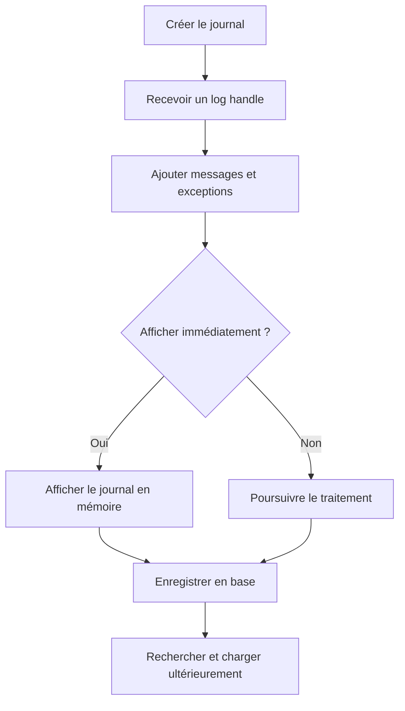

# 🌸 ARCHITECTURE ET CYCLE DE VIE DU BAL

## 🌺 OBJECTIFS

- Comprendre le cycle de vie d’un journal
- Distinguer le handle du numéro de journal en base
- Identifier les opérations réalisées en mémoire et en base

## 🌺 CYCLE DE VIE



Les fonctions `BAL_LOG_*` travaillent principalement sur les journaux présents dans la mémoire globale du groupe de fonctions BAL. La fonction `BAL_DB_SAVE` assure ensuite la persistance.

## 🌺 IDENTIFIANTS

| Identifiant     | Rôle                                                    |
| --------------- | ------------------------------------------------------- |
| Object          | Domaine applicatif stable                               |
| Subobject       | Sous-processus ou scénario                              |
| External number | Identifiant métier ou technique exploitable dans `SLG1` |
| Log handle      | Identifiant technique permanent du journal              |
| Log number      | Numéro interne attribué lors de la sauvegarde en base   |
| Message handle  | Identifie un message précis dans un journal             |

Le **log handle** est disponible dès la création. Le numéro interne de base n’est définitivement attribué qu’au moment de la sauvegarde.

## 🌺 DONNÉES PHYSIQUES

Les données persistées sont gérées par le framework BAL. Le code applicatif ne doit pas écrire directement dans les tables techniques du journal, notamment `BALHDR`, `BALDAT` ou `BAL_INDX`.

## 🌺 RÈGLE DE CONCEPTION

Encapsuler le BAL dans une classe ou un composant applicatif évite de disperser les appels de modules fonction dans tout le programme. L’appelant doit manipuler des opérations métier comme `ADD_SUCCESS`, `ADD_WARNING`, `ADD_EXCEPTION` et `SAVE`.

## 🌺 CAS D’USAGE

Dans un contexte où un traitement automatique doit produire un historique exploitable par le support avec contexte, messages et identifiants, le besoin consiste à **utiliser architecture et cycle de vie du bal pour produire un journal applicatif retrouvable et exploitable par le support**. Cette notion est pertinente lorsque le comportement dépend du contexte d’exécution et des composants impliqués.

## 🌺 PROCÉDURE PAS À PAS

1. Saisir `/nSLG1`.
2. Renseigner objet, sous-objet, identifiant externe, utilisateur et période selon les informations du traitement.
3. Exécuter la recherche.
4. Ouvrir le journal correspondant au bon horodatage.
5. Analyser l’en-tête, les niveaux de gravité et le contexte des messages.
6. Exporter ou transmettre uniquement les informations nécessaires, sans données sensibles inutiles.

## 🌺 VÉRIFICATION

- Le journal est retrouvable dans `SLG1` avec objet, sous-objet et période.
- Chaque erreur contient un contexte permettant d’identifier l’enregistrement concerné.
- Le log est sauvegardé même lorsque le traitement se termine avec des erreurs gérées.
- Aucune donnée sensible inutile n’est enregistrée.

## 🌺 ERREURS FRÉQUENTES

- Enregistrer uniquement un texte générique sans clé métier.
- Journaliser des mots de passe, tokens ou données personnelles inutiles.

## 🌺 FICHE DE CONTRÔLE À COPIER

```text
Système / SID       :
Mandant             :
Utilisateur         :
Transaction / outil :
Objet technique     :
Jeu de données      :
Résultat attendu    :
Résultat observé    :
Horodatage          :
Ordre de transport  :
```

## 🌺 TERMES DU LEXIQUE

- [Application Log](<../└─ 🧩 00 - LEXIQUE SAP ET ABAP/08 - 🍧 EXECUTION EXPLOITATION ET ADMINISTRATION.md#application-log>)
- [BAL](<../└─ 🧩 00 - LEXIQUE SAP ET ABAP/10 - 🍧 ACRONYMES SAP.md#acro-bal>)
- [Job](<../└─ 🧩 00 - LEXIQUE SAP ET ABAP/06 - 🍧 PROGRAMMES CLASSES ET OBJETS TECHNIQUES.md#job>)

## 🌺 À RETENIR

- À l’issue du chapitre, le lecteur sait **utiliser architecture et cycle de vie du bal pour produire un journal applicatif retrouvable et exploitable par le support**.
- Toujours tester sur un objet Z ou un jeu de données sans impact avant d’intervenir sur un traitement réel.
- La documentation `F1` du système reste la référence pour la syntaxe disponible dans sa release.

## 🌺 RÉFÉRENCES OFFICIELLES SAP

- [Basics — SAP Help Portal](https://help.sap.com/docs/ABAP_PLATFORM_NEW/addb96cd90c945dfb3182865363bbc47/4e21029235d44180e10000000a15822b.html)
- [Database Interface — SAP Help Portal](https://help.sap.com/docs/ABAP_PLATFORM_NEW/addb96cd90c945dfb3182865363bbc47/4e21021635d44180e10000000a15822b.html)
- [Function Module Overview — SAP Help Portal](https://help.sap.com/docs/ABAP_PLATFORM_NEW/addb96cd90c945dfb3182865363bbc47/4e23b1720771417fe10000000a15822b.html)


---

➡️ [Chapitre suivant — OBJETS, SOUS-OBJETS ET IDENTIFIANTS](<./03 - 🍧 OBJETS SOUS OBJETS ET IDENTIFIANTS.md>)
