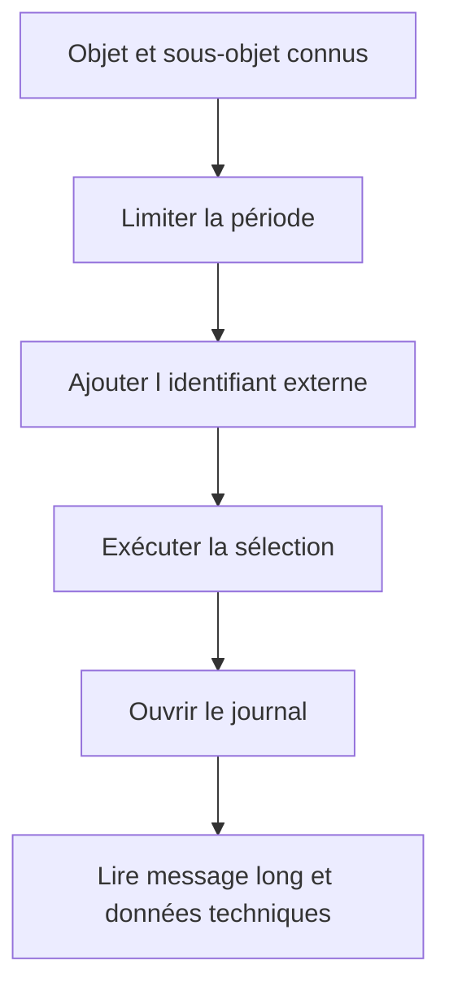

# 🌸 ANALYSER LES JOURNAUX AVEC SLG1

## 🌺 OBJECTIFS

- Rechercher efficacement un journal
- Lire les niveaux d’information disponibles
- Constituer une méthode de diagnostic reproductible

## 🌺 CRITÈRES PRINCIPAUX

La transaction `SLG1` permet de filtrer notamment par :

- objet et sous-objet ;
- identifiant externe ;
- période et heure de création ;
- utilisateur ;
- transaction ou programme ;
- classe du journal ;
- mode de création, par exemple dialogue ou batch.

## 🌺 MÉTHODE DE RECHERCHE

Toujours commencer par une période courte. Une sélection sans objet ni restriction temporelle peut charger un volume important.

## 🌺 LECTURE DU RÉSULTAT

L’affichage standard présente :

- l’en-tête du journal ;
- une arborescence ou une liste de messages ;
- le texte court ;
- le texte long T100 lorsqu’il existe ;
- les informations techniques du message ;
- le contexte ou les paramètres complémentaires si l’application les fournit.

## 🌺 DIAGNOSTIC

Pour chaque anomalie, relever :

1. objet et sous-objet ;
2. identifiant externe ;
3. date, heure et utilisateur ;
4. programme ou transaction ;
5. premier message d’erreur ;
6. messages précédents expliquant le contexte ;
7. données techniques du message.

## 🌺 RÉFÉRENCES OFFICIELLES SAP

- [Analyze Logs — SAP Help Portal](https://help.sap.com/docs/ABAP_PLATFORM_NEW/addb96cd90c945dfb3182865363bbc47/4e21048535d44180e10000000a15822b.html)
- [Displaying Logs — SAP Help Portal](https://help.sap.com/docs/ABAP_PLATFORM/addb96cd90c945dfb3182865363bbc47/4e21041a35d44180e10000000a15822b.html)
- [Application Log – User Guidelines — SAP Help Portal](https://help.sap.com/docs/SAP_S4HANA_ON-PREMISE/f63dd39a28bb4b90adbf9e608aff58ea/4e23ac220771417fe10000000a15822b.html)

---

➡️ [Chapitre suivant — EN TETE DU JOURNAL AVEC BAL_S_LOG](<./06 - 🍧 EN TETE DU JOURNAL AVEC BAL_S_LOG.md>)
