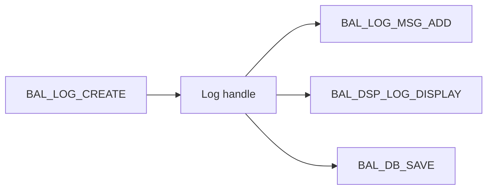

# 🌸 CRÉER UN JOURNAL AVEC BAL_LOG_CREATE

## 🌺 OBJECTIFS

- Créer un journal en mémoire
- Récupérer son handle
- Contrôler les erreurs de configuration

## 🌺 EXEMPLE

```abap
DATA:
  ls_log        TYPE bal_s_log,
  lv_log_handle TYPE balloghndl.

ls_log-object    = 'ZDEV_LOG'.
ls_log-subobject = 'IMPORT'.
ls_log-extnumber = |RUN_{ sy-datum }_{ sy-uzeit }|.
ls_log-alprog     = sy-repid.

CALL FUNCTION 'BAL_LOG_CREATE'
  EXPORTING
    i_s_log                 = ls_log
  IMPORTING
    e_log_handle            = lv_log_handle
  EXCEPTIONS
    log_header_inconsistent = 1
    OTHERS                  = 2.

IF sy-subrc <> 0.
  MESSAGE ID sy-msgid TYPE sy-msgty NUMBER sy-msgno
    WITH sy-msgv1 sy-msgv2 sy-msgv3 sy-msgv4.
ENDIF.
```

## 🌺 HANDLE

Le type `BALLOGHNDL` identifie le journal créé. Il doit être conservé par le composant de journalisation et transmis à chaque ajout de message, affichage ou sauvegarde ciblée.



## 🌺 ERREURS DE CRÉATION

La création échoue notamment lorsque :

- l’objet ou le sous-objet n’existe pas ;
- la combinaison objet/sous-objet est invalide ;
- l’en-tête contient des données incohérentes.

Ne pas ignorer `sy-subrc`. Sans handle valide, les appels suivants ne produisent pas de journal exploitable.

## 🌺 CAS D’USAGE

Dans un contexte où un traitement automatique doit produire un historique exploitable par le support avec contexte, messages et identifiants, le besoin consiste à **créer, alimenter et sauvegarder un journal applicatif**. Cette notion est pertinente lorsque le lecteur doit pouvoir relier la syntaxe ou l’outil à une situation professionnelle concrète.

## 🌺 PROCÉDURE PAS À PAS

1. Saisir `/nSE38` dans le champ de commande.
2. Entrer le nom d’un programme Z de test, par exemple `ZREF_DEMO`, puis choisir **Créer** ou **Modifier** selon le cas.
3. Pour un exercice local uniquement, affecter `$TMP` ; pour un développement livrable, utiliser le package et l’ordre fournis par le projet.
4. Coller ou adapter le snippet du chapitre.
5. Exécuter le contrôle syntaxique avec `Ctrl+F2`.
6. Activer avec `Ctrl+F3`.
7. Exécuter avec `F8` et comparer le résultat avec la section **Vérification**.

## 🌺 VÉRIFICATION

- Le journal est retrouvable dans `SLG1` avec objet, sous-objet et période.
- Chaque erreur contient un contexte permettant d’identifier l’enregistrement concerné.
- Le log est sauvegardé même lorsque le traitement se termine avec des erreurs gérées.
- Aucune donnée sensible inutile n’est enregistrée.

## 🌺 ERREURS FRÉQUENTES

- Copier un exemple sans adapter les types, noms d’objets et données disponibles dans le système.
- Tester uniquement le cas nominal et ignorer les valeurs initiales, absentes ou invalides.
- Enregistrer uniquement un texte générique sans clé métier.
- Journaliser des mots de passe, tokens ou données personnelles inutiles.

## 🌺 SNIPPET À RÉUTILISER

> [!NOTE]
> Adapter les noms `Z*`, les types DDIC, les données et les autorisations au système cible. Effectuer un contrôle syntaxique avant activation.

```abap
DATA:
  ls_log        TYPE bal_s_log,
  lv_log_handle TYPE balloghndl.

ls_log-object    = 'ZDEV_LOG'.
ls_log-subobject = 'IMPORT'.
ls_log-extnumber = |RUN_{ sy-datum }_{ sy-uzeit }|.
ls_log-alprog     = sy-repid.

CALL FUNCTION 'BAL_LOG_CREATE'
  EXPORTING
    i_s_log                 = ls_log
  IMPORTING
    e_log_handle            = lv_log_handle
  EXCEPTIONS
    log_header_inconsistent = 1
    OTHERS                  = 2.

IF sy-subrc <> 0.
  MESSAGE ID sy-msgid TYPE sy-msgty NUMBER sy-msgno
    WITH sy-msgv1 sy-msgv2 sy-msgv3 sy-msgv4.
ENDIF.
```

## 🌺 TERMES DU LEXIQUE

- [Application Log](<../└─ 🧩 00 - LEXIQUE SAP ET ABAP/08 - 🍧 EXECUTION EXPLOITATION ET ADMINISTRATION.md#application-log>)
- [BAL](<../└─ 🧩 00 - LEXIQUE SAP ET ABAP/10 - 🍧 ACRONYMES SAP.md#acro-bal>)
- [Job](<../└─ 🧩 00 - LEXIQUE SAP ET ABAP/06 - 🍧 PROGRAMMES CLASSES ET OBJETS TECHNIQUES.md#job>)

## 🌺 À RETENIR

- À l’issue du chapitre, le lecteur sait **créer, alimenter et sauvegarder un journal applicatif**.
- Toujours tester sur un objet Z ou un jeu de données sans impact avant d’intervenir sur un traitement réel.
- La documentation `F1` du système reste la référence pour la syntaxe disponible dans sa release.

## 🌺 RÉFÉRENCES OFFICIELLES SAP

- [Basics — SAP Help Portal](https://help.sap.com/docs/ABAP_PLATFORM_NEW/addb96cd90c945dfb3182865363bbc47/4e21029235d44180e10000000a15822b.html)
- [Function Module Overview — SAP Help Portal](https://help.sap.com/docs/ABAP_PLATFORM_NEW/addb96cd90c945dfb3182865363bbc47/4e23b1720771417fe10000000a15822b.html)


---

➡️ [Chapitre suivant — AJOUTER DES MESSAGES T100](<./08 - 🍧 AJOUTER DES MESSAGES T100.md>)
