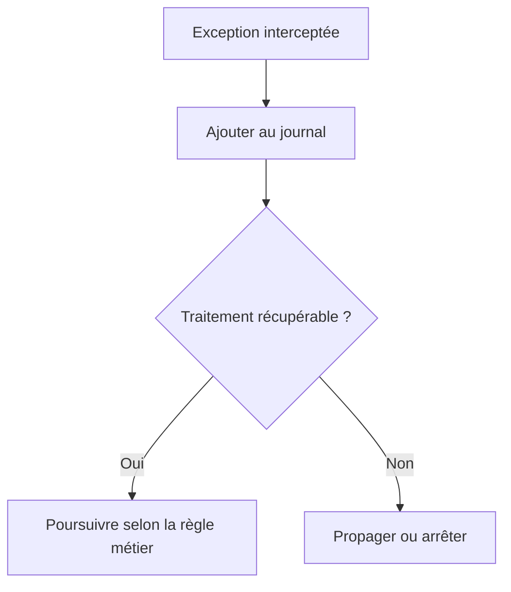

# 🌸 AJOUTER DES EXCEPTIONS

## 🌺 OBJECTIFS

- Ajouter une exception de classe au journal
- Préserver son texte et son niveau de gravité
- Distinguer journalisation et traitement de l’exception

## 🌺 EXEMPLE

```abap
TRY.
    lo_service->execute( ).
  CATCH cx_root INTO DATA(lx_error).
    DATA(ls_exception) = VALUE bal_s_exc(
      exception = lx_error
      msgty     = 'E'
      probclass = '2'
      detlevel  = '1' ).

    CALL FUNCTION 'BAL_LOG_EXCEPTION_ADD'
      EXPORTING
        i_log_handle = lv_log_handle
        i_s_exc      = ls_exception
      EXCEPTIONS
        OTHERS       = 1.

    RAISE EXCEPTION lx_error.
ENDTRY.
```

## 🌺 POINT CRITIQUE

Ajouter une exception au journal ne la traite pas. Le programme doit encore décider s’il faut :

- poursuivre ;
- ignorer l’élément courant ;
- annuler la transaction ;
- lever une nouvelle exception ;
- arrêter le traitement.



Les exceptions T100 produisent un contenu plus structuré. Une exception sans message T100 reste néanmoins journalisable par le framework.

## 🌺 RÉFÉRENCES OFFICIELLES SAP

- [Basics — SAP Help Portal](https://help.sap.com/docs/ABAP_PLATFORM_NEW/addb96cd90c945dfb3182865363bbc47/4e21029235d44180e10000000a15822b.html)
- [Which Data Can Be Collected? — SAP Help Portal](https://help.sap.com/docs/SAP_NETWEAVER_AS_ABAP_752/addb96cd90c945dfb3182865363bbc47/4e2106b735d44180e10000000a15822b.html)
- [Function Module Overview — SAP Help Portal](https://help.sap.com/docs/ABAP_PLATFORM_NEW/addb96cd90c945dfb3182865363bbc47/4e23b1720771417fe10000000a15822b.html)

---

➡️ [Chapitre suivant — CLASSE DE PROBLEME NIVEAU DE DETAIL TRI ET CONTEXTE](<./11 - 🍧 CLASSE DE PROBLEME NIVEAU DE DETAIL TRI ET CONTEXTE.md>)
