# 🌸 AJOUTER DES EXCEPTIONS

## 🌺 OBJECTIFS

- Ajouter une exception de classe au journal
- Préserver son texte et son niveau de gravité
- Distinguer journalisation et traitement de l’exception

## 🌺 EXEMPLE

```abap
TRY.
    lo_service->execute( ).
  CATCH cx_root INTO DATA(lx_error).
    DATA(ls_exception) = VALUE bal_s_exc(
      exception = lx_error
      msgty     = 'E'
      probclass = '2'
      detlevel  = '1' ).

    CALL FUNCTION 'BAL_LOG_EXCEPTION_ADD'
      EXPORTING
        i_log_handle = lv_log_handle
        i_s_exc      = ls_exception
      EXCEPTIONS
        OTHERS       = 1.

    RAISE EXCEPTION lx_error.
ENDTRY.
```

## 🌺 POINT CRITIQUE

Ajouter une exception au journal ne la traite pas. Le programme doit encore décider s’il faut :

- poursuivre ;
- ignorer l’élément courant ;
- annuler la transaction ;
- lever une nouvelle exception ;
- arrêter le traitement.

```mermaid
flowchart TD
    A["Exception interceptée"] --> B["Ajouter au journal"]
    B --> C{"Traitement récupérable ?"}
    C -->|"Oui"| D["Poursuivre selon la règle métier"]
    C -->|"Non"| E["Propager ou arrêter"]
```



Les exceptions T100 produisent un contenu plus structuré. Une exception sans message T100 reste néanmoins journalisable par le framework.

## 🌺 CAS D’USAGE

Dans un contexte où un traitement automatique doit produire un historique exploitable par le support avec contexte, messages et identifiants, le besoin consiste à **effectuer « ajouter des exceptions » en limitant l’action au périmètre prévu**. Cette notion est pertinente lorsque le lecteur doit pouvoir relier la syntaxe ou l’outil à une situation professionnelle concrète.

## 🌺 PROCÉDURE PAS À PAS

1. Saisir `/nSE38` dans le champ de commande.
2. Entrer le nom d’un programme Z de test, par exemple `ZREF_DEMO`, puis choisir **Créer** ou **Modifier** selon le cas.
3. Pour un exercice local uniquement, affecter `$TMP` ; pour un développement livrable, utiliser le package et l’ordre fournis par le projet.
4. Coller ou adapter le snippet du chapitre.
5. Exécuter le contrôle syntaxique avec `Ctrl+F2`.
6. Activer avec `Ctrl+F3`.
7. Exécuter avec `F8` et comparer le résultat avec la section **Vérification**.

## 🌺 VÉRIFICATION

- Le journal est retrouvable dans `SLG1` avec objet, sous-objet et période.
- Chaque erreur contient un contexte permettant d’identifier l’enregistrement concerné.
- Le log est sauvegardé même lorsque le traitement se termine avec des erreurs gérées.
- Aucune donnée sensible inutile n’est enregistrée.

## 🌺 ERREURS FRÉQUENTES

- Copier un exemple sans adapter les types, noms d’objets et données disponibles dans le système.
- Tester uniquement le cas nominal et ignorer les valeurs initiales, absentes ou invalides.
- Enregistrer uniquement un texte générique sans clé métier.
- Journaliser des mots de passe, tokens ou données personnelles inutiles.

## 🌺 SNIPPET À RÉUTILISER

> [!NOTE]
> Adapter les noms `Z*`, les types DDIC, les données et les autorisations au système cible. Effectuer un contrôle syntaxique avant activation.

```abap
TRY.
    lo_service->execute( ).
  CATCH cx_root INTO DATA(lx_error).
    DATA(ls_exception) = VALUE bal_s_exc(
      exception = lx_error
      msgty     = 'E'
      probclass = '2'
      detlevel  = '1' ).

    CALL FUNCTION 'BAL_LOG_EXCEPTION_ADD'
      EXPORTING
        i_log_handle = lv_log_handle
        i_s_exc      = ls_exception
      EXCEPTIONS
        OTHERS       = 1.

    RAISE EXCEPTION lx_error.
ENDTRY.
```

## 🌺 TERMES DU LEXIQUE

- [Exception](<../└─ 🧩 00 - LEXIQUE SAP ET ABAP/04 - 🍧 LANGAGE ET DEVELOPPEMENT ABAP.md#exception>)
- [Application Log](<../└─ 🧩 00 - LEXIQUE SAP ET ABAP/08 - 🍧 EXECUTION EXPLOITATION ET ADMINISTRATION.md#application-log>)
- [BAL](<../└─ 🧩 00 - LEXIQUE SAP ET ABAP/10 - 🍧 ACRONYMES SAP.md#acro-bal>)
- [Job](<../└─ 🧩 00 - LEXIQUE SAP ET ABAP/06 - 🍧 PROGRAMMES CLASSES ET OBJETS TECHNIQUES.md#job>)

## 🌺 À RETENIR

- À l’issue du chapitre, le lecteur sait **effectuer « ajouter des exceptions » en limitant l’action au périmètre prévu**.
- Toujours tester sur un objet Z ou un jeu de données sans impact avant d’intervenir sur un traitement réel.
- La documentation `F1` du système reste la référence pour la syntaxe disponible dans sa release.

## 🌺 RÉFÉRENCES OFFICIELLES SAP

- [Basics — SAP Help Portal](https://help.sap.com/docs/ABAP_PLATFORM_NEW/addb96cd90c945dfb3182865363bbc47/4e21029235d44180e10000000a15822b.html)
- [Which Data Can Be Collected? — SAP Help Portal](https://help.sap.com/docs/SAP_NETWEAVER_AS_ABAP_752/addb96cd90c945dfb3182865363bbc47/4e2106b735d44180e10000000a15822b.html)
- [Function Module Overview — SAP Help Portal](https://help.sap.com/docs/ABAP_PLATFORM_NEW/addb96cd90c945dfb3182865363bbc47/4e23b1720771417fe10000000a15822b.html)


---

➡️ [Chapitre suivant — CLASSE DE PROBLÈME, NIVEAU DE DÉTAIL, TRI ET CONTEXTE](<./11 - 🍧 CLASSE DE PROBLEME NIVEAU DE DETAIL TRI ET CONTEXTE.md>)
