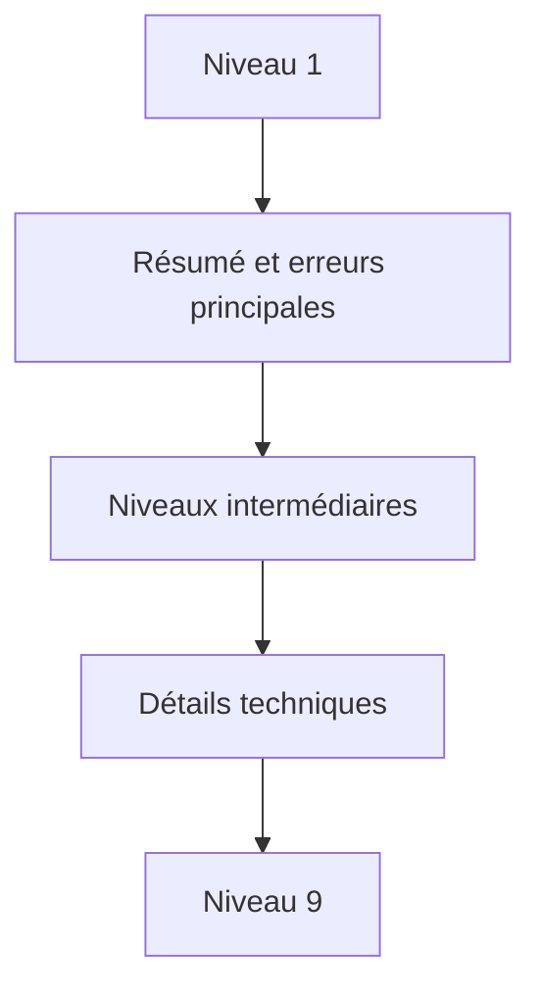

# 🌸 CLASSE DE PROBLÈME, NIVEAU DE DÉTAIL, TRI ET CONTEXTE

## 🌺 OBJECTIFS

- Qualifier les messages au-delà du type `E`, `W` ou `I`
- Organiser un journal volumineux
- Fournir le contexte métier nécessaire au diagnostic

## 🌺 ATTRIBUTS

La structure `BAL_S_MSG` contient notamment :

| Champ       | Usage                                   |
| ----------- | --------------------------------------- |
| `PROBCLASS` | Importance du problème pour le filtrage |
| `DETLEVEL`  | Niveau de détail, de 1 à 9              |
| `ALSORT`    | Critère de tri applicatif               |
| `TIME_STMP` | Horodatage du message                   |
| `CONTEXT`   | Données de contexte structurées         |
| `PARAMS`    | Texte étendu ou callback de détail      |

Le type du message et la classe de problème ne représentent pas la même notion. Un message `I` peut être important pour l’exploitation ; un message `E` peut ne concerner qu’un élément rejeté parmi plusieurs milliers.

## 🌺 NIVEAUX DE DÉTAIL

Définir une convention projet, par exemple :

- 1 : résultat global ;
- 2 : étape fonctionnelle ;
- 3 : document traité ;
- 5 : détail d’une règle ;
- 9 : trace technique temporaire.

## 🌺 CONTEXTE

Le contexte permet d’associer à un message une structure DDIC contenant, par exemple, un document, un poste ou un identifiant de fichier. SAP limite la taille du contexte. Utiliser des champs de type caractère simplifie la compatibilité Unicode.

## 🌺 RÉFÉRENCES OFFICIELLES SAP

- [Which Data Can Be Collected? — SAP Help Portal](https://help.sap.com/docs/SAP_NETWEAVER_AS_ABAP_752/addb96cd90c945dfb3182865363bbc47/4e2106b735d44180e10000000a15822b.html)
- [Log Display — SAP Help Portal](https://help.sap.com/docs/SAP_NETWEAVER_731_BW_ABAP/addb96cd90c945dfb3182865363bbc47/4e2102fa35d44180e10000000a15822b.html)

---

➡️ [Chapitre suivant — CUMULER MODIFIER ET SUPPRIMER DES MESSAGES](<./12 - 🍧 CUMULER MODIFIER ET SUPPRIMER DES MESSAGES.md>)
