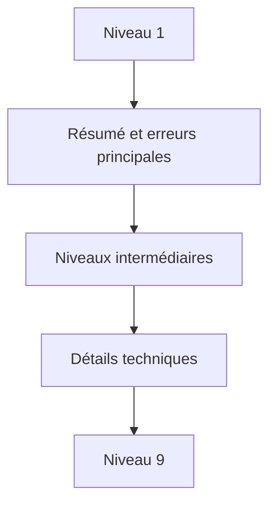

# 🌸 CLASSE DE PROBLÈME, NIVEAU DE DÉTAIL, TRI ET CONTEXTE

## 🌺 OBJECTIFS

- Qualifier les messages au-delà du type `E`, `W` ou `I`
- Organiser un journal volumineux
- Fournir le contexte métier nécessaire au diagnostic

## 🌺 ATTRIBUTS

La structure `BAL_S_MSG` contient notamment :

| Champ       | Usage                                   |
| ----------- | --------------------------------------- |
| `PROBCLASS` | Importance du problème pour le filtrage |
| `DETLEVEL`  | Niveau de détail, de 1 à 9              |
| `ALSORT`    | Critère de tri applicatif               |
| `TIME_STMP` | Horodatage du message                   |
| `CONTEXT`   | Données de contexte structurées         |
| `PARAMS`    | Texte étendu ou callback de détail      |

Le type du message et la classe de problème ne représentent pas la même notion. Un message `I` peut être important pour l’exploitation ; un message `E` peut ne concerner qu’un élément rejeté parmi plusieurs milliers.

## 🌺 NIVEAUX DE DÉTAIL



Définir une convention projet, par exemple :

- 1 : résultat global ;
- 2 : étape fonctionnelle ;
- 3 : document traité ;
- 5 : détail d’une règle ;
- 9 : trace technique temporaire.

## 🌺 CONTEXTE

Le contexte permet d’associer à un message une structure DDIC contenant, par exemple, un document, un poste ou un identifiant de fichier. SAP limite la taille du contexte. Utiliser des champs de type caractère simplifie la compatibilité Unicode.

## 🌺 CAS D’USAGE

Dans un contexte où un traitement automatique doit produire un historique exploitable par le support avec contexte, messages et identifiants, le besoin consiste à **utiliser classe de problème, niveau de détail, tri et contexte pour produire un journal applicatif retrouvable et exploitable par le support**. Cette notion est pertinente lorsque le lecteur doit pouvoir relier la syntaxe ou l’outil à une situation professionnelle concrète.

## 🌺 PROCÉDURE PAS À PAS

1. Lire la définition et identifier les prérequis du chapitre.
2. Choisir un objet Z ou un scénario de démonstration sans impact métier.
3. Reproduire l’exemple dans un système de développement et relever les données d’entrée.
4. Contrôler la syntaxe ou la configuration avant activation/exécution.
5. Comparer le résultat observé avec la section **Vérification**.
6. Documenter toute différence liée à la release, aux autorisations ou au paramétrage du système.

## 🌺 VÉRIFICATION

- Le journal est retrouvable dans `SLG1` avec objet, sous-objet et période.
- Chaque erreur contient un contexte permettant d’identifier l’enregistrement concerné.
- Le log est sauvegardé même lorsque le traitement se termine avec des erreurs gérées.
- Aucune donnée sensible inutile n’est enregistrée.

## 🌺 ERREURS FRÉQUENTES

- Enregistrer uniquement un texte générique sans clé métier.
- Journaliser des mots de passe, tokens ou données personnelles inutiles.

## 🌺 FICHE DE CONTRÔLE À COPIER

```text
Système / SID       :
Mandant             :
Utilisateur         :
Transaction / outil :
Objet technique     :
Jeu de données      :
Résultat attendu    :
Résultat observé    :
Horodatage          :
Ordre de transport  :
```

## 🌺 TERMES DU LEXIQUE

- [Classe](<../└─ 🧩 00 - LEXIQUE SAP ET ABAP/04 - 🍧 LANGAGE ET DEVELOPPEMENT ABAP.md#classe>)
- [Application Log](<../└─ 🧩 00 - LEXIQUE SAP ET ABAP/08 - 🍧 EXECUTION EXPLOITATION ET ADMINISTRATION.md#application-log>)
- [BAL](<../└─ 🧩 00 - LEXIQUE SAP ET ABAP/10 - 🍧 ACRONYMES SAP.md#acro-bal>)
- [Job](<../└─ 🧩 00 - LEXIQUE SAP ET ABAP/06 - 🍧 PROGRAMMES CLASSES ET OBJETS TECHNIQUES.md#job>)

## 🌺 À RETENIR

- À l’issue du chapitre, le lecteur sait **utiliser classe de problème, niveau de détail, tri et contexte pour produire un journal applicatif retrouvable et exploitable par le support**.
- Toujours tester sur un objet Z ou un jeu de données sans impact avant d’intervenir sur un traitement réel.
- La documentation `F1` du système reste la référence pour la syntaxe disponible dans sa release.

## 🌺 RÉFÉRENCES OFFICIELLES SAP

- [Which Data Can Be Collected? — SAP Help Portal](https://help.sap.com/docs/SAP_NETWEAVER_AS_ABAP_752/addb96cd90c945dfb3182865363bbc47/4e2106b735d44180e10000000a15822b.html)
- [Log Display — SAP Help Portal](https://help.sap.com/docs/SAP_NETWEAVER_731_BW_ABAP/addb96cd90c945dfb3182865363bbc47/4e2102fa35d44180e10000000a15822b.html)


---

➡️ [Chapitre suivant — CUMULER, MODIFIER ET SUPPRIMER DES MESSAGES](<./12 - 🍧 CUMULER MODIFIER ET SUPPRIMER DES MESSAGES.md>)
