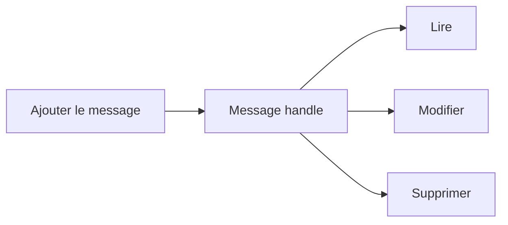

# 🌸 CUMULER, MODIFIER ET SUPPRIMER DES MESSAGES

## 🌺 OBJECTIFS

- Éviter les milliers de messages identiques
- Manipuler un message à partir de son handle
- Connaître les fonctions avancées du BAL

## 🌺 CUMULER

`BAL_LOG_MSG_CUMULATE` ajoute un message ou incrémente son compteur lorsqu’un message équivalent existe. Cette technique réduit le volume pour les erreurs répétitives.

Exemple de résultat :

> Article sans unité de mesure — 1 542 occurrences

Le journal doit néanmoins conserver assez de contexte pour identifier les enregistrements concernés. Une cumulation totale sans fichier de rejet ni identifiants rend le diagnostic impossible.

## 🌺 HANDLES DE MESSAGE

Les fonctions d’ajout renvoient un `BALMSGHNDL`. Ce handle permet notamment :

- `BAL_LOG_MSG_READ` ;
- `BAL_LOG_MSG_CHANGE` ;
- `BAL_LOG_MSG_REPLACE` ;
- `BAL_LOG_MSG_DELETE`.

## 🌺 USAGE

La modification d’un message est utile lorsqu’un traitement ajoute d’abord un état provisoire, puis complète le résultat. Dans la majorité des traitements, il reste plus simple et plus traçable d’ajouter un nouveau message.

Ne pas supprimer une erreur uniquement pour produire un journal « vert ». Le journal doit refléter le résultat réel du traitement.

## 🌺 RÉFÉRENCES OFFICIELLES SAP

- [Function Module Overview — SAP Help Portal](https://help.sap.com/docs/ABAP_PLATFORM_NEW/addb96cd90c945dfb3182865363bbc47/4e23b1720771417fe10000000a15822b.html)
- [Basics — SAP Help Portal](https://help.sap.com/docs/ABAP_PLATFORM_NEW/addb96cd90c945dfb3182865363bbc47/4e21029235d44180e10000000a15822b.html)

---

➡️ [Chapitre suivant — AFFICHER UN JOURNAL EN MEMOIRE](<./13 - 🍧 AFFICHER UN JOURNAL EN MEMOIRE.md>)
