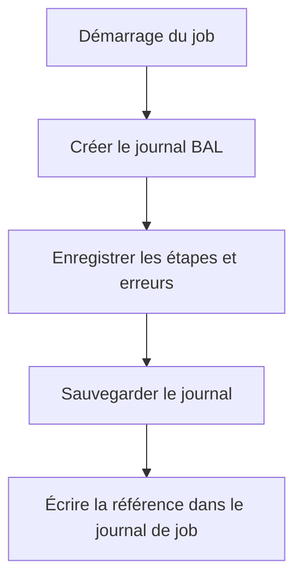

# 🌸 INTÉGRER LE JOURNAL AUX JOBS ET PROGRAMMES BATCH

## 🌺 OBJECTIFS

- Rendre un traitement batch exploitable
- Relier le journal applicatif au journal de job
- Éviter les dépendances à l’affichage SAP GUI

## 🌺 STRATÉGIE



Le programme batch doit écrire dans le journal de job une référence exploitable :

- objet ;
- sous-objet ;
- identifiant externe ;
- résultat global ;
- nombre de succès, avertissements et erreurs.

```abap
WRITE: / |Journal SLG1 : ZDEV_LOG / IMPORT / { lv_extnumber }|.
```

## 🌺 RÈGLES

- ne pas appeler `BAL_DSP_LOG_DISPLAY` en arrière-plan ;
- sauvegarder le journal même lorsqu’aucune erreur n’est rencontrée si la traçabilité l’exige ;
- intercepter les exceptions au niveau supérieur pour enregistrer le résultat final ;
- distinguer erreur technique du job et rejet fonctionnel d’une ligne ;
- rendre la reprise idempotente.

## 🌺 RÉSULTAT DU JOB

Un job peut techniquement se terminer correctement alors que des éléments métier ont été rejetés. Le programme doit définir explicitement les seuils qui provoquent une terminaison anormale, un simple avertissement ou un succès partiel.

## 🌺 RÉFÉRENCES OFFICIELLES SAP

- [Logging Application Jobs — SAP Help Portal](https://help.sap.com/docs/SAP_NETWEAVER_AS_ABAP_752/b4367b1cec3243c4989f0ff3d727c4ab/3882707a014c4b5e85d31c459bfb8652.html)
- [Application Log – Guidelines for Developers — SAP Help Portal](https://help.sap.com/docs/SAP_NETWEAVER_AS_ABAP_FOR_SOH_740/addb96cd90c945dfb3182865363bbc47/4e21000f35d44180e10000000a15822b.html)

---

➡️ [Chapitre suivant — JOURNALISER IMPORTS EXPORTS ET TRAITEMENTS DE MASSE](<./19 - 🍧 JOURNALISER IMPORTS EXPORTS ET TRAITEMENTS DE MASSE.md>)
