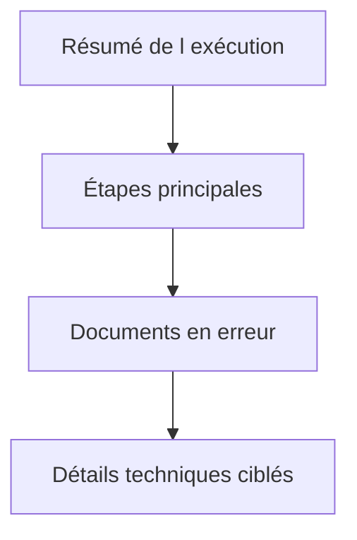

# 🌸 JOURNALISER IMPORTS, EXPORTS ET TRAITEMENTS DE MASSE

## 🌺 OBJECTIFS

- Concevoir un journal lisible pour un grand volume
- Séparer résumé, erreurs et détails
- Permettre la reprise d’une exécution

## 🌺 STRUCTURE RECOMMANDÉE

1. message de démarrage ;
2. paramètres significatifs ;
3. nombre d’enregistrements lus ;
4. avertissements globaux ;
5. erreurs par document ou groupe ;
6. nombre de succès, rejets et erreurs techniques ;
7. statut final et référence de reprise.



## 🌺 VOLUME

Ne pas créer un message de succès pour chaque ligne lorsque plusieurs millions de lignes sont traitées. Préférer :

- compteurs ;
- cumulation ;
- messages uniquement pour les anomalies ;
- fichier de rejet séparé ;
- détails activables par niveau de journalisation.

## 🌺 IDENTIFIANT EXTERNE

Exemples :

```text
PRODUCTS_20260731_044000
orders_20260731_001.csv
IDOC_0000000123456789
RUN_4F8A2C
```

L’identifiant doit être reproductible dans les autres outils de suivi : nom du fichier, identifiant CPI, numéro de job, document SAP ou identifiant de corrélation.

## 🌺 SUCCÈS PARTIEL

Le journal doit distinguer :

- succès complet ;
- succès avec avertissements ;
- succès partiel ;
- échec fonctionnel ;
- échec technique ;
- exécution annulée.

## 🌺 CAS D’USAGE

Dans un contexte où un traitement automatique doit produire un historique exploitable par le support avec contexte, messages et identifiants, le besoin consiste à **utiliser journaliser imports, exports et traitements de masse pour produire un journal applicatif retrouvable et exploitable par le support**. Cette notion est pertinente lorsque le lecteur doit pouvoir relier la syntaxe ou l’outil à une situation professionnelle concrète.

## 🌺 PROCÉDURE PAS À PAS

1. Lire la définition et identifier les prérequis du chapitre.
2. Choisir un objet Z ou un scénario de démonstration sans impact métier.
3. Reproduire l’exemple dans un système de développement et relever les données d’entrée.
4. Contrôler la syntaxe ou la configuration avant activation/exécution.
5. Comparer le résultat observé avec la section **Vérification**.
6. Documenter toute différence liée à la release, aux autorisations ou au paramétrage du système.

## 🌺 VÉRIFICATION

- Le journal est retrouvable dans `SLG1` avec objet, sous-objet et période.
- Chaque erreur contient un contexte permettant d’identifier l’enregistrement concerné.
- Le log est sauvegardé même lorsque le traitement se termine avec des erreurs gérées.
- Aucune donnée sensible inutile n’est enregistrée.

## 🌺 ERREURS FRÉQUENTES

- Enregistrer uniquement un texte générique sans clé métier.
- Journaliser des mots de passe, tokens ou données personnelles inutiles.

## 🌺 FICHE DE CONTRÔLE À COPIER

```text
Système / SID       :
Mandant             :
Utilisateur         :
Transaction / outil :
Objet technique     :
Jeu de données      :
Résultat attendu    :
Résultat observé    :
Horodatage          :
Ordre de transport  :
```

## 🌺 TERMES DU LEXIQUE

- [Import](<../└─ 🧩 00 - LEXIQUE SAP ET ABAP/03 - 🍧 REPOSITORY PACKAGES ET TRANSPORTS.md#import-transport>)
- [Application Log](<../└─ 🧩 00 - LEXIQUE SAP ET ABAP/08 - 🍧 EXECUTION EXPLOITATION ET ADMINISTRATION.md#application-log>)
- [BAL](<../└─ 🧩 00 - LEXIQUE SAP ET ABAP/10 - 🍧 ACRONYMES SAP.md#acro-bal>)
- [Job](<../└─ 🧩 00 - LEXIQUE SAP ET ABAP/06 - 🍧 PROGRAMMES CLASSES ET OBJETS TECHNIQUES.md#job>)

## 🌺 À RETENIR

- À l’issue du chapitre, le lecteur sait **utiliser journaliser imports, exports et traitements de masse pour produire un journal applicatif retrouvable et exploitable par le support**.
- Toujours tester sur un objet Z ou un jeu de données sans impact avant d’intervenir sur un traitement réel.
- La documentation `F1` du système reste la référence pour la syntaxe disponible dans sa release.

## 🌺 RÉFÉRENCES OFFICIELLES SAP

- [Application Log – Guidelines for Developers — SAP Help Portal](https://help.sap.com/docs/SAP_NETWEAVER_AS_ABAP_FOR_SOH_740/addb96cd90c945dfb3182865363bbc47/4e21000f35d44180e10000000a15822b.html)
- [Which Data Can Be Collected? — SAP Help Portal](https://help.sap.com/docs/SAP_NETWEAVER_AS_ABAP_752/addb96cd90c945dfb3182865363bbc47/4e2106b735d44180e10000000a15822b.html)


---

➡️ [Chapitre suivant — RÉTENTION, SUPPRESSION ET ARCHIVAGE](<./20 - 🍧 RETENTION SUPPRESSION ET ARCHIVAGE.md>)
