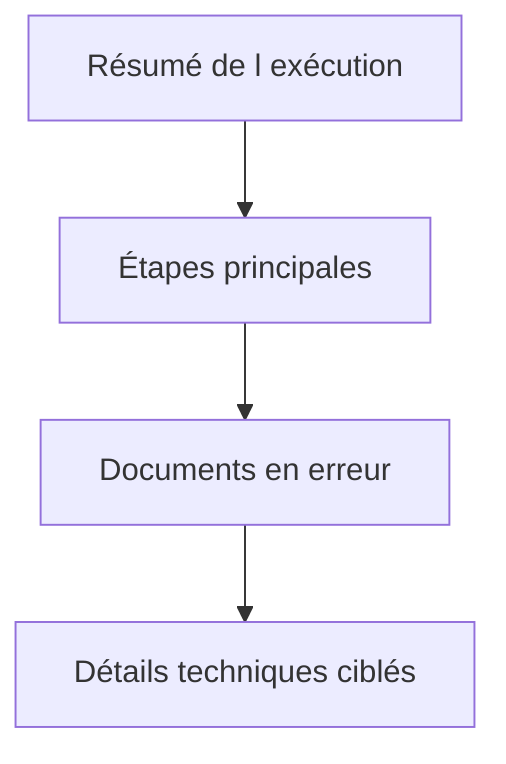

# 🌸 JOURNALISER IMPORTS, EXPORTS ET TRAITEMENTS DE MASSE

## 🌺 OBJECTIFS

- Concevoir un journal lisible pour un grand volume
- Séparer résumé, erreurs et détails
- Permettre la reprise d’une exécution

## 🌺 STRUCTURE RECOMMANDÉE

1. message de démarrage ;
2. paramètres significatifs ;
3. nombre d’enregistrements lus ;
4. avertissements globaux ;
5. erreurs par document ou groupe ;
6. nombre de succès, rejets et erreurs techniques ;
7. statut final et référence de reprise.



## 🌺 VOLUME

Ne pas créer un message de succès pour chaque ligne lorsque plusieurs millions de lignes sont traitées. Préférer :

- compteurs ;
- cumulation ;
- messages uniquement pour les anomalies ;
- fichier de rejet séparé ;
- détails activables par niveau de journalisation.

## 🌺 IDENTIFIANT EXTERNE

Exemples :

```text
PRODUCTS_20260731_044000
orders_20260731_001.csv
IDOC_0000000123456789
RUN_4F8A2C
```

L’identifiant doit être reproductible dans les autres outils de suivi : nom du fichier, identifiant CPI, numéro de job, document SAP ou identifiant de corrélation.

## 🌺 SUCCÈS PARTIEL

Le journal doit distinguer :

- succès complet ;
- succès avec avertissements ;
- succès partiel ;
- échec fonctionnel ;
- échec technique ;
- exécution annulée.

## 🌺 RÉFÉRENCES OFFICIELLES SAP

- [Application Log – Guidelines for Developers — SAP Help Portal](https://help.sap.com/docs/SAP_NETWEAVER_AS_ABAP_FOR_SOH_740/addb96cd90c945dfb3182865363bbc47/4e21000f35d44180e10000000a15822b.html)
- [Which Data Can Be Collected? — SAP Help Portal](https://help.sap.com/docs/SAP_NETWEAVER_AS_ABAP_752/addb96cd90c945dfb3182865363bbc47/4e2106b735d44180e10000000a15822b.html)

---

➡️ [Chapitre suivant — RETENTION SUPPRESSION ET ARCHIVAGE](<./20 - 🍧 RETENTION SUPPRESSION ET ARCHIVAGE.md>)
