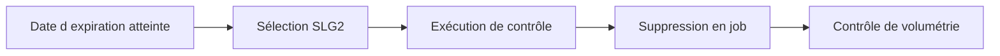

# 🌸 RÉTENTION, SUPPRESSION ET ARCHIVAGE

## 🌺 OBJECTIFS

- Définir une durée de conservation
- Supprimer les journaux de façon contrôlée
- Éviter la croissance illimitée des tables BAL

## 🌺 PRINCIPES

Un journal applicatif est une donnée technique persistante. Sa durée de conservation doit être définie selon :

- besoin opérationnel ;
- fréquence du traitement ;
- obligations d’audit ;
- présence de données personnelles ;
- volumétrie ;
- capacité de reprise.

## 🌺 SUPPRESSION AVEC SLG2

La transaction `SLG2` utilise le programme de suppression standard du BAL. La sélection doit cibler l’objet, le sous-objet, la période ou la date d’expiration.



Planifier la suppression en arrière-plan pour les volumes importants.

## 🌺 ARCHIVAGE

L’objet d’archivage `BC_SBAL` permet d’archiver les journaux applicatifs. SAP fournit notamment des programmes pour écrire les données BAL dans les archives puis supprimer les données archivées des tables d’origine.

## 🌺 PRÉCAUTIONS

- ne pas supprimer tous les objets sans filtre ;
- tester la sélection en environnement non productif ;
- aligner `DATE_DEL` et la politique d’exploitation ;
- documenter la responsabilité du nettoyage ;
- surveiller les tables techniques et les temps de sélection `SLG1`.

## 🌺 CAS D’USAGE

Dans un contexte où un traitement automatique doit produire un historique exploitable par le support avec contexte, messages et identifiants, le besoin consiste à **utiliser rétention, suppression et archivage pour produire un journal applicatif retrouvable et exploitable par le support**. Cette notion est pertinente lorsque le lecteur doit pouvoir relier la syntaxe ou l’outil à une situation professionnelle concrète.

## 🌺 PROCÉDURE PAS À PAS

1. Saisir `/nSLG1`.
2. Renseigner objet, sous-objet, identifiant externe, utilisateur et période selon les informations du traitement.
3. Exécuter la recherche.
4. Ouvrir le journal correspondant au bon horodatage.
5. Analyser l’en-tête, les niveaux de gravité et le contexte des messages.
6. Exporter ou transmettre uniquement les informations nécessaires, sans données sensibles inutiles.

## 🌺 VÉRIFICATION

- Le journal est retrouvable dans `SLG1` avec objet, sous-objet et période.
- Chaque erreur contient un contexte permettant d’identifier l’enregistrement concerné.
- Le log est sauvegardé même lorsque le traitement se termine avec des erreurs gérées.
- Aucune donnée sensible inutile n’est enregistrée.

## 🌺 ERREURS FRÉQUENTES

- Enregistrer uniquement un texte générique sans clé métier.
- Journaliser des mots de passe, tokens ou données personnelles inutiles.

## 🌺 FICHE DE CONTRÔLE À COPIER

```text
Système / SID       :
Mandant             :
Utilisateur         :
Transaction / outil :
Objet technique     :
Jeu de données      :
Résultat attendu    :
Résultat observé    :
Horodatage          :
Ordre de transport  :
```

## 🌺 TERMES DU LEXIQUE

- [Application Log](<../└─ 🧩 00 - LEXIQUE SAP ET ABAP/08 - 🍧 EXECUTION EXPLOITATION ET ADMINISTRATION.md#application-log>)
- [BAL](<../└─ 🧩 00 - LEXIQUE SAP ET ABAP/10 - 🍧 ACRONYMES SAP.md#acro-bal>)
- [Job](<../└─ 🧩 00 - LEXIQUE SAP ET ABAP/06 - 🍧 PROGRAMMES CLASSES ET OBJETS TECHNIQUES.md#job>)

## 🌺 À RETENIR

- À l’issue du chapitre, le lecteur sait **utiliser rétention, suppression et archivage pour produire un journal applicatif retrouvable et exploitable par le support**.
- Toujours tester sur un objet Z ou un jeu de données sans impact avant d’intervenir sur un traitement réel.
- La documentation `F1` du système reste la référence pour la syntaxe disponible dans sa release.

## 🌺 RÉFÉRENCES OFFICIELLES SAP

- [Archiving Object BC_SBAL — SAP Help Portal](https://help.sap.com/docs/ABAP_PLATFORM_NEW/addb96cd90c945dfb3182865363bbc47/4e4a2209872c3b0fe10000000a42189e.html)
- [Deletion of Business Application Logs — SAP Help Portal](https://help.sap.com/docs/btc/security-guide/deletion-of-business-application-logs)
- [Database Interface — SAP Help Portal](https://help.sap.com/docs/ABAP_PLATFORM_NEW/addb96cd90c945dfb3182865363bbc47/4e21021635d44180e10000000a15822b.html)


---

➡️ [Chapitre suivant — AUTORISATIONS ET DONNÉES SENSIBLES](<./21 - 🍧 AUTORISATIONS ET DONNEES SENSIBLES.md>)
