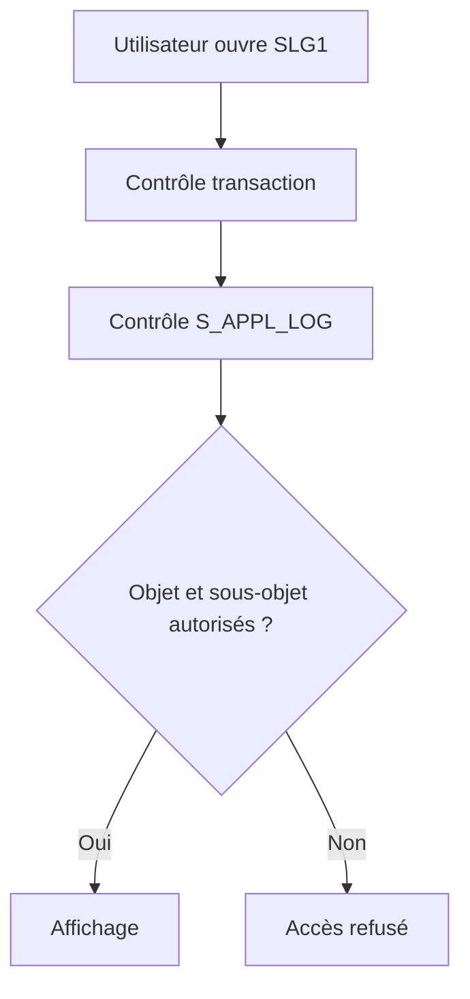

# 🌸 AUTORISATIONS ET DONNÉES SENSIBLES

## 🌺 OBJECTIFS

- Protéger la consultation des journaux
- Concevoir les objets selon les périmètres d’autorisation
- Éviter la fuite de données sensibles

## 🌺 OBJET D’AUTORISATION

L’accès aux journaux peut être protégé avec `S_APPL_LOG` selon :

- `ALG_OBJECT` : objet du journal ;
- `ALG_SUBOBJ` : sous-objet ;
- `ACTVT` : activité autorisée.

L’autorisation de démarrer `SLG1` ne suffit pas nécessairement pour consulter tous les objets.

## 🌺 CONCEPTION DES OBJETS

Si deux équipes ne doivent pas accéder aux mêmes données, les placer sous des objets ou sous-objets permettant une séparation d’autorisation claire.

## 🌺 DONNÉES À EXCLURE

- mots de passe et secrets ;
- jetons OAuth ou certificats ;
- numéros de carte complets ;
- données personnelles non nécessaires ;
- payloads complets contenant des informations sensibles ;
- données techniques permettant une attaque.

Masquer ou tronquer les valeurs. Préférer un identifiant de corrélation permettant de retrouver la donnée dans un système autorisé.

## 🌺 CONTRÔLE

Tester les rôles avec `SU53` après un refus et faire analyser la trace d’autorisation avec les outils Basis appropriés. Ne pas contourner un refus en élargissant `S_APPL_LOG` à tous les objets sans justification.

## 🌺 RÉFÉRENCES OFFICIELLES SAP

- [Authorization Objects — SAP Help Portal](https://help.sap.com/docs/SAP_ERP/da5ab0fa48b34143a25d0e08448f5219/9301c5536a51204be10000000a174cb4.html)
- [Application Logging — SAP Help Portal](https://help.sap.com/docs/ABAP_PLATFORM_NEW/864321b9b3dd487d94c70f6a007b0397/c769bcc9f36611d3a6510000e835363f.html)

---

➡️ [Chapitre suivant — API BAL CLASSIQUE API OBJET ET CODE HISTORIQUE](<./22 - 🍧 API BAL CLASSIQUE API OBJET ET CODE HISTORIQUE.md>)
