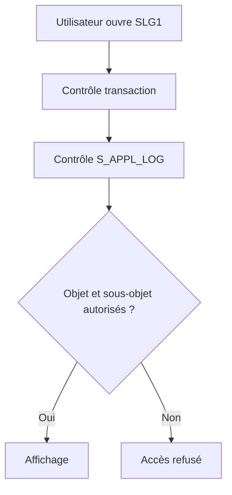

# 🌸 AUTORISATIONS ET DONNÉES SENSIBLES

## 🌺 OBJECTIFS

- Protéger la consultation des journaux
- Concevoir les objets selon les périmètres d’autorisation
- Éviter la fuite de données sensibles

## 🌺 OBJET D’AUTORISATION

L’accès aux journaux peut être protégé avec `S_APPL_LOG` selon :

- `ALG_OBJECT` : objet du journal ;
- `ALG_SUBOBJ` : sous-objet ;
- `ACTVT` : activité autorisée.

L’autorisation de démarrer `SLG1` ne suffit pas nécessairement pour consulter tous les objets.

## 🌺 CONCEPTION DES OBJETS

Si deux équipes ne doivent pas accéder aux mêmes données, les placer sous des objets ou sous-objets permettant une séparation d’autorisation claire.



## 🌺 DONNÉES À EXCLURE

- mots de passe et secrets ;
- jetons OAuth ou certificats ;
- numéros de carte complets ;
- données personnelles non nécessaires ;
- payloads complets contenant des informations sensibles ;
- données techniques permettant une attaque.

Masquer ou tronquer les valeurs. Préférer un identifiant de corrélation permettant de retrouver la donnée dans un système autorisé.

## 🌺 CONTRÔLE

Tester les rôles avec `SU53` après un refus et faire analyser la trace d’autorisation avec les outils Basis appropriés. Ne pas contourner un refus en élargissant `S_APPL_LOG` à tous les objets sans justification.

## 🌺 CAS D’USAGE

Dans un contexte où un traitement automatique doit produire un historique exploitable par le support avec contexte, messages et identifiants, le besoin consiste à **répéter un traitement un nombre connu ou borné de fois**. Cette notion est pertinente lorsque le lecteur doit pouvoir relier la syntaxe ou l’outil à une situation professionnelle concrète.

## 🌺 PROCÉDURE PAS À PAS

1. Saisir `/nSAT`.
2. Créer ou sélectionner une variante de mesure adaptée.
3. Définir le programme, la transaction ou l’utilisateur à mesurer.
4. Démarrer la mesure puis reproduire une seule fois le scénario.
5. Arrêter et analyser le hit list, la hiérarchie d’appels et les temps nets.
6. Répéter la mesure après correction avec les mêmes données et le même contexte.

## 🌺 VÉRIFICATION

- Le scénario reproduit correspond au même utilisateur, mandant, transaction et jeu de données.
- L’horodatage et l’identifiant de l’analyse sont conservés.
- La cause retenue est soutenue par une ligne source, une trace ou une valeur observée.
- Après correction, le même scénario ne reproduit plus le défaut et le résultat métier reste identique.

## 🌺 ERREURS FRÉQUENTES

- Enregistrer uniquement un texte générique sans clé métier.
- Journaliser des mots de passe, tokens ou données personnelles inutiles.

## 🌺 FICHE DE CONTRÔLE À COPIER

```text
Système / SID       :
Mandant             :
Utilisateur         :
Transaction / outil :
Objet technique     :
Jeu de données      :
Résultat attendu    :
Résultat observé    :
Horodatage          :
Ordre de transport  :
```

## 🌺 TERMES DU LEXIQUE

- [Application Log](<../└─ 🧩 00 - LEXIQUE SAP ET ABAP/08 - 🍧 EXECUTION EXPLOITATION ET ADMINISTRATION.md#application-log>)
- [BAL](<../└─ 🧩 00 - LEXIQUE SAP ET ABAP/10 - 🍧 ACRONYMES SAP.md#acro-bal>)
- [Job](<../└─ 🧩 00 - LEXIQUE SAP ET ABAP/06 - 🍧 PROGRAMMES CLASSES ET OBJETS TECHNIQUES.md#job>)

## 🌺 À RETENIR

- À l’issue du chapitre, le lecteur sait **répéter un traitement un nombre connu ou borné de fois**.
- Toujours tester sur un objet Z ou un jeu de données sans impact avant d’intervenir sur un traitement réel.
- La documentation `F1` du système reste la référence pour la syntaxe disponible dans sa release.

## 🌺 RÉFÉRENCES OFFICIELLES SAP

- [Authorization Objects — SAP Help Portal](https://help.sap.com/docs/SAP_ERP/da5ab0fa48b34143a25d0e08448f5219/9301c5536a51204be10000000a174cb4.html)
- [Application Logging — SAP Help Portal](https://help.sap.com/docs/ABAP_PLATFORM_NEW/864321b9b3dd487d94c70f6a007b0397/c769bcc9f36611d3a6510000e835363f.html)


---

➡️ [Chapitre suivant — API BAL CLASSIQUE, API OBJET ET CODE HISTORIQUE](<./22 - 🍧 API BAL CLASSIQUE API OBJET ET CODE HISTORIQUE.md>)
