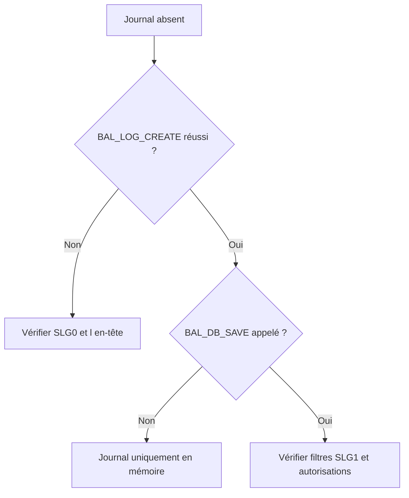

# 🌸 PROGRAMMES DE DÉMONSTRATION, TESTS ET DIAGNOSTIC

## 🌺 OBJECTIFS

- Utiliser les démonstrations standard SAP
- Tester chaque étape du cycle BAL
- Diagnostiquer un journal absent ou incomplet

## 🌺 PROGRAMMES STANDARD

SAP documente plusieurs programmes de démonstration :

| Programme      | Sujet principal                 |
| -------------- | ------------------------------- |
| `SBAL_DEMO_01` | Création et ajout simple        |
| `SBAL_DEMO_02` | Méthodes avancées de collecte   |
| `SBAL_DEMO_03` | Recherche et lecture en mémoire |
| `SBAL_DEMO_04` | Profils et affichage            |
| `SBAL_DEMO_05` | Interface base de données       |

Analyser ces programmes dans `SE38` ou `SE80` avant d’inventer une implémentation spécifique.

## 🌺 PLAN DE TEST

1. vérifier l’objet et le sous-objet dans `SLG0` ;
2. créer un journal ;
3. ajouter un message `S`, `W` et `E` ;
4. ajouter une exception ;
5. afficher le journal en mémoire ;
6. sauvegarder ;
7. rechercher dans `SLG1` ;
8. rechercher par programme avec `BAL_DB_SEARCH` ;
9. charger et réafficher ;
10. tester les autorisations avec un utilisateur représentatif.

## 🌺 JOURNAL ABSENT DANS SLG1

## 🌺 MESSAGES MANQUANTS

Contrôler :

- handle transmis ;
- `sy-subrc` des fonctions d’ajout ;
- niveau de détail ou filtre d’affichage ;
- cumul involontaire ;
- journal retiré de la mémoire ;
- rollback ou échec de l’update task ;
- sélection trop restrictive dans `SLG1`.

## 🌺 RÉFÉRENCES OFFICIELLES SAP

- [Function Module Overview — SAP Help Portal](https://help.sap.com/docs/ABAP_PLATFORM_NEW/addb96cd90c945dfb3182865363bbc47/4e23b1720771417fe10000000a15822b.html)
- [Log Display — SAP Help Portal](https://help.sap.com/docs/SAP_NETWEAVER_731_BW_ABAP/addb96cd90c945dfb3182865363bbc47/4e2102fa35d44180e10000000a15822b.html)
- [Database Interface — SAP Help Portal](https://help.sap.com/docs/ABAP_PLATFORM_NEW/addb96cd90c945dfb3182865363bbc47/4e21021635d44180e10000000a15822b.html)

---

➡️ [Chapitre suivant — BONNES PRATIQUES ET CHECKLIST](<./24 - 🍧 BONNES PRATIQUES ET CHECKLIST.md>)
