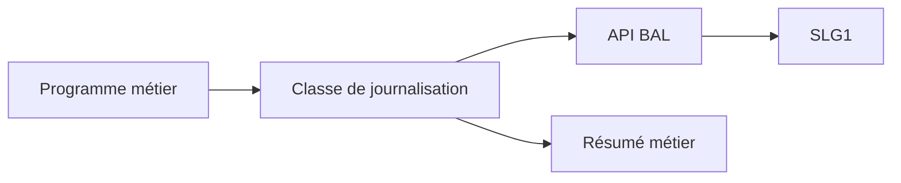

# 🌸 BONNES PRATIQUES ET CHECKLIST

## 🌺 OBJECTIFS

- Standardiser l’implémentation
- Produire des journaux exploitables
- Limiter la volumétrie et les risques de sécurité

## 🌺 CHECKLIST DE CONCEPTION

- [ ] L’objet et le sous-objet existent dans `SLG0`.
- [ ] Leur découpage correspond aux autorisations attendues.
- [ ] L’identifiant externe permet de retrouver l’exécution.
- [ ] Une classe de messages `SE91` contient les messages stables.
- [ ] Les messages indiquent l’action, l’objet concerné et la cause.
- [ ] Le traitement produit un résumé final.
- [ ] Le volume maximal de messages est maîtrisé.
- [ ] La date d’expiration est définie selon la politique de rétention.
- [ ] Aucune donnée sensible inutile n’est journalisée.
- [ ] Tous les `sy-subrc` critiques sont contrôlés.
- [ ] La stratégie de sauvegarde respecte la SAP LUW.
- [ ] Le programme batch écrit la référence `SLG1` dans son journal de job.
- [ ] Les rôles `S_APPL_LOG` ont été testés.
- [ ] Une procédure `SLG2` ou d’archivage est prévue.

## 🌺 PRINCIPES DE QUALITÉ

| Principe       | Application                                                             |
| -------------- | ----------------------------------------------------------------------- |
| Corrélation    | Identifiant externe partagé avec le document, fichier ou message source |
| Synthèse       | Résultat global lisible sans parcourir tous les détails                 |
| Actionnabilité | Le message indique quoi vérifier ou corriger                            |
| Stabilité      | Objets et numéros de messages pérennes                                  |
| Sobriété       | Pas de succès unitaire inutile en masse                                 |
| Sécurité       | Masquage des données sensibles                                          |
| Exploitabilité | Recherche rapide dans `SLG1`                                            |
| Maintenance    | Encapsulation dans une classe dédiée                                    |

## 🌺 ARCHITECTURE RECOMMANDÉE

La classe de journalisation doit rester un adaptateur. Elle ne doit pas décider seule du rollback, de la poursuite ou du statut métier du traitement.

## 🌺 RÉFÉRENCES OFFICIELLES SAP

- [Application Log – Guidelines for Developers — SAP Help Portal](https://help.sap.com/docs/SAP_NETWEAVER_AS_ABAP_FOR_SOH_740/addb96cd90c945dfb3182865363bbc47/4e21000f35d44180e10000000a15822b.html)
- [Application Log – User Guidelines — SAP Help Portal](https://help.sap.com/docs/SAP_S4HANA_ON-PREMISE/f63dd39a28bb4b90adbf9e608aff58ea/4e23ac220771417fe10000000a15822b.html)
- [Application Logging — SAP Help Portal](https://help.sap.com/docs/ABAP_PLATFORM_NEW/864321b9b3dd487d94c70f6a007b0397/c769bcc9f36611d3a6510000e835363f.html)
