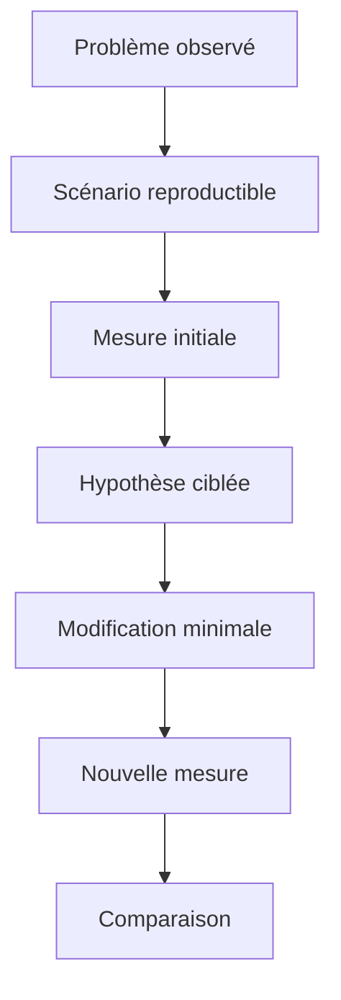

# 🍧 MESURER AVANT D OPTIMISER

## 🎯 Objectif

Établir une méthode de mesure reproductible avant toute modification de performance.

## 📏 Définir un scénario de référence

Une mesure n’est comparable que si le contexte reste stable :

- même système et même client ;
- même utilisateur ou mêmes autorisations ;
- mêmes paramètres de sélection ;
- volume de données comparable ;
- état du buffer identifié ;
- même mode d’exécution : dialogue, RFC ou batch.

## 🔍 Choisir l’outil selon la question

| Question                                         | Outil            |
| ------------------------------------------------ | ---------------- |
| Quelle procédure ABAP consomme le plus ?         | `SAT`            |
| Quelles requêtes SQL sont exécutées ?            | `ST05`           |
| Quels accès SQL sont coûteux sur une période ?   | `SQLM`           |
| Quel code cumule finding statique et coût réel ? | `SWLT`           |
| La mémoire augmente-t-elle entre deux étapes ?   | Memory Inspector |

## 📊 Mesures minimales à conserver

Documenter au minimum :

- temps total ;
- temps base de données ;
- nombre d’exécutions SQL ;
- nombre de lignes lues ou transférées ;
- consommation mémoire lorsque pertinente ;
- identifiant du scénario et date de la mesure.

## ⚠️ Sources de biais

Le premier passage peut charger des programmes, remplir des buffers ou initialiser des caches. Une seule exécution n’est donc pas suffisante. Répéter le scénario, écarter les mesures manifestement perturbées et comparer des tendances plutôt qu’une valeur isolée.

## ✅ Critère de décision

La modification est retenue uniquement si elle améliore la métrique visée sans dégrader le résultat fonctionnel, la lisibilité, la robustesse ou une autre métrique importante.

## 🔗 Références SAP officielles

- [SAP Help Portal — ABAP Performance and Tuning](https://help.sap.com/docs/SUPPORT_CONTENT/ABAP/3353523595.html)
- [SAP Help Portal — Analyzing Performance with ABAP Runtime Analysis](https://help.sap.com/docs/ABAP_PLATFORM_NEW/ba879a6e2ea04d9bb94c7ccd7cdac446/3c74c6163ce4459888bc06dedda37685.html)
- [SAP Help Portal — SQL Trace Analysis](https://help.sap.com/docs/ABAP_PLATFORM_NEW/ba879a6e2ea04d9bb94c7ccd7cdac446/d1801f89454211d189710000e8322d00.html)
- [SAP Help Portal — Memory Inspector Concepts](https://help.sap.com/docs/ABAP_PLATFORM_NEW/ba879a6e2ea04d9bb94c7ccd7cdac446/8884fb5269d34838a1f119b41dcdbc57.html)

---

➡️ [Chapitre suivant : IDENTIFIER LES COUTS D EXECUTION](<03 - 🍧 IDENTIFIER LES COUTS D EXECUTION.md>)
