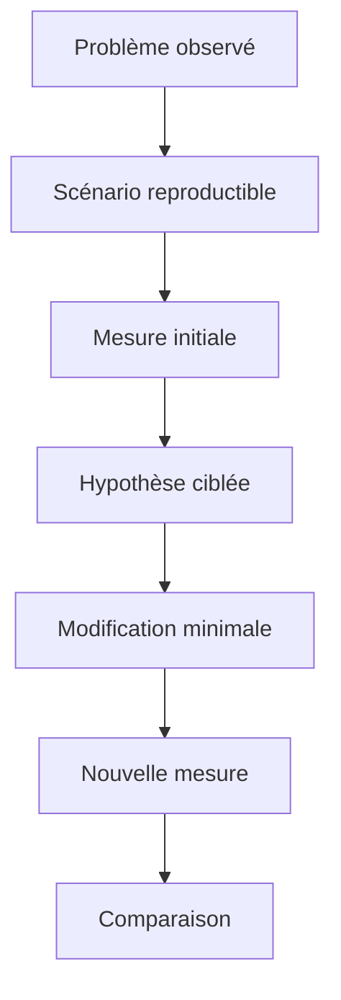

# 🌸 MESURER AVANT D OPTIMISER

## 🌺 Objectif

Établir une méthode de mesure reproductible avant toute modification de performance.

## 🌺 Définir un scénario de référence

Une mesure n’est comparable que si le contexte reste stable :

- même système et même client ;
- même utilisateur ou mêmes autorisations ;
- mêmes paramètres de sélection ;
- volume de données comparable ;
- état du buffer identifié ;
- même mode d’exécution : dialogue, RFC ou batch.



## 🌺 Choisir l’outil selon la question

| Question                                         | Outil            |
| ------------------------------------------------ | ---------------- |
| Quelle procédure ABAP consomme le plus ?         | `SAT`            |
| Quelles requêtes SQL sont exécutées ?            | `ST05`           |
| Quels accès SQL sont coûteux sur une période ?   | `SQLM`           |
| Quel code cumule finding statique et coût réel ? | `SWLT`           |
| La mémoire augmente-t-elle entre deux étapes ?   | Memory Inspector |

## 🌺 Mesures minimales à conserver

Documenter au minimum :

- temps total ;
- temps base de données ;
- nombre d’exécutions SQL ;
- nombre de lignes lues ou transférées ;
- consommation mémoire lorsque pertinente ;
- identifiant du scénario et date de la mesure.

## 🌺 Sources de biais

Le premier passage peut charger des programmes, remplir des buffers ou initialiser des caches. Une seule exécution n’est donc pas suffisante. Répéter le scénario, écarter les mesures manifestement perturbées et comparer des tendances plutôt qu’une valeur isolée.

## 🌺 Critère de décision

La modification est retenue uniquement si elle améliore la métrique visée sans dégrader le résultat fonctionnel, la lisibilité, la robustesse ou une autre métrique importante.

## 🌺 Références SAP officielles

- [SAP Help Portal — ABAP Performance and Tuning](https://help.sap.com/docs/SUPPORT_CONTENT/ABAP/3353523595.html)
- [SAP Help Portal — Analyzing Performance with ABAP Runtime Analysis](https://help.sap.com/docs/ABAP_PLATFORM_NEW/ba879a6e2ea04d9bb94c7ccd7cdac446/3c74c6163ce4459888bc06dedda37685.html)
- [SAP Help Portal — SQL Trace Analysis](https://help.sap.com/docs/ABAP_PLATFORM_NEW/ba879a6e2ea04d9bb94c7ccd7cdac446/d1801f89454211d189710000e8322d00.html)
- [SAP Help Portal — Memory Inspector Concepts](https://help.sap.com/docs/ABAP_PLATFORM_NEW/ba879a6e2ea04d9bb94c7ccd7cdac446/8884fb5269d34838a1f119b41dcdbc57.html)

## 🌺 CAS D’USAGE

Dans un contexte où un programme critique doit conserver ses résultats tout en respectant les exigences de performance, qualité et non-régression, le besoin consiste à **appliquer mesurer avant d optimiser pour mesurer, contrôler et sécuriser la qualité d’une livraison ABAP**. Cette notion est pertinente lorsque le lecteur doit pouvoir relier la syntaxe ou l’outil à une situation professionnelle concrète.

## 🌺 PROCÉDURE PAS À PAS

1. Saisir `/nSAT`.
2. Créer ou sélectionner une variante de mesure adaptée.
3. Définir le programme, la transaction ou l’utilisateur à mesurer.
4. Démarrer la mesure puis reproduire une seule fois le scénario.
5. Arrêter et analyser le hit list, la hiérarchie d’appels et les temps nets.
6. Répéter la mesure après correction avec les mêmes données et le même contexte.

## 🌺 VÉRIFICATION

- Le scénario reproduit correspond au même utilisateur, mandant, transaction et jeu de données.
- L’horodatage et l’identifiant de l’analyse sont conservés.
- La cause retenue est soutenue par une ligne source, une trace ou une valeur observée.
- Après correction, le même scénario ne reproduit plus le défaut et le résultat métier reste identique.

## 🌺 ERREURS FRÉQUENTES

- Optimiser sans mesure de référence.
- Accepter un finding critique sans correction ni justification formelle.

## 🌺 FICHE DE CONTRÔLE À COPIER

```text
Système / SID       :
Mandant             :
Utilisateur         :
Transaction / outil :
Objet technique     :
Jeu de données      :
Résultat attendu    :
Résultat observé    :
Horodatage          :
Ordre de transport  :
```

## 🌺 TERMES DU LEXIQUE

- [ATC](<../└─ 🧩 00 - LEXIQUE SAP ET ABAP/10 - 🍧 ACRONYMES SAP.md#acro-atc>)
- [ABAP](<../└─ 🧩 00 - LEXIQUE SAP ET ABAP/10 - 🍧 ACRONYMES SAP.md#acro-abap>)
- [Trace](<../└─ 🧩 00 - LEXIQUE SAP ET ABAP/08 - 🍧 EXECUTION EXPLOITATION ET ADMINISTRATION.md#trace>)

## 🌺 À RETENIR

- À l’issue du chapitre, le lecteur sait **appliquer mesurer avant d optimiser pour mesurer, contrôler et sécuriser la qualité d’une livraison ABAP**.
- Toujours tester sur un objet Z ou un jeu de données sans impact avant d’intervenir sur un traitement réel.
- La documentation `F1` du système reste la référence pour la syntaxe disponible dans sa release.


---

➡️ [Chapitre suivant — IDENTIFIER LES COUTS D EXECUTION](<./03 - 🍧 IDENTIFIER LES COUTS D EXECUTION.md>)
