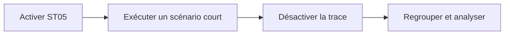

# 🌸 ANALYSER LES ACCES SQL AVEC ST05

## 🌺 Objectif

Tracer précisément les accès SQL exécutés pendant un scénario court et reproductible.

## 🌺 Procédure sûre

1. Ouvrir `ST05`.
2. Activer la trace SQL pour le bon utilisateur ou contexte.
3. Exécuter immédiatement le scénario ciblé.
4. Désactiver la trace sans attendre.
5. Afficher la trace et regrouper les instructions identiques.

## 🌺 Informations à examiner

- durée totale et moyenne ;
- nombre d’exécutions ;
- lignes retournées ;
- paramètres transmis ;
- source ABAP appelante ;
- plan d’exécution lorsque disponible.

## 🌺 Signaux fréquents

| Signal                           | Hypothèse                      |
| -------------------------------- | ------------------------------ |
| même requête répétée             | SQL dans une boucle            |
| beaucoup de lignes retournées    | filtre insuffisant             |
| temps moyen élevé                | plan d’accès ou volumétrie     |
| nombreuses requêtes très courtes | coût cumulé des allers-retours |



## 🌺 Discipline d’utilisation

La trace peut capturer des données techniques sensibles et produire un volume important. Cibler l’utilisateur, limiter la durée et désactiver la trace immédiatement après le scénario. Ne pas lancer une trace globale prolongée sans coordination avec l’administration.

## 🌺 Après correction

Répéter exactement le même scénario et comparer le nombre d’accès, le temps cumulé et le volume retourné.

## 🌺 Références SAP officielles

- [SAP Help Portal — SQL Trace Analysis](https://help.sap.com/docs/ABAP_PLATFORM_NEW/ba879a6e2ea04d9bb94c7ccd7cdac446/d1801f89454211d189710000e8322d00.html)
- [SAP Help Portal — ABAP Performance and Tuning](https://help.sap.com/docs/SUPPORT_CONTENT/ABAP/3353523595.html)

## 🌺 CAS D’USAGE

Dans un contexte où un programme critique doit conserver ses résultats tout en respectant les exigences de performance, qualité et non-régression, le besoin consiste à **tracer les accès SQL d’un utilisateur pendant une fenêtre courte**. Cette notion est pertinente lorsque la modification ne doit intervenir qu’après identification du bon objet et de son impact.

## 🌺 VÉRIFICATION

- Le scénario reproduit correspond au même utilisateur, mandant, transaction et jeu de données.
- L’horodatage et l’identifiant de l’analyse sont conservés.
- La cause retenue est soutenue par une ligne source, une trace ou une valeur observée.
- Après correction, le même scénario ne reproduit plus le défaut et le résultat métier reste identique.

## 🌺 ERREURS FRÉQUENTES

- Optimiser sans mesure de référence.
- Accepter un finding critique sans correction ni justification formelle.

## 🌺 FICHE DE CONTRÔLE À COPIER

```text
Système / SID       :
Mandant             :
Utilisateur         :
Transaction / outil :
Objet technique     :
Jeu de données      :
Résultat attendu    :
Résultat observé    :
Horodatage          :
Ordre de transport  :
```

## 🌺 TERMES DU LEXIQUE

- [ATC](<../└─ 🧩 00 - LEXIQUE SAP ET ABAP/10 - 🍧 ACRONYMES SAP.md#acro-atc>)
- [ABAP](<../└─ 🧩 00 - LEXIQUE SAP ET ABAP/10 - 🍧 ACRONYMES SAP.md#acro-abap>)
- [Trace](<../└─ 🧩 00 - LEXIQUE SAP ET ABAP/08 - 🍧 EXECUTION EXPLOITATION ET ADMINISTRATION.md#trace>)

## 🌺 À RETENIR

- À l’issue du chapitre, le lecteur sait **tracer les accès SQL d’un utilisateur pendant une fenêtre courte**.
- Toujours tester sur un objet Z ou un jeu de données sans impact avant d’intervenir sur un traitement réel.
- La documentation `F1` du système reste la référence pour la syntaxe disponible dans sa release.


---

➡️ [Chapitre suivant — SURVEILLER LES ACCES SQL AVEC SQLM](<./09 - 🍧 SURVEILLER LES ACCES SQL AVEC SQLM.md>)
