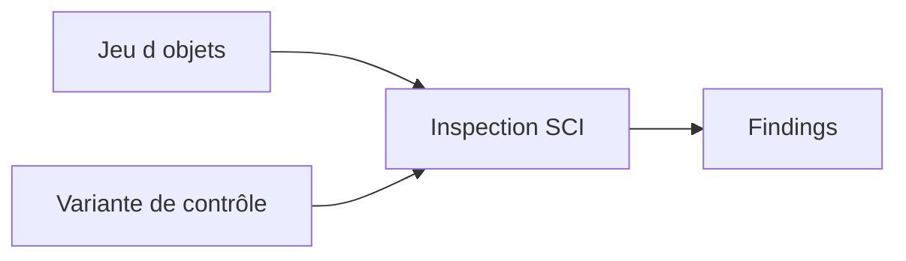

# 🍧 CODE INSPECTOR AVEC SCI

## 🎯 Objectif

Utiliser `SCI` pour exécuter un ensemble cohérent de contrôles sur un objet ou un groupe d’objets Repository.

## 🧩 Objets principaux

| Objet SCI            | Rôle                                            |
| -------------------- | ----------------------------------------------- |
| Variante de contrôle | règles et paramètres appliqués                  |
| Jeu d’objets         | objets Repository analysés                      |
| Inspection           | association variante + jeu d’objets + résultats |

## 🛠️ Contrôle ad hoc

1. Ouvrir `SCI`.
2. Lancer une inspection ad hoc.
3. Définir les objets ou le package.
4. Choisir une variante globale autorisée.
5. Exécuter et analyser les résultats.

## 🔍 Domaines de contrôle

Selon la variante : performance, sécurité, robustesse, conventions, syntaxe, recherche de code, objets DDIC, traductions ou dépendances.

## ⚠️ Gouvernance

Une variante locale personnelle n’est pas une référence projet. Pour une validation de livraison, utiliser la variante globale définie par l’équipe qualité ou l’ATC central.

## 🔄 Relation avec ATC

ATC réutilise l’infrastructure et les contrôles du Code Inspector, tout en ajoutant une gouvernance centralisée des exécutions, résultats, exemptions et transports. SCI reste utile pour construire et comprendre les variantes ainsi que pour les analyses ad hoc.

## 🔗 Références SAP officielles

- [SAP Help Portal — Code Inspector](https://help.sap.com/docs/ABAP_PLATFORM_NEW/ba879a6e2ea04d9bb94c7ccd7cdac446/49205531d0fc14cfe10000000a42189b.html)
- [SAP Help Portal — Creating Code Inspections](https://help.sap.com/docs/ABAP_PLATFORM_NEW/ba879a6e2ea04d9bb94c7ccd7cdac446/4926dff4c93016b8e10000000a42189d.html)
- [SAP Help Portal — ATC Quality Checking](https://help.sap.com/docs/ABAP_PLATFORM_NEW/c238d694b825421f940829321ffa326a/4ec1a1126e391014adc9fffe4e204223.html)

---

➡️ [Chapitre suivant : VARIANTES ET INSPECTIONS SCI](<14 - 🍧 VARIANTES ET INSPECTIONS SCI.md>)
