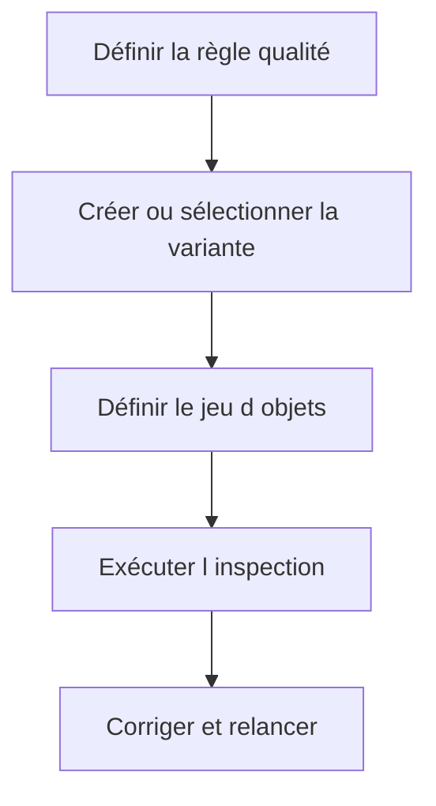

# 🍧 VARIANTES ET INSPECTIONS SCI

## 🎯 Objectif

Construire des variantes de contrôle stables et des inspections reproductibles.

## 🧱 Concevoir une variante

Une variante doit refléter un objectif explicite : contrôle quotidien développeur, sécurité, performance SQL, migration ou validation avant transport.

### Principes

- partir d’une variante SAP ou projet reconnue ;
- ne pas désactiver une règle uniquement pour réduire le nombre de findings ;
- paramétrer les seuils selon la volumétrie et la release ;
- versionner la décision de gouvernance hors de l’outil si nécessaire ;
- tester la variante sur un package pilote.

## 📦 Construire un jeu d’objets

Le jeu peut viser un programme, une classe, un package, un transport ou un ensemble sélectionné. Il doit être assez précis pour fournir un résultat exploitable.

## 🧪 Inspection reproductible

Une inspection nommée permet de relancer la même combinaison et de comparer l’évolution des findings.

## ⚠️ Résultats historiques

Ne pas comparer deux inspections si la variante, le jeu d’objets ou la version active a changé sans le documenter.

## 🔗 Références SAP officielles

- [SAP Help Portal — Code Inspector](https://help.sap.com/docs/ABAP_PLATFORM_NEW/ba879a6e2ea04d9bb94c7ccd7cdac446/49205531d0fc14cfe10000000a42189b.html)
- [SAP Help Portal — Creating Code Inspections](https://help.sap.com/docs/ABAP_PLATFORM_NEW/ba879a6e2ea04d9bb94c7ccd7cdac446/4926dff4c93016b8e10000000a42189d.html)

---

➡️ [Chapitre suivant : ABAP TEST COCKPIT AVEC ATC](<15 - 🍧 ABAP TEST COCKPIT AVEC ATC.md>)
