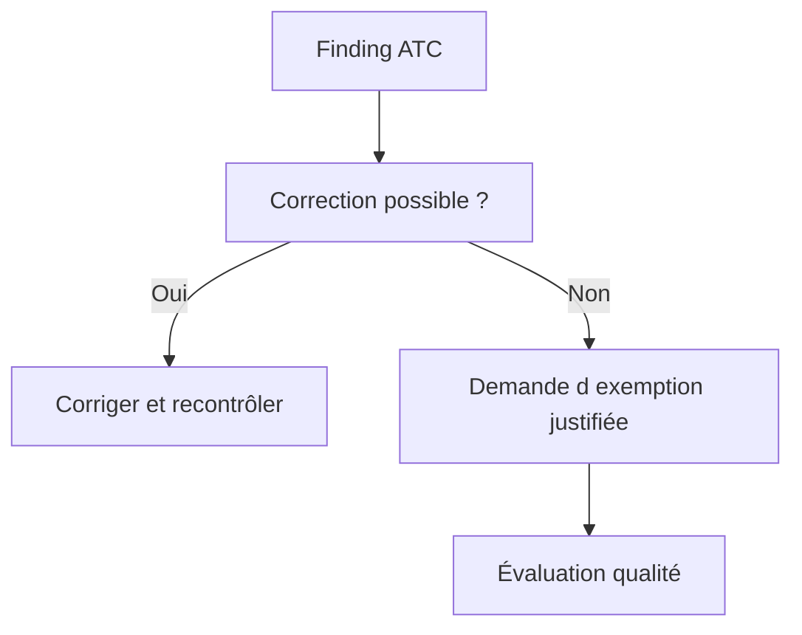

# 🌸 RESULTATS PRIORITES ET EXEMPTIONS ATC

## 🌺 Objectif

Traiter les findings ATC selon leur priorité et encadrer strictement les exemptions.

## 🌺 🚦 Priorités

Les findings ATC utilisent des niveaux de priorité. Dans une configuration courante, les priorités 1 et 2 peuvent bloquer la libération des transports, tandis que la priorité 3 est informative ou moins critique. Le comportement exact dépend des réglages du système.

## 🌺 Ordre de traitement

1. Findings de sécurité et erreurs potentielles.
2. Incompatibilités de release ou d’API.
3. Défauts de performance avérés.
4. Maintenabilité et conventions.
5. Findings faibles ou contextuels.

## 🌺 🛡️ Exemption

Une exemption n’est pas une suppression arbitraire. Elle doit contenir :

- justification technique précise ;
- périmètre minimal ;
- durée de validité limitée lorsque possible ;
- approbation par le rôle qualité autorisé ;
- référence au risque accepté.



## 🌺 Mauvaises pratiques

- pseudo-commentaire sans analyse ;
- exemption sur tout un package alors qu’un sous-objet suffit ;
- validité illimitée par défaut ;
- justification « faux positif » sans démonstration ;
- demandeur et approbateur confondus lorsque la gouvernance l’interdit.

## 🌺 Références SAP officielles

- [SAP Help Portal — ATC Quality Checking](https://help.sap.com/docs/ABAP_PLATFORM_NEW/c238d694b825421f940829321ffa326a/4ec1a1126e391014adc9fffe4e204223.html)
- [SAP Help Portal — ATC Exemptions](https://help.sap.com/docs/ABAP_PLATFORM_NEW/ba879a6e2ea04d9bb94c7ccd7cdac446/3a759579e173410caa551e0d428bd7d6.html)

## 🌺 PROCÉDURE PAS À PAS

1. Saisir `/nATC` ou utiliser l’entrée ATC disponible dans le système.
2. Choisir une variante de contrôle autorisée.
3. Lancer le contrôle sur l’objet, le package ou l’ordre de transport.
4. Classer les findings par priorité et corriger d’abord les erreurs bloquantes.
5. Demander une exemption uniquement avec justification, propriétaire et échéance.
6. Relancer le contrôle avant libération.

## 🌺 VÉRIFICATION

- Le résultat fonctionnel est identique avant et après optimisation.
- La mesure est répétée avec le même jeu de données et le même contexte.
- Les contrôles statiques ne retournent plus de finding bloquant.
- Les tests automatiques couvrent les cas nominal, limites et erreurs attendues.

## 🌺 ERREURS FRÉQUENTES

- Optimiser sans mesure de référence.
- Accepter un finding critique sans correction ni justification formelle.

## 🌺 FICHE DE CONTRÔLE À COPIER

```text
Système / SID       :
Mandant             :
Utilisateur         :
Transaction / outil :
Objet technique     :
Jeu de données      :
Résultat attendu    :
Résultat observé    :
Horodatage          :
Ordre de transport  :
```

## 🌺 TERMES DU LEXIQUE

- [ATC](<../└─ 🧩 00 - LEXIQUE SAP ET ABAP/10 - 🍧 ACRONYMES SAP.md#acro-atc>)
- [ABAP](<../└─ 🧩 00 - LEXIQUE SAP ET ABAP/10 - 🍧 ACRONYMES SAP.md#acro-abap>)
- [Trace](<../└─ 🧩 00 - LEXIQUE SAP ET ABAP/08 - 🍧 EXECUTION EXPLOITATION ET ADMINISTRATION.md#trace>)
