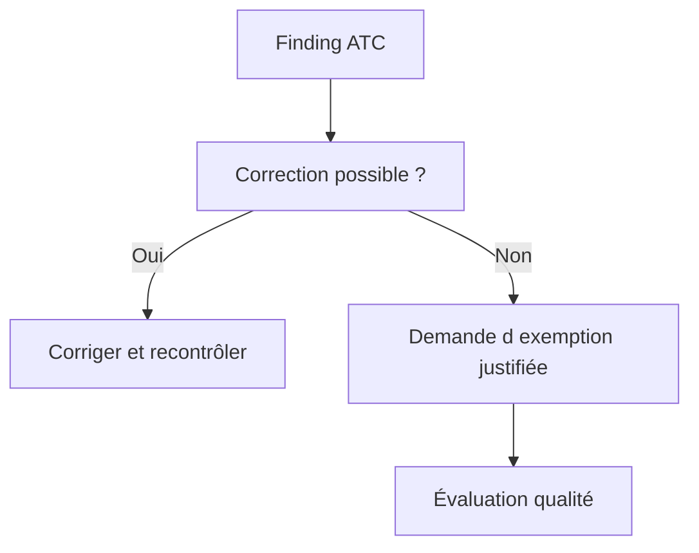

# 🍧 RESULTATS PRIORITES ET EXEMPTIONS ATC

## 🎯 Objectif

Traiter les findings ATC selon leur priorité et encadrer strictement les exemptions.

## 🚦 Priorités

Les findings ATC utilisent des niveaux de priorité. Dans une configuration courante, les priorités 1 et 2 peuvent bloquer la libération des transports, tandis que la priorité 3 est informative ou moins critique. Le comportement exact dépend des réglages du système.

## 🧭 Ordre de traitement

1. Findings de sécurité et erreurs potentielles.
2. Incompatibilités de release ou d’API.
3. Défauts de performance avérés.
4. Maintenabilité et conventions.
5. Findings faibles ou contextuels.

## 🛡️ Exemption

Une exemption n’est pas une suppression arbitraire. Elle doit contenir :

- justification technique précise ;
- périmètre minimal ;
- durée de validité limitée lorsque possible ;
- approbation par le rôle qualité autorisé ;
- référence au risque accepté.

## ❌ Mauvaises pratiques

- pseudo-commentaire sans analyse ;
- exemption sur tout un package alors qu’un sous-objet suffit ;
- validité illimitée par défaut ;
- justification « faux positif » sans démonstration ;
- demandeur et approbateur confondus lorsque la gouvernance l’interdit.

## 🔗 Références SAP officielles

- [SAP Help Portal — ATC Quality Checking](https://help.sap.com/docs/ABAP_PLATFORM_NEW/c238d694b825421f940829321ffa326a/4ec1a1126e391014adc9fffe4e204223.html)
- [SAP Help Portal — ATC Exemptions](https://help.sap.com/docs/ABAP_PLATFORM_NEW/ba879a6e2ea04d9bb94c7ccd7cdac446/3a759579e173410caa551e0d428bd7d6.html)

---

➡️ [Chapitre suivant : PRINCIPES D ABAP UNIT](<17 - 🍧 PRINCIPES D ABAP UNIT.md>)
