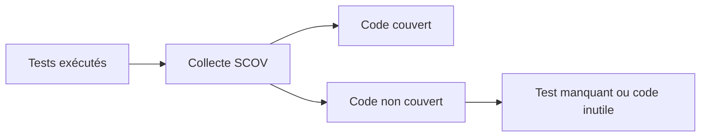

# 🍧 MESURER LA COUVERTURE AVEC SCOV

## 🎯 Objectif

Mesurer quelles parties du code ont réellement été exécutées pendant une campagne de tests.

## 🛠️ Transaction SCOV

`SCOV` permet d’activer la collecte, de définir des groupes et d’afficher la couverture selon les fonctions disponibles sur la release.

## 📊 Interprétation

La couverture répond à la question : **ce code a-t-il été exécuté ?** Elle ne répond pas à : **le résultat a-t-il été correctement vérifié ?**

## 🎯 Utilisations

- identifier des branches non testées ;
- vérifier qu’un scénario de recette traverse le code attendu ;
- repérer du code potentiellement mort ;
- suivre l’évolution d’un périmètre critique.

## ⚠️ Précautions

- activer la collecte selon les règles d’administration ;
- inclure tous les serveurs applicatifs concernés lorsque nécessaire ;
- limiter le périmètre et la durée ;
- ne pas viser mécaniquement 100 % ;
- analyser la qualité des assertions en parallèle.

## ✅ Lecture utile

Une branche métier critique non couverte est prioritaire. Une ligne technique sans enjeu peut rester moins importante qu’un test de limite manquant.

## 🔗 Références SAP officielles

- [SAP Help Portal — Coverage Analyzer](https://help.sap.com/docs/ABAP_PLATFORM_NEW/ba879a6e2ea04d9bb94c7ccd7cdac446/49216c634ab514cde10000000a42189b.html)
- [SAP Help Portal — ABAP Unit](https://help.sap.com/docs/ABAP_PLATFORM_NEW/ba879a6e2ea04d9bb94c7ccd7cdac446/491cfd8926bc14cde10000000a42189b.html)

---

➡️ [Chapitre suivant : STRATEGIE DE TEST ET NON REGRESSION](<23 - 🍧 STRATEGIE DE TEST ET NON REGRESSION.md>)
