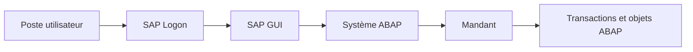
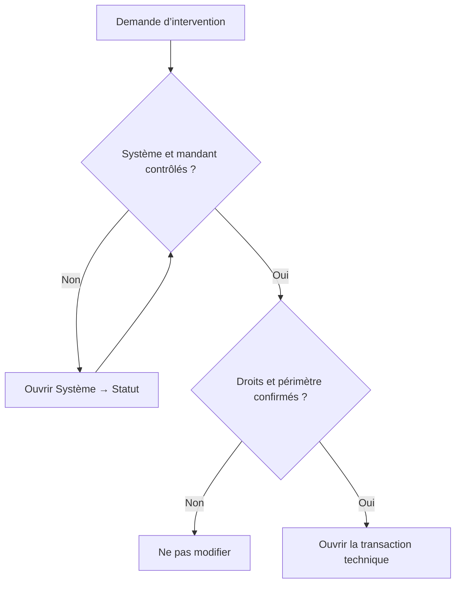

# ENVIRONNEMENT SAP GUI

## OBJECTIFS

- Distinguer le client SAP GUI du système ABAP auquel il se connecte
- Identifier le système, le mandant, l’utilisateur et la transaction en cours
- Naviguer avec SAP Easy Access et le champ de commande
- Utiliser les aides standard `F1` et `F4`
- Éviter les erreurs d’intervention sur un mauvais environnement

## VUE D’ENSEMBLE



## SAP GUI ET SYSTÈME ABAP

`SAP GUI` est le client graphique utilisé pour accéder à un système SAP reposant sur un serveur d’applications ABAP.

Il faut distinguer :

| Élément         | Rôle                                                               |
| --------------- | ------------------------------------------------------------------ |
| SAP Logon       | Répertorie les connexions disponibles                              |
| SAP GUI         | Affiche les écrans et transmet les actions utilisateur             |
| Système ABAP    | Exécute les transactions, programmes et contrôles d’autorisation   |
| Mandant         | Sépare une partie des données et du paramétrage au sein du système |
| Utilisateur SAP | Porte les autorisations, paramètres et préférences de session      |

> [!IMPORTANT]
> Un même poste peut contenir plusieurs connexions vers des environnements différents : développement, qualité, recette ou production. Le nom visuel de la connexion ne suffit pas toujours pour confirmer l’environnement réellement ouvert.

## QU’EST-CE QU’UN MANDANT ?

Un **mandant** est une subdivision logique d’un système SAP. Il est identifié par un numéro à trois chiffres, par exemple `100`, `200` ou `300`.

Un même système peut contenir plusieurs mandants. Ils partagent le même Repository ABAP actif, mais une partie de leurs données, de leur paramétrage et de leurs utilisateurs peut être séparée.

| Élément | Exemple | Portée habituelle |
| --- | --- | --- |
| Système | `D01` | Ensemble technique complet |
| Mandant | `200` | Contexte logique dans le système |
| Utilisateur | `DEV_USER` | Identité et autorisations dans le mandant |
| Programme ABAP | `ZDEV_REPORT` | Généralement commun aux mandants du système |
| Données d’une table avec `MANDT` | Ligne du mandant `200` | Séparées par mandant |

Dans une table dépendante du mandant, le premier champ de clé est généralement `MANDT`. ABAP SQL applique normalement automatiquement le mandant courant. Les accès inter-mandants sont des cas particuliers qui exigent une justification et des autorisations adaptées.

### COMMENT IDENTIFIER LE MANDANT COURANT

1. ouvrir le menu **Système** ;
2. choisir **Statut** ;
3. relever le **mandant**, le **système** et l’**utilisateur** ;
4. vérifier ces informations avant toute création, modification ou exécution destructive.

> [!IMPORTANT]
> Un programme activé dans un système ABAP est généralement visible dans tous les mandants du système. Modifier le code dans le « bon mandant » ne protège donc pas les autres mandants du même système.

## CONNEXION

Une connexion SAP demande généralement :

- un **mandant** ;
- un **utilisateur** ;
- un **mot de passe** ;
- une **langue de connexion**.

La combinaison système, mandant et utilisateur détermine le contexte de travail.

### CONTRÔLE DU CONTEXTE

Avant toute modification :

1. ouvrir **Système → Statut** ;
2. contrôler le système et le mandant ;
3. contrôler l’utilisateur connecté ;
4. identifier la transaction et le programme actifs si nécessaire ;
5. confirmer que l’environnement autorise la modification prévue.

> [!CAUTION]
> Ne jamais déduire qu’un système est un environnement de développement uniquement à partir de sa couleur SAP GUI ou du texte affiché dans SAP Logon. Ces éléments sont configurables.

## SAP EASY ACCESS

SAP Easy Access constitue le point d’entrée classique de SAP GUI. Il permet notamment d’utiliser :

- le menu utilisateur ;
- le menu SAP ;
- les favoris ;
- le champ de commande ;
- plusieurs sessions SAP GUI.

L’affichage des noms techniques peut être activé afin de faire apparaître les codes de transaction dans l’arborescence.

## CHAMP DE COMMANDE

Le champ de commande permet d’appeler directement une transaction.

| Saisie   | Effet                                                                |
| -------- | -------------------------------------------------------------------- |
| `SE38`   | Appelle la transaction depuis SAP Easy Access                        |
| `/nSE38` | Termine la transaction courante et ouvre `SE38` dans la même session |
| `/oSE38` | Ouvre `SE38` dans une nouvelle session                               |
| `/n`     | Revient à SAP Easy Access en quittant la transaction courante        |
| `/h`     | Active le débogage pour la prochaine action compatible               |

> [!NOTE]
> L’ouverture de nouvelles sessions peut être limitée par la configuration du système.

## AIDES STANDARD

### AIDE F1

`F1` affiche l’aide associée à un champ ou à un élément de l’interface.

Dans de nombreux écrans, l’aide permet aussi d’accéder aux **informations techniques** :

- programme ;
- dynpro ;
- nom technique du champ ;
- élément de données ;
- table ou structure de référence.

Ces informations sont essentielles pour analyser un écran standard ou préparer une recherche dans le Repository.

### AIDE F4

`F4` ouvre l’aide à la saisie lorsqu’elle existe. Elle peut présenter :

- une liste fixe ;
- une aide à la recherche ;
- une recherche multicritère ;
- des valeurs provenant du Dictionnaire ABAP.

> [!TIP]
> Utiliser `F1` pour comprendre un champ et `F4` pour rechercher une valeur autorisée.

## RÉFLEXES AVANT INTERVENTION



- vérifier l’environnement avant toute création ou modification ;
- éviter de travailler avec plusieurs systèmes visuellement similaires sans contrôle explicite ;
- ne pas partager d’identifiants ni de captures contenant des données sensibles ;
- fermer les sessions devenues inutiles ;
- utiliser les transactions techniques uniquement avec les autorisations adaptées.

## PROCÉDURE PAS À PAS

1. Ouvrir la connexion concernée dans SAP Logon.
2. Dans SAP GUI, ouvrir **Système → Statut**.
3. Relever le SID, le mandant, l’utilisateur et le serveur d’application.
4. Comparer ces valeurs avec le ticket, la consigne de l’équipe ou la documentation du paysage.
5. Vérifier que l’action demandée est autorisée dans cet environnement.
6. Ouvrir la transaction avec `/n<code>` dans la même session ou `/o<code>` dans une nouvelle session.
7. Avant une modification ou une exécution destructive, refaire le contrôle du contexte.

## VÉRIFICATION

- Le SID, le mandant et l’utilisateur relevés correspondent au contexte demandé.
- Le lecteur sait expliquer pourquoi deux mandants d’un même système partagent généralement le même programme actif mais pas nécessairement les mêmes données.
- La transaction ouverte est bien celle attendue et l’action est autorisée dans l’environnement.
- La fiche de contrôle contient un horodatage et peut être jointe au diagnostic.

## ERREURS FRÉQUENTES

- Intervenir dans le mauvais système ou mandant.
- Confondre sauvegarde et activation.

## FICHE DE CONTRÔLE À COPIER

```text
Système / SID       :
Mandant             :
Utilisateur         :
Transaction / outil :
Objet technique     :
Jeu de données      :
Résultat attendu    :
Résultat observé    :
Horodatage          :
Ordre de transport  :
```

## TERMES DU LEXIQUE

- [Environnement](<../00 ├── LEXIQUE SAP ET ABAP/01 ├── SYSTEMES ENVIRONNEMENTS ET MANDANTS.md#environnement>)
- [SAP GUI](<../00 ├── LEXIQUE SAP ET ABAP/02 ├── SAP GUI NAVIGATION ET TRANSACTIONS.md#sap-gui>)
- [Système SAP](<../00 ├── LEXIQUE SAP ET ABAP/01 ├── SYSTEMES ENVIRONNEMENTS ET MANDANTS.md#systeme-sap>)
- [Mandant](<../00 ├── LEXIQUE SAP ET ABAP/01 ├── SYSTEMES ENVIRONNEMENTS ET MANDANTS.md#mandant>)
- [Transaction](<../00 ├── LEXIQUE SAP ET ABAP/02 ├── SAP GUI NAVIGATION ET TRANSACTIONS.md#transaction>)
- [Repository ABAP](<../00 ├── LEXIQUE SAP ET ABAP/03 ├── REPOSITORY PACKAGES ET TRANSPORTS.md#repository-abap>)

## RÉFÉRENCES OFFICIELLES SAP

- [SAP GUI for Windows — Command Field](https://help.sap.com/docs/sap_gui_for_windows/63bd20104af84112973ad59590645513/d1a516153a4d438691ecee7f83a5d77b.html)
- [SAP GUI — SAP Easy Access](https://help.sap.com/docs/ABAP_PLATFORM_1909/b1c834a22d05483b8a75710743b5ff26/cb11a43814a54af19c4bcf0221c24eb7.html)
- [SAP GUI — Using Transaction Codes](https://help.sap.com/docs/SAP_NETWEAVER_AS_ABAP_FOR_SOH_740/b1c834a22d05483b8a75710743b5ff26/f735dd776e724195b5562592a5e88b45.html)
- [SAP GUI for Windows — Fields and Input Help](https://help.sap.com/docs/sap_gui_for_windows/63bd20104af84112973ad59590645513/a7ca442f0a4d43ddb266e5a73dbb989d.html)


---

[Chapitre suivant — OBJETS DU REPOSITORY ABAP](<./02 ├── OBJETS DU REPOSITORY ABAP.md>)
