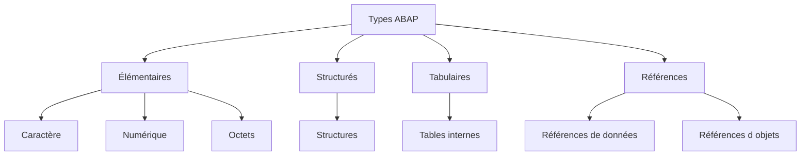

# SYSTÈME DE TYPES ABAP

## OBJECTIFS

- Distinguer un type de données d’un objet de données
- Comprendre le rôle du typage dans l’exécution d’un programme ABAP
- Identifier les principales catégories de types et d’objets
- Distinguer les définitions locales des types globaux du Dictionnaire ABAP
- Choisir un type adapté à la donnée métier manipulée

## TYPE ET OBJET DE DONNÉES

Un **type de données** décrit les propriétés d’une valeur :

- nature de la donnée ;
- longueur éventuelle ;
- nombre de décimales éventuel ;
- organisation en composants pour un type structuré ;
- opérations autorisées.

Un **objet de données** est une zone de données utilisable pendant l’exécution. Il possède toujours un type.


Exemple :

```abap
DATA lv_quantity TYPE i VALUE 10.
```

| Élément       | Signification                         |
| ------------- | ------------------------------------- |
| `i`           | Type de données entier                |
| `lv_quantity` | Objet de données variable             |
| `10`          | Valeur initiale explicitement fournie |

## TYPOLOGIE GÉNÉRALE



Ce dossier traite :

- des types élémentaires ;
- des structures ;
- des références de données ;
- des variables, constantes et field-symbols.

Les tables internes et les références d’objets seront détaillées dans leurs dossiers respectifs.

## SOURCES DES TYPES

Un objet de données peut être typé à partir de plusieurs sources.

| Source                                | Exemple                    | Portée                                      |
| ------------------------------------- | -------------------------- | ------------------------------------------- |
| Type ABAP intégré                     | `TYPE i`                   | Disponible dans le langage                  |
| Type local                            | `TYPE ty_amount`           | Programme ou procédure selon la déclaration |
| Objet du Dictionnaire ABAP            | `TYPE bukrs`               | Global au système ABAP                      |
| Type public d’une classe ou interface | `TYPE zcl_demo=>ty_result` | Global si la visibilité l’autorise          |
| Type d’un objet visible               | `LIKE lv_source`           | Dépend de l’objet référencé                 |

> [!NOTE]
> Le Dictionnaire ABAP sera traité dans un dossier dédié. Ici, ses objets sont uniquement utilisés comme sources de typage.

## TYPE COMPLET ET TYPE GÉNÉRIQUE

Un **type complet** détermine entièrement les propriétés techniques d’un objet. Il peut servir à déclarer une variable autonome.

```abap
DATA lv_text TYPE c LENGTH 40.
```

Un **type générique** ne décrit qu’un ensemble de types possibles. Il est principalement utilisé pour typer des paramètres de procédures ou des field-symbols.

```abap
FIELD-SYMBOLS <lv_value> TYPE any.
```

Il n’est pas possible de créer une variable autonome de type générique `any` avec une déclaration classique `DATA`.

## TYPE LIÉ ET TYPE AUTONOME

Un type créé avec `TYPES` est un type autonome réutilisable dans sa zone de visibilité.

```abap
TYPES ty_customer_id TYPE c LENGTH 10.

DATA lv_customer_id TYPE ty_customer_id.
DATA lv_payer_id    TYPE ty_customer_id.
```

Une déclaration basée directement sur un autre objet avec `LIKE` reprend le type de cet objet sans créer un type nommé autonome.

```abap
DATA lv_copy LIKE lv_customer_id.
```

Pour une donnée métier réutilisée, un type nommé ou un type global du Dictionnaire est généralement plus explicite qu’une succession de déclarations dépendantes avec `LIKE`.

## CHOIX DU TYPE

Le type doit refléter la **sémantique** de la donnée, pas uniquement son apparence.

| Donnée                            | Choix cohérent                            | Choix risqué                                 |
| --------------------------------- | ----------------------------------------- | -------------------------------------------- |
| Quantité entière de tentatives    | `i`                                       | `c LENGTH 10`                                |
| Montant décimal                   | `p` avec décimales ou type métier du DDIC | `f` sans justification                       |
| Texte de longueur variable        | `string`                                  | `c` surdimensionné systématiquement          |
| Identifiant numérique non calculé | `n` ou type métier du DDIC                | `i` si les zéros initiaux sont significatifs |
| Date SAP classique                | `d` ou type métier du DDIC                | chaîne libre                                 |

> [!IMPORTANT]
> Deux champs techniquement compatibles ne sont pas nécessairement sémantiquement interchangeables. Une société, une division et un numéro de document peuvent avoir la même longueur sans représenter la même donnée métier.

## EXEMPLE DE SYNTHÈSE

```abap
REPORT zdemo_types_abap.

TYPES ty_rate TYPE p LENGTH 5 DECIMALS 2.

CONSTANTS lc_default_rate TYPE ty_rate VALUE '20.00'.

DATA lv_rate  TYPE ty_rate VALUE lc_default_rate.
DATA lv_label TYPE string  VALUE `Taux appliqué`.

WRITE: / lv_label, lv_rate.
```

Dans cet exemple :

1. `ty_rate` définit un type local ;
2. `lc_default_rate` est une constante typée ;
3. `lv_rate` est une variable du même type ;
4. `lv_label` est une chaîne de caractères variable.

## VÉRIFICATION

- Le contrôle syntaxique réussit.
- La version active correspond au code sauvegardé.
- L’exécution produit le résultat décrit dans le chapitre.
- Les cas vide, limite et erreur sont testés séparément lorsque la syntaxe le permet.

## ERREURS FRÉQUENTES

- Copier un exemple sans adapter les types, noms d’objets et données disponibles dans le système.
- Tester uniquement le cas nominal et ignorer les valeurs initiales, absentes ou invalides.
- Choisir un type trop générique ou dépendant d’une variable existante sans justification.
- Utiliser une référence ou un field-symbol non lié.

## SNIPPET À RÉUTILISER

> [!NOTE]
> Adapter les noms `Z*`, les types DDIC, les données et les autorisations au système cible. Effectuer un contrôle syntaxique avant activation.

```abap
REPORT zdemo_types_abap.

TYPES ty_rate TYPE p LENGTH 5 DECIMALS 2.

CONSTANTS lc_default_rate TYPE ty_rate VALUE '20.00'.

DATA lv_rate  TYPE ty_rate VALUE lc_default_rate.
DATA lv_label TYPE string  VALUE `Taux appliqué`.

WRITE: / lv_label, lv_rate.
```

## TERMES DU LEXIQUE

- [ABAP](<../00 ├── LEXIQUE SAP ET ABAP/10 └── ACRONYMES SAP.md#acro-abap>)
- [Type de données](<../00 ├── LEXIQUE SAP ET ABAP/04 ├── LANGAGE ET DEVELOPPEMENT ABAP.md#type-donnees>)
- [Objet de données](<../00 ├── LEXIQUE SAP ET ABAP/04 ├── LANGAGE ET DEVELOPPEMENT ABAP.md#objet-donnees>)
- [Structure](<../00 ├── LEXIQUE SAP ET ABAP/04 ├── LANGAGE ET DEVELOPPEMENT ABAP.md#structure-abap>)
- [Table interne](<../00 ├── LEXIQUE SAP ET ABAP/04 ├── LANGAGE ET DEVELOPPEMENT ABAP.md#table-interne>)
- [Field-symbol](<../00 ├── LEXIQUE SAP ET ABAP/04 ├── LANGAGE ET DEVELOPPEMENT ABAP.md#field-symbol>)

## RÉFÉRENCES OFFICIELLES SAP

- [Working With Basic Data Objects and Data Types](https://learning.sap.com/courses/basic-abap-programming/working-with-basic-data-objects-and-data-types_cf92dee2-85ec-4b9f-a778-1a7cfef70dad)
- [Data Types — SAP Help Portal](https://help.sap.com/docs/abap-cloud/abap-concepts/data-types)
- [Bound and Standalone Data Types — ABAP Keyword Documentation](https://help.sap.com/doc/abapdocu_latest_index_htm/latest/en-US/ABENBOUND_INDEPENDENT_DTYPE_GUIDL.html)


---

[Chapitre suivant — TYPES ÉLÉMENTAIRES INTÉGRÉS](<./02 ├── TYPES ELEMENTAIRES INTEGRES.md>)
