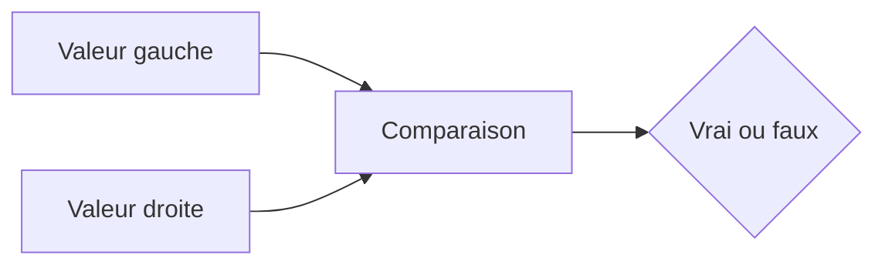

# EXPRESSIONS LOGIQUES ET COMPARAISONS

## OBJECTIFS

- Construire une expression logique
- Comparer des valeurs numériques et textuelles
- Utiliser les prédicats usuels
- Combiner plusieurs conditions avec `AND`, `OR` et `NOT`
- Comprendre les risques liés aux conversions pendant une comparaison

## RÉSULTAT LOGIQUE

Une expression logique produit un résultat vrai ou faux. Elle est utilisée par les structures de contrôle et par certaines expressions conditionnelles.



Exemple :

```abap
DATA lv_quantity TYPE i VALUE 10.

IF lv_quantity > 0.
  WRITE / 'Quantité positive'.
ENDIF.
```

## OPÉRATEURS DE COMPARAISON

| Symbolique | Mot-clé | Signification     |
| ---------- | ------- | ----------------- |
| `=`        | `EQ`    | Égal              |
| `<>`       | `NE`    | Différent         |
| `<`        | `LT`    | Inférieur         |
| `>`        | `GT`    | Supérieur         |
| `<=`       | `LE`    | Inférieur ou égal |
| `>=`       | `GE`    | Supérieur ou égal |

Les formes symboliques et textuelles expriment les mêmes comparaisons.

```abap
IF lv_quantity >= 10.
  WRITE / 'Seuil atteint'.
ENDIF.
```

## COMBINAISON DE CONDITIONS

```abap
IF lv_quantity > 0 AND lv_quantity <= 100.
  WRITE / 'Quantité valide'.
ENDIF.
```

| Opérateur | Résultat                                  |
| --------- | ----------------------------------------- |
| `AND`     | Vrai si les deux expressions sont vraies  |
| `OR`      | Vrai si au moins une expression est vraie |
| `NOT`     | Inverse le résultat logique               |

Utiliser des parenthèses pour rendre l’ordre explicite :

```abap
IF ( lv_status = 'A' OR lv_status = 'B' )
   AND lv_quantity > 0.
  WRITE / 'Traitement autorisé'.
ENDIF.
```

## PRÉDICATS USUELS

### Valeur initiale

```abap
IF lv_text IS INITIAL.
  WRITE / 'Valeur initiale'.
ENDIF.
```

```abap
IF lv_text IS NOT INITIAL.
  WRITE / lv_text.
ENDIF.
```

### Référence liée

```abap
IF lr_data IS BOUND.
  WRITE / 'Référence utilisable'.
ENDIF.
```

### Field-symbol affecté

```abap
IF <lv_value> IS ASSIGNED.
  WRITE / <lv_value>.
ENDIF.
```

## OPÉRATEURS POUR CHAÎNES DE CARACTÈRES

| Opérateur | Signification                                      |
| --------- | -------------------------------------------------- |
| `CO`      | Contient uniquement les caractères indiqués        |
| `CN`      | Ne contient pas uniquement les caractères indiqués |
| `CA`      | Contient au moins un des caractères indiqués       |
| `NA`      | Ne contient aucun des caractères indiqués          |
| `CS`      | Contient la sous-chaîne                            |
| `NS`      | Ne contient pas la sous-chaîne                     |
| `CP`      | Correspond à un motif simple                       |
| `NP`      | Ne correspond pas au motif simple                  |

```abap
DATA lv_code TYPE string VALUE `ABAP-2026`.

IF lv_code CS `ABAP`.
  WRITE / 'Préfixe trouvé'.
ENDIF.
```

`CP` utilise les caractères génériques du langage ABAP, notamment `*` et `+`. Il ne s’agit pas d’une expression régulière.

```abap
IF lv_code CP `ABAP-*`.
  WRITE / 'Motif simple respecté'.
ENDIF.
```

## COMPARAISON ET CONVERSION

Lorsque les opérandes n’ont pas le même type, ABAP applique des règles de comparaison et peut convertir une valeur.

```abap
DATA lv_number TYPE i VALUE 10.
DATA lv_text   TYPE c LENGTH 2 VALUE '10'.

IF lv_number = lv_text.
  WRITE / 'Valeurs considérées comme égales'.
ENDIF.
```

Cette possibilité ne justifie pas un modèle de données incohérent. Comparer des objets ayant une sémantique et des types compatibles réduit les résultats inattendus.

## ABAP_BOOL

ABAP classique utilise souvent le type `abap_bool` et les constantes :

- `abap_true` ;
- `abap_false` ;
- `abap_undefined`.

```abap
DATA lv_is_valid TYPE abap_bool.

lv_is_valid = xsdbool( lv_quantity > 0 ).
```

`xsdbool( )` transforme le résultat d’une expression logique en valeur de type `abap_bool`.

## VÉRIFICATION

- Le contrôle syntaxique réussit.
- La version active correspond au code sauvegardé.
- L’exécution produit le résultat décrit dans le chapitre.
- Les cas vide, limite et erreur sont testés séparément lorsque la syntaxe le permet.

## ERREURS FRÉQUENTES

- Copier un exemple sans adapter les types, noms d’objets et données disponibles dans le système.
- Tester uniquement le cas nominal et ignorer les valeurs initiales, absentes ou invalides.
- S’appuyer sur une conversion implicite pouvant tronquer ou arrondir.
- Ignorer l’encodage et les formats externes.

## SNIPPET À RÉUTILISER

> [!NOTE]
> Adapter les noms `Z*`, les types DDIC, les données et les autorisations au système cible. Effectuer un contrôle syntaxique avant activation.

```abap
DATA lv_number TYPE i VALUE 10.
DATA lv_text   TYPE c LENGTH 2 VALUE '10'.

IF lv_number = lv_text.
  WRITE / 'Valeurs considérées comme égales'.
ENDIF.
```

## TERMES DU LEXIQUE

- [Expression](<../00 ├── LEXIQUE SAP ET ABAP/04 ├── LANGAGE ET DEVELOPPEMENT ABAP.md#expression>)
- [Instruction ABAP](<../00 ├── LEXIQUE SAP ET ABAP/04 ├── LANGAGE ET DEVELOPPEMENT ABAP.md#instruction-abap>)
- [Type de données](<../00 ├── LEXIQUE SAP ET ABAP/04 ├── LANGAGE ET DEVELOPPEMENT ABAP.md#type-donnees>)

## RÉFÉRENCES OFFICIELLES SAP

- [Logical Expressions — ABAP Keyword Documentation](https://help.sap.com/doc/abapdocu_latest_index_htm/latest/en-US/ABENLOG_EXP_SHORTREF.html)
- [Character-Like Comparison Operators — ABAP Keyword Documentation](https://help.sap.com/doc/abapdocu_latest_index_htm/latest/en-US/ABENLOGEXP_STRINGS.html)


---

[Chapitre suivant — CONVERSIONS IMPLICITES](<./06 ├── CONVERSIONS IMPLICITES.md>)
