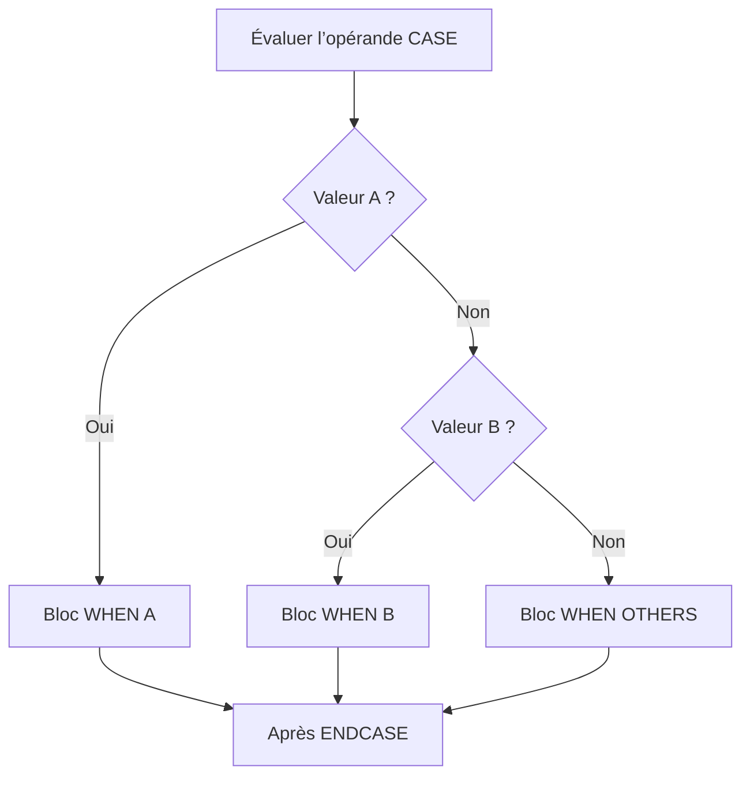

# BRANCHEMENTS AVEC CASE

## OBJECTIFS

- Sélectionner un traitement selon la valeur d’un opérande
- Utiliser `WHEN` et `WHEN OTHERS`
- Regrouper plusieurs valeurs dans une branche
- Comprendre la différence entre `CASE` et `IF`
- Éviter les branches silencieusement ignorées

## STRUCTURE GÉNÉRALE

`CASE` compare un opérande à plusieurs valeurs possibles.

```abap
DATA lv_status TYPE c LENGTH 1 VALUE 'A'.

CASE lv_status.
  WHEN 'A'.
    WRITE: / 'Actif'.
  WHEN 'B'.
    WRITE: / 'Bloqué'.
  WHEN OTHERS.
    WRITE: / 'Statut inconnu'.
ENDCASE.
```



Une seule branche est exécutée.

## TRAITEMENT PAR DÉFAUT

`WHEN OTHERS` intercepte toutes les valeurs non traitées auparavant.

```abap
CASE lv_action.
  WHEN 'CREATE'.
    WRITE: / 'Création'.
  WHEN 'UPDATE'.
    WRITE: / 'Modification'.
  WHEN OTHERS.
    WRITE: / 'Action non prise en charge'.
ENDCASE.
```

> [!IMPORTANT]
> L’absence de `WHEN OTHERS` est valide. Dans ce cas, aucune branche n’est exécutée lorsqu’aucune valeur ne correspond. Ce comportement doit être intentionnel.

## REGROUPER PLUSIEURS VALEURS

Plusieurs valeurs peuvent déclencher le même bloc avec `OR`.

```abap
DATA lv_language TYPE sylangu VALUE sy-langu.

CASE lv_language.
  WHEN 'F' OR 'E'.
    WRITE: / 'Langue prise en charge'.
  WHEN OTHERS.
    WRITE: / 'Langue à vérifier'.
ENDCASE.
```

`OR` dans une branche `WHEN` regroupe des valeurs d’égalité. Il ne remplace pas une expression logique générale.

## CASE AVEC CONSTANTES

Les constantes rendent les branches plus explicites.

```abap
CONSTANTS:
  lc_status_open   TYPE c LENGTH 1 VALUE 'O',
  lc_status_closed TYPE c LENGTH 1 VALUE 'C'.

CASE lv_status.
  WHEN lc_status_open.
    WRITE: / 'Ouvert'.
  WHEN lc_status_closed.
    WRITE: / 'Fermé'.
  WHEN OTHERS.
    WRITE: / 'Statut invalide'.
ENDCASE.
```

## CASE N’EST PAS UN TEST DE PLAGE

Pour des intervalles, des comparaisons complexes ou plusieurs objets de données, utiliser `IF`.

```abap
IF lv_amount < 0.
  WRITE: / 'Montant négatif'.
ELSEIF lv_amount BETWEEN 0 AND 100.
  WRITE: / 'Montant standard'.
ELSE.
  WRITE: / 'Montant élevé'.
ENDIF.
```

Un `CASE` est adapté lorsqu’un même opérande est comparé par égalité à une liste de valeurs.

## BRANCHES VIDES

Ne pas conserver une branche vide sans explication.

```abap
CASE lv_status.
  WHEN 'A'.
    WRITE: / 'Actif'.
  WHEN 'I'.
    " Statut inactif : aucun traitement requis
  WHEN OTHERS.
    WRITE: / 'Statut inconnu'.
ENDCASE.
```

Une branche vide peut masquer un oubli. Un commentaire doit justifier l’absence volontaire de traitement.

## VÉRIFICATION

- Le contrôle syntaxique réussit.
- La version active correspond au code sauvegardé.
- L’exécution produit le résultat décrit dans le chapitre.
- Les cas vide, limite et erreur sont testés séparément lorsque la syntaxe le permet.

## ERREURS FRÉQUENTES

- Copier un exemple sans adapter les types, noms d’objets et données disponibles dans le système.
- Tester uniquement le cas nominal et ignorer les valeurs initiales, absentes ou invalides.
- Créer une boucle sans condition de sortie fiable.
- Utiliser `CHECK`, `CONTINUE`, `EXIT` ou `RETURN` sans rendre le flux lisible.

## SNIPPET À RÉUTILISER

> [!NOTE]
> Adapter les noms `Z*`, les types DDIC, les données et les autorisations au système cible. Effectuer un contrôle syntaxique avant activation.

```abap
IF lv_amount < 0.
  WRITE: / 'Montant négatif'.
ELSEIF lv_amount BETWEEN 0 AND 100.
  WRITE: / 'Montant standard'.
ELSE.
  WRITE: / 'Montant élevé'.
ENDIF.
```

## TERMES DU LEXIQUE

- [Instruction ABAP](<../00 ├── LEXIQUE SAP ET ABAP/04 ├── LANGAGE ET DEVELOPPEMENT ABAP.md#instruction-abap>)
- [Expression](<../00 ├── LEXIQUE SAP ET ABAP/04 ├── LANGAGE ET DEVELOPPEMENT ABAP.md#expression>)

## RÉFÉRENCES OFFICIELLES SAP

- [Using Control Structures in ABAP — SAP Learning](https://learning.sap.com/courses/basic-abap-programming/using-control-structures-in-abap_a4d7803e-eac2-458e-acf9-8628289f3701)
- [Control Flow — SAP Help Portal](https://help.sap.com/docs/ABAP_PLATFORM_NEW/8132142fd1a144a59303663a03a7c2d4/94e1b1978adf45c1a72bd9d8075436d3.html)
- [CASE — ABAP Keyword Documentation](https://help.sap.com/doc/abapdocu_latest_index_htm/latest/en-US/index.htm?file=abapcase.htm)


---

[Chapitre suivant — CHOISIR ENTRE IF ET CASE](<./04 ├── CHOISIR ENTRE IF ET CASE.md>)
