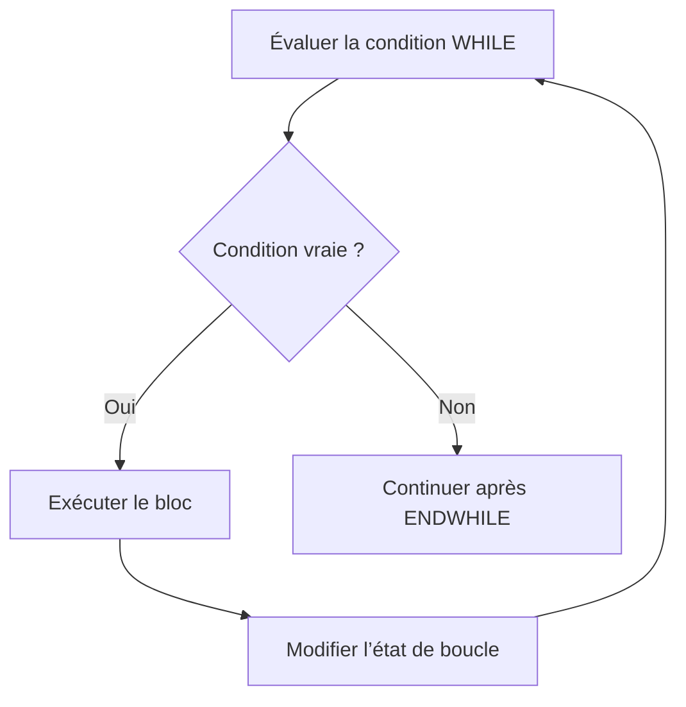

# BOUCLES CONDITIONNELLES AVEC WHILE

## OBJECTIFS

- Répéter un traitement tant qu’une condition est vraie
- Comprendre l’évaluation avant la première itération
- Modifier explicitement l’état qui pilote la boucle
- Ajouter une limite de sécurité
- Choisir entre `WHILE` et `DO`

## PRINCIPE

`WHILE` évalue la condition avant chaque itération.

```abap
DATA lv_counter TYPE i VALUE 1.

WHILE lv_counter <= 5.
  WRITE: / 'Compteur :', lv_counter.
  ADD 1 TO lv_counter.
ENDWHILE.
```



Si la condition est fausse dès le départ, le bloc n’est jamais exécuté.

## ÉTAT DE BOUCLE EXPLICITE

La condition doit dépendre d’une valeur susceptible d’évoluer.

```abap
DATA lv_remaining TYPE i VALUE 3.

WHILE lv_remaining > 0.
  WRITE: / 'Restant :', lv_remaining.
  SUBTRACT 1 FROM lv_remaining.
ENDWHILE.
```

À éviter :

```abap
WHILE lv_remaining > 0.
  WRITE: / lv_remaining.
ENDWHILE.
```

Si `lv_remaining` n’est jamais modifié, la boucle peut être infinie.

## WHILE AVEC INDICATEUR

```abap
DATA lv_complete TYPE abap_bool VALUE abap_false.
DATA lv_attempt  TYPE i.

WHILE lv_complete = abap_false.
  ADD 1 TO lv_attempt.

  IF lv_attempt >= 3.
    lv_complete = abap_true.
  ENDIF.
ENDWHILE.
```

Un indicateur doit représenter un état métier clair. Éviter les noms génériques comme `lv_flag` lorsque plusieurs états sont possibles.

## AJOUTER UNE LIMITE TECHNIQUE

```abap
CONSTANTS lc_max_iterations TYPE i VALUE 100.
DATA lv_iteration TYPE i.
DATA lv_complete  TYPE abap_bool VALUE abap_false.

WHILE lv_complete = abap_false
  AND lv_iteration < lc_max_iterations.

  ADD 1 TO lv_iteration.
  " Traitement susceptible de positionner lv_complete
ENDWHILE.

IF lv_complete = abap_false.
  WRITE: / 'Traitement interrompu par la limite technique'.
ENDIF.
```

La limite protège le système contre un état fonctionnel qui ne progresse plus.

## CHOISIR ENTRE DO ET WHILE

| Situation                                         | Structure                                  |
| ------------------------------------------------- | ------------------------------------------ |
| Nombre d’itérations connu                         | `DO n TIMES`                               |
| Répétition pilotée par un état                    | `WHILE`                                    |
| Boucle volontairement ouverte avec sortie interne | `DO` avec `EXIT`, à utiliser avec prudence |
| Parcours d’une table interne                      | `LOOP AT`, traité ultérieurement           |

## CONDITION TROP COMPLEXE

Une condition de boucle très longue est difficile à vérifier.

Avant :

```abap
WHILE lv_active = abap_true
  AND lv_blocked = abap_false
  AND lv_attempt < lc_max_attempts
  AND lv_result IS INITIAL.
  " Traitement
ENDWHILE.
```

Une variable nommée peut clarifier l’intention si elle est recalculée à chaque passage :

```abap
DATA lv_can_continue TYPE abap_bool.

lv_can_continue = xsdbool(
  lv_active = abap_true
  AND lv_blocked = abap_false
  AND lv_attempt < lc_max_attempts
  AND lv_result IS INITIAL ).

WHILE lv_can_continue = abap_true.
  " Traitement

  lv_can_continue = xsdbool(
    lv_active = abap_true
    AND lv_blocked = abap_false
    AND lv_attempt < lc_max_attempts
    AND lv_result IS INITIAL ).
ENDWHILE.
```

## VÉRIFICATION

- Le contrôle syntaxique réussit.
- La version active correspond au code sauvegardé.
- L’exécution produit le résultat décrit dans le chapitre.
- Les cas vide, limite et erreur sont testés séparément lorsque la syntaxe le permet.

## ERREURS FRÉQUENTES

- Copier un exemple sans adapter les types, noms d’objets et données disponibles dans le système.
- Tester uniquement le cas nominal et ignorer les valeurs initiales, absentes ou invalides.
- Créer une boucle sans condition de sortie fiable.
- Utiliser `CHECK`, `CONTINUE`, `EXIT` ou `RETURN` sans rendre le flux lisible.

## SNIPPET À RÉUTILISER

> [!NOTE]
> Adapter les noms `Z*`, les types DDIC, les données et les autorisations au système cible. Effectuer un contrôle syntaxique avant activation.

```abap
DATA lv_can_continue TYPE abap_bool.

lv_can_continue = xsdbool(
  lv_active = abap_true
  AND lv_blocked = abap_false
  AND lv_attempt < lc_max_attempts
  AND lv_result IS INITIAL ).

WHILE lv_can_continue = abap_true.
  " Traitement

  lv_can_continue = xsdbool(
    lv_active = abap_true
    AND lv_blocked = abap_false
    AND lv_attempt < lc_max_attempts
    AND lv_result IS INITIAL ).
ENDWHILE.
```

## TERMES DU LEXIQUE

- [Instruction ABAP](<../00 ├── LEXIQUE SAP ET ABAP/04 ├── LANGAGE ET DEVELOPPEMENT ABAP.md#instruction-abap>)
- [Expression](<../00 ├── LEXIQUE SAP ET ABAP/04 ├── LANGAGE ET DEVELOPPEMENT ABAP.md#expression>)

## RÉFÉRENCES OFFICIELLES SAP

- [Using Control Structures in ABAP — SAP Learning](https://learning.sap.com/courses/basic-abap-programming/using-control-structures-in-abap_a4d7803e-eac2-458e-acf9-8628289f3701)
- [WHILE — ABAP Keyword Documentation](https://help.sap.com/doc/abapdocu_latest_index_htm/latest/en-US/ABAPWHILE_SHORTREF.html)
- [ABAP Statements, Overview — ABAP Keyword Documentation](https://help.sap.com/doc/abapdocu_latest_index_htm/latest/en-US/ABENABAP_STATEMENTS_OVERVIEW.html)


---

[Chapitre suivant — COMPTEUR DE BOUCLE SY-INDEX](<./08 ├── COMPTEUR DE BOUCLE SY INDEX.md>)
