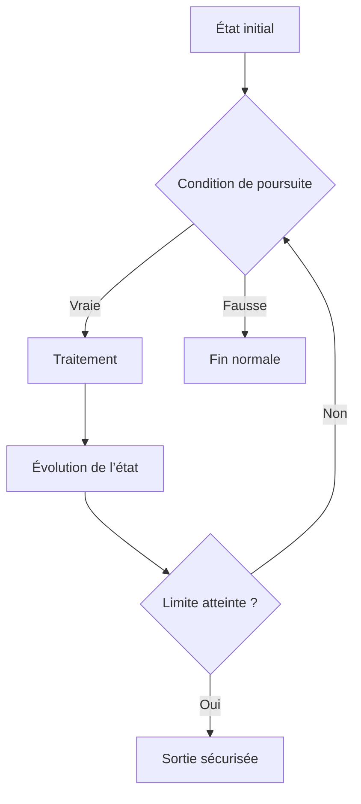

# IMBRICATION, LISIBILITÉ ET SÉCURISATION

## OBJECTIFS

- Limiter la profondeur des structures imbriquées
- Séparer règles métier et mécanismes de boucle
- Prévenir les boucles infinies
- Préparer les cas de test de chaque branche
- Construire un flux de traitement vérifiable

## COÛT DE L’IMBRICATION

Chaque niveau supplémentaire augmente le nombre de chemins possibles et la difficulté de lecture.

```abap
IF lv_active = abap_true.
  IF lv_authorized = abap_true.
    DO 10 TIMES.
      IF sy-index MOD 2 = 0.
        WRITE: / sy-index.
      ENDIF.
    ENDDO.
  ENDIF.
ENDIF.
```

Version avec gardes :

```abap
IF lv_active = abap_false.
  WRITE: / 'Objet inactif'.
  RETURN.
ENDIF.

IF lv_authorized = abap_false.
  WRITE: / 'Accès refusé'.
  RETURN.
ENDIF.

DO 10 TIMES.
  CHECK sy-index MOD 2 = 0.
  WRITE: / sy-index.
ENDDO.
```

Le chemin principal reste aligné à gauche.

## SÉPARER LES RESPONSABILITÉS

Une boucle ne doit pas cumuler sans nécessité :

- validation d’entrée ;
- conversion complexe ;
- décision métier ;
- accès aux données ;
- affichage ;
- gestion d’erreur.

La modularisation permettra d’extraire ces responsabilités dans des procédures ou méthodes dédiées.

## PROTÉGER LES BOUCLES

Pour toute boucle conditionnelle, identifier :

1. l’état initial ;
2. la condition de poursuite ;
3. l’instruction qui fait évoluer cet état ;
4. la sortie normale ;
5. la limite technique éventuelle.



## EXEMPLE SÉCURISÉ

```abap
PARAMETERS p_target TYPE i DEFAULT 7.

CONSTANTS lc_max_iterations TYPE i VALUE 100.

DATA lv_found     TYPE abap_bool VALUE abap_false.
DATA lv_iteration TYPE i.

START-OF-SELECTION.

  IF p_target <= 0.
    WRITE: / 'La cible doit être positive'.
    RETURN.
  ENDIF.

  WHILE lv_found = abap_false
    AND lv_iteration < lc_max_iterations.

    ADD 1 TO lv_iteration.

    IF lv_iteration = p_target.
      lv_found = abap_true.
    ENDIF.
  ENDWHILE.

  IF lv_found = abap_true.
    WRITE: / 'Cible atteinte après', lv_iteration, 'itérations'.
  ELSE.
    WRITE: / 'Limite technique atteinte'.
  ENDIF.
```

## MATRICE DE CHOIX

| Besoin                                | Instruction principale | Instruction complémentaire éventuelle |
| ------------------------------------- | ---------------------- | ------------------------------------- |
| Exécuter selon une condition générale | `IF`                   | `RETURN` comme garde                  |
| Comparer un code à plusieurs valeurs  | `CASE`                 | `WHEN OTHERS`                         |
| Construire une valeur conditionnelle  | `COND` ou `SWITCH`     | Type de résultat explicite            |
| Répéter un nombre connu de fois       | `DO ... TIMES`         | `EXIT` pour arrêt anticipé            |
| Répéter tant qu’un état est vrai      | `WHILE`                | Limite technique                      |
| Ignorer une itération non pertinente  | `CHECK` ou `CONTINUE`  | —                                     |
| Quitter la boucle                     | `EXIT`                 | Indicateur de résultat                |
| Quitter le bloc courant               | `RETURN`               | Message ou journalisation             |

## CAS DE TEST MINIMAUX

Pour une condition :

- valeur qui satisfait chaque branche ;
- valeur limite ;
- valeur initiale ;
- valeur non prévue traitée par défaut.

Pour une boucle :

- zéro itération ;
- une itération ;
- plusieurs itérations ;
- sortie anticipée ;
- limite maximale atteinte ;
- condition qui reste fausse dès le départ.

## CONTRÔLE DANS LE DEBUGGER ABAP

Placer des points d’arrêt :

- avant l’entrée dans la structure ;
- sur chaque branche importante ;
- sur l’instruction qui modifie la condition de boucle ;
- sur `CHECK`, `CONTINUE`, `EXIT` ou `RETURN` ;
- après la structure pour vérifier le chemin réellement suivi.

Surveiller notamment :

- les valeurs utilisées dans la condition ;
- `sy-index` ;
- les indicateurs de sortie ;
- le nombre d’itérations ;
- les valeurs limites.

## RÈGLES DE SYNTHÈSE

- choisir la structure la plus spécifique au besoin ;
- classer les conditions par priorité métier ;
- traiter les prérequis en début de bloc ;
- rendre toute boucle finie ou techniquement bornée ;
- réserver `EXIT` aux boucles et `RETURN` aux blocs ;
- éviter les structures imbriquées lorsque des gardes suffisent ;
- tester chaque branche et chaque mode de sortie ;
- ne pas utiliser une construction moderne sans vérifier la version ABAP cible.

## PROCÉDURE PAS À PAS

1. Saisir `/nSAT`.
2. Créer ou sélectionner une variante de mesure adaptée.
3. Définir le programme, la transaction ou l’utilisateur à mesurer.
4. Démarrer la mesure puis reproduire une seule fois le scénario.
5. Arrêter et analyser le hit list, la hiérarchie d’appels et les temps nets.
6. Répéter la mesure après correction avec les mêmes données et le même contexte.

## VÉRIFICATION

- Le scénario reproduit correspond au même utilisateur, mandant, transaction et jeu de données.
- L’horodatage et l’identifiant de l’analyse sont conservés.
- La cause retenue est soutenue par une ligne source, une trace ou une valeur observée.
- Après correction, le même scénario ne reproduit plus le défaut et le résultat métier reste identique.

## ERREURS FRÉQUENTES

- Copier un exemple sans adapter les types, noms d’objets et données disponibles dans le système.
- Tester uniquement le cas nominal et ignorer les valeurs initiales, absentes ou invalides.
- Créer une boucle sans condition de sortie fiable.
- Utiliser `CHECK`, `CONTINUE`, `EXIT` ou `RETURN` sans rendre le flux lisible.

## SNIPPET À RÉUTILISER

> [!NOTE]
> Adapter les noms `Z*`, les types DDIC, les données et les autorisations au système cible. Effectuer un contrôle syntaxique avant activation.

```abap
PARAMETERS p_target TYPE i DEFAULT 7.

CONSTANTS lc_max_iterations TYPE i VALUE 100.

DATA lv_found     TYPE abap_bool VALUE abap_false.
DATA lv_iteration TYPE i.

START-OF-SELECTION.

  IF p_target <= 0.
    WRITE: / 'La cible doit être positive'.
    RETURN.
  ENDIF.

  WHILE lv_found = abap_false
    AND lv_iteration < lc_max_iterations.

    ADD 1 TO lv_iteration.

    IF lv_iteration = p_target.
      lv_found = abap_true.
    ENDIF.
  ENDWHILE.

  IF lv_found = abap_true.
    WRITE: / 'Cible atteinte après', lv_iteration, 'itérations'.
  ELSE.
    WRITE: / 'Limite technique atteinte'.
  ENDIF.
```

## TERMES DU LEXIQUE

- [Instruction ABAP](<../00 ├── LEXIQUE SAP ET ABAP/04 ├── LANGAGE ET DEVELOPPEMENT ABAP.md#instruction-abap>)
- [Expression](<../00 ├── LEXIQUE SAP ET ABAP/04 ├── LANGAGE ET DEVELOPPEMENT ABAP.md#expression>)

## RÉFÉRENCES OFFICIELLES SAP

- [Using Control Structures in ABAP — SAP Learning](https://learning.sap.com/courses/basic-abap-programming/using-control-structures-in-abap_a4d7803e-eac2-458e-acf9-8628289f3701)
- [Branch Code Coverage — SAP Help Portal](https://help.sap.com/docs/ABAP_PLATFORM_NEW/ba879a6e2ea04d9bb94c7ccd7cdac446/7f27a2638ee64d1d97dd53c69c562e7b.html)
- [Modern ABAP — ABAP Keyword Documentation](https://help.sap.com/doc/abapdocu_latest_index_htm/latest/en-US/ABENMODERN_ABAP_GUIDL.html)
