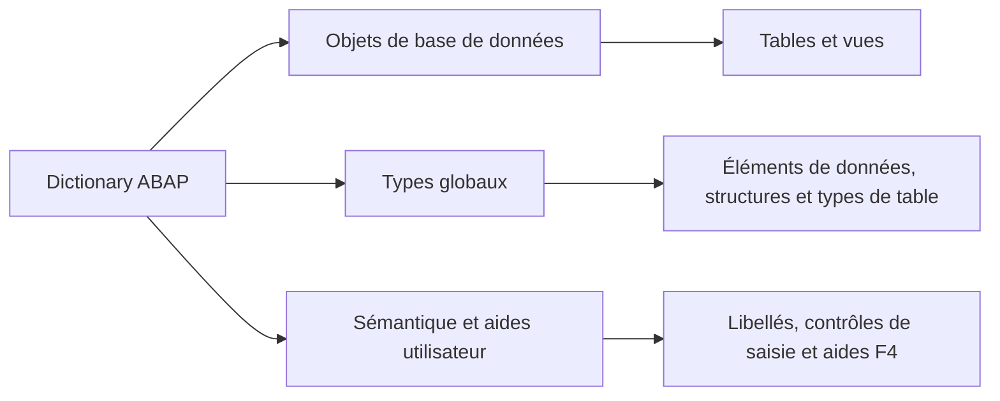

# PRINCIPES DU DICTIONNAIRE ABAP

## OBJECTIFS

- Comprendre le rôle du Dictionary ABAP
- Identifier les principales catégories d’objets DDIC
- Distinguer définition technique, type global et information sémantique
- Comprendre les dépendances entre les objets
- Délimiter le périmètre du Dictionary classique dans SAP GUI

## RÔLE DU DICTIONNAIRE ABAP

Le Dictionary ABAP, souvent abrégé **DDIC**, centralise les métadonnées utilisées par le système ABAP.

Il remplit principalement trois fonctions :

1. définir des objets persistants représentés dans la base de données ;
2. fournir des types globaux utilisables dans les programmes ABAP ;
3. porter des informations sémantiques utilisées par les technologies classiques SAP GUI.



## PRINCIPAUX OBJETS

| Objet                 | Fonction principale                                            | Objet physique en base |
| --------------------- | -------------------------------------------------------------- | ---------------------: |
| Domaine               | Définir les caractéristiques techniques et la plage de valeurs |                    Non |
| Élément de données    | Donner un type global et une signification métier              |                    Non |
| Structure             | Regrouper plusieurs composants                                 |                    Non |
| Type de table         | Définir un type global de table interne                        |                    Non |
| Table transparente    | Définir une table persistante                                  |                    Oui |
| Vue classique         | Présenter une projection ou une combinaison de données         |          Selon le type |
| Aide à la recherche   | Définir une aide à la saisie F4                                |                    Non |
| Objet de verrouillage | Définir un verrou logique SAP                                  |                    Non |

## DÉPENDANCES ENTRE OBJETS

Les objets DDIC sont généralement construits par couches.


Une modification d’un domaine peut donc rendre inactifs plusieurs éléments de données, structures, tables et programmes dépendants.

## OBJETS GLOBAUX ET TYPES LOCAUX

Un type déclaré avec `TYPES` dans un programme est local à ce programme ou à son contexte de déclaration.

Un élément de données, une structure ou un type de table créé dans SE11 est global au système ABAP et réutilisable par plusieurs objets de développement.

```abap
DATA lv_vbeln TYPE vbeln_va.
DATA ls_bapiret TYPE bapiret2.
```

Dans cet exemple, `VBELN_VA` est un élément de données et `BAPIRET2` une structure du Dictionary.

## PÉRIMÈTRE DU DOSSIER

Ce dossier traite des objets classiques accessibles depuis SAP GUI, principalement avec les transactions `SE11`, `SE14`, `SE54` et `SM30`.

Les définitions CDS et leur édition dans ADT ne sont pas détaillées ici. Elles feront partie d’un dossier distinct consacré aux développements sous Eclipse.

## POINTS À RETENIR

- Le Dictionary est le référentiel central des métadonnées ABAP.
- Les domaines ne sont pas des types ABAP directement utilisables.
- Les éléments de données, structures et types de table sont des types globaux.
- Les tables transparentes définissent également des objets persistants en base.
- Les dépendances doivent être analysées avant toute modification.

## PROCÉDURE PAS À PAS

1. Saisir `/nSE11`.
2. Choisir le type d’objet DDIC correspondant au chapitre.
3. Entrer le nom technique ; utiliser **Afficher** pour un objet existant ou **Créer** pour un objet Z autorisé.
4. Renseigner les attributs et composants en suivant les règles du chapitre.
5. Lancer le contrôle de cohérence.
6. Activer l’objet et traiter chaque message avant de poursuivre.
7. Utiliser la liste d’utilisation et, pour les tables, vérifier les paramètres techniques et la structure physique.

## VÉRIFICATION

- Le contrôle de cohérence ne retourne aucune erreur bloquante.
- L’objet est actif et son entrée de répertoire pointe vers le package attendu.
- La liste d’utilisation et les dépendances correspondent au périmètre prévu.
- Pour une table Z, la structure active et la structure de base sont cohérentes.

## ERREURS FRÉQUENTES

- Copier un exemple sans adapter les types, noms d’objets et données disponibles dans le système.
- Tester uniquement le cas nominal et ignorer les valeurs initiales, absentes ou invalides.
- Modifier un objet standard au lieu d’utiliser une extension.
- Activer une table sans vérifier clé, paramètres techniques et impact base.

## SNIPPET À RÉUTILISER

> [!NOTE]
> Adapter les noms `Z*`, les types DDIC, les données et les autorisations au système cible. Effectuer un contrôle syntaxique avant activation.

```abap
DATA lv_vbeln TYPE vbeln_va.
DATA ls_bapiret TYPE bapiret2.
```

## TERMES DU LEXIQUE

- [ABAP](<../00 ├── LEXIQUE SAP ET ABAP/10 └── ACRONYMES SAP.md#acro-abap>)
- [ABAP Dictionary](<../00 ├── LEXIQUE SAP ET ABAP/05 ├── DONNEES DICTIONNAIRE ET BASE DE DONNEES.md#abap-dictionary>)
- [Domaine](<../00 ├── LEXIQUE SAP ET ABAP/05 ├── DONNEES DICTIONNAIRE ET BASE DE DONNEES.md#domaine>)
- [Élément de données](<../00 ├── LEXIQUE SAP ET ABAP/05 ├── DONNEES DICTIONNAIRE ET BASE DE DONNEES.md#element-donnees>)
- [Table transparente](<../00 ├── LEXIQUE SAP ET ABAP/05 ├── DONNEES DICTIONNAIRE ET BASE DE DONNEES.md#table-transparente>)
- [MANDT](<../00 ├── LEXIQUE SAP ET ABAP/05 ├── DONNEES DICTIONNAIRE ET BASE DE DONNEES.md#mandt>)

## RÉFÉRENCES OFFICIELLES SAP

- [Exploring ABAP Dictionary — SAP Learning](https://learning.sap.com/courses/building-data-models-with-the-abap-dictionary-and-abap-core-data-services/exploring-abap-dictionary_af8fdedf-0a10-43ab-aa1b-20abbece9d8b)
- [ABAP Dictionary — SAP Help Portal](https://help.sap.com/docs/SAP_NETWEAVER_740/ec1c9c8191b74de98feb94001a95dd76/cf21ea0b446011d189700000e8322d00.html)
- [Repository Information System — SAP Help Portal](https://help.sap.com/docs/SAP_NETWEAVER_740/bd833c8355f34e96a6e83096b38bf192/d180198c454211d189710000e8322d00.html)


---

[Chapitre suivant — NAVIGATION ET ANALYSE AVEC SE11](<./02 ├── NAVIGATION ET ANALYSE AVEC SE11.md>)
