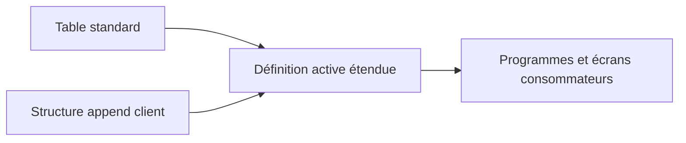

# STRUCTURES APPEND ET EXTENSIONS

## OBJECTIFS

- Étendre une table ou une structure sans modifier sa définition d’origine
- Distinguer append, include et modification
- Comprendre l’effet de l’activation
- Ajouter des champs, clés étrangères ou aides à la recherche
- Sécuriser une extension d’objet standard

## PRINCIPE D’UN APPEND

Une structure append est affectée à une seule table ou structure cible.

Lors de l’activation, ses composants sont ajoutés à la définition active de l’objet cible.



Plusieurs structures append peuvent être affectées au même objet lorsque le système et la catégorie d’amélioration l’autorisent.

## POSSIBILITÉS

Un append peut notamment :

- ajouter de nouveaux champs ;
- définir une clé étrangère sur certains champs existants ;
- affecter une aide à la recherche à certains champs existants.

Les éléments ajoutés appartiennent à l’append et sont transportés avec lui.

## APPEND, INCLUDE ET MODIFICATION

| Mécanisme    | Usage                                                                |
| ------------ | -------------------------------------------------------------------- |
| Include      | Composer un objet que l’on maîtrise à partir d’une structure commune |
| Append       | Étendre un objet existant sans changer directement son original      |
| Modification | Changer directement un objet livré par SAP                           |

Pour une extension client, utiliser le mécanisme prévu par SAP. Une modification directe du standard complique les montées de version et doit être évitée.

## CRÉATION

Depuis la table ou la structure dans `SE11` :

1. ouvrir la fonction d’append ;
2. créer une structure append dans l’espace client ;
3. définir les composants ;
4. utiliser des éléments de données adaptés ;
5. maintenir la catégorie d’amélioration de l’append si nécessaire ;
6. activer l’append ;
7. contrôler l’activation de l’objet cible et ses dépendances.

## CATÉGORIE D’AMÉLIORATION

La catégorie d’amélioration indique quels types de composants peuvent être ajoutés.

Elle protège notamment les usages qui exigent une structure plate ou sans types particuliers.

Ne pas choisir une catégorie plus permissive que nécessaire uniquement pour supprimer un avertissement.

## IMPACT TECHNIQUE

L’ajout d’un champ à une table persistante modifie sa structure en base. L’activation peut déclencher un ajustement technique selon le type de changement et le système.

Avant l’extension :

- vérifier la catégorie d’amélioration ;
- analyser la liste d’utilisation ;
- contrôler les structures de communication et interfaces ;
- anticiper l’alimentation du nouveau champ ;
- tester les programmes qui utilisent des affectations implicites ou des structures complètes.

## POINTS À RETENIR

- Un append étend un objet sans modifier sa définition d’origine.
- Il est lié à une seule table ou structure cible.
- L’activation ajoute ses composants à l’objet actif.
- La catégorie d’amélioration doit être respectée.
- Une extension de table peut nécessiter un ajustement physique et des tests de régression.

## PROCÉDURE PAS À PAS

1. Saisir `/nSE11`.
2. Choisir le type d’objet DDIC correspondant au chapitre.
3. Entrer le nom technique ; utiliser **Afficher** pour un objet existant ou **Créer** pour un objet Z autorisé.
4. Renseigner les attributs et composants en suivant les règles du chapitre.
5. Lancer le contrôle de cohérence.
6. Activer l’objet et traiter chaque message avant de poursuivre.
7. Utiliser la liste d’utilisation et, pour les tables, vérifier les paramètres techniques et la structure physique.

## VÉRIFICATION

- Le contrôle de cohérence ne retourne aucune erreur bloquante.
- L’objet est actif et son entrée de répertoire pointe vers le package attendu.
- La liste d’utilisation et les dépendances correspondent au périmètre prévu.
- Pour une table Z, la structure active et la structure de base sont cohérentes.

## ERREURS FRÉQUENTES

- Modifier un objet standard au lieu d’utiliser une extension.
- Activer une table sans vérifier clé, paramètres techniques et impact base.

## FICHE DE CONTRÔLE À COPIER

```text
Système / SID       :
Mandant             :
Utilisateur         :
Transaction / outil :
Objet technique     :
Jeu de données      :
Résultat attendu    :
Résultat observé    :
Horodatage          :
Ordre de transport  :
```

## TERMES DU LEXIQUE

- [Structure](<../00 ├── LEXIQUE SAP ET ABAP/04 ├── LANGAGE ET DEVELOPPEMENT ABAP.md#structure-abap>)
- [ABAP Dictionary](<../00 ├── LEXIQUE SAP ET ABAP/05 ├── DONNEES DICTIONNAIRE ET BASE DE DONNEES.md#abap-dictionary>)
- [Domaine](<../00 ├── LEXIQUE SAP ET ABAP/05 ├── DONNEES DICTIONNAIRE ET BASE DE DONNEES.md#domaine>)
- [Élément de données](<../00 ├── LEXIQUE SAP ET ABAP/05 ├── DONNEES DICTIONNAIRE ET BASE DE DONNEES.md#element-donnees>)
- [Table transparente](<../00 ├── LEXIQUE SAP ET ABAP/05 ├── DONNEES DICTIONNAIRE ET BASE DE DONNEES.md#table-transparente>)
- [MANDT](<../00 ├── LEXIQUE SAP ET ABAP/05 ├── DONNEES DICTIONNAIRE ET BASE DE DONNEES.md#mandt>)

## RÉFÉRENCES OFFICIELLES SAP

- [Append Structures — SAP Help Portal](https://help.sap.com/docs/SAP_NETWEAVER_731_BW_ABAP/ec1c9c8191b74de98feb94001a95dd76/cf21eb61446011d189700000e8322d00.html)
- [Adding an Append Structure — SAP Help Portal](https://help.sap.com/docs/SAP_NETWEAVER_740/ec1c9c8191b74de98feb94001a95dd76/cf21ebc9446011d189700000e8322d00.html)


---

[Chapitre suivant — ACTIVATION, AJUSTEMENT BASE ET ANALYSE DES DÉPENDANCES](<./16 ├── ACTIVATION AJUSTEMENT BASE ET ANALYSE DES DEPENDANCES.md>)
