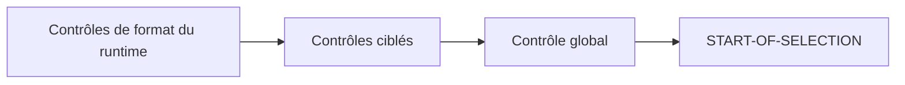

# VALIDATION AVEC AT SELECTION-SCREEN

## OBJECTIFS

- Valider les entrées avant le traitement principal
- Cibler un paramètre, un critère ou un bloc
- Distinguer contrôle technique et règle métier
- Maintenir l’utilisateur sur l’écran en cas d’erreur
- Éviter les traitements lourds pendant la validation

## VALIDATION GLOBALE

```abap
AT SELECTION-SCREEN.
  IF p_from > p_to.
    MESSAGE 'La date de début doit précéder la date de fin' TYPE 'E'.
  ENDIF.
```

Une erreur de type `E` dans ce contexte empêche la poursuite et ramène l’utilisateur à l’écran de sélection.

Le dossier consacré aux messages détaillera les classes de messages et les bonnes pratiques de traduction.

## VALIDATION D’UN PARAMÈTRE

```abap
AT SELECTION-SCREEN ON p_bukrs.
  IF p_bukrs IS INITIAL.
    MESSAGE 'La société est obligatoire' TYPE 'E'.
  ENDIF.
```

Cette forme cible le champ concerné.

## VALIDATION D’UN SELECT-OPTIONS

```abap
AT SELECTION-SCREEN ON END OF s_date.
  LOOP AT s_date ASSIGNING FIELD-SYMBOL(<ls_date>).
    IF <ls_date>-option = 'BT'
       AND <ls_date>-low > <ls_date>-high.
      MESSAGE 'Intervalle de dates invalide' TYPE 'E'.
    ENDIF.
  ENDLOOP.
```

## VALIDATION D’UN BLOC

```abap
SELECTION-SCREEN BEGIN OF BLOCK b_period WITH FRAME TITLE text-t01.
  PARAMETERS:
    p_from TYPE sy-datum,
    p_to   TYPE sy-datum.
SELECTION-SCREEN END OF BLOCK b_period.

AT SELECTION-SCREEN ON BLOCK b_period.
  IF p_from IS NOT INITIAL
     AND p_to IS NOT INITIAL
     AND p_from > p_to.
    MESSAGE 'Période invalide' TYPE 'E'.
  ENDIF.
```

## ORDRE DES CONTRÔLES



La séquence exacte dépend des éléments et de l’action utilisateur. Ne pas répartir une même règle sur plusieurs événements sans nécessité.

## ACCÈS BASE PENDANT LA VALIDATION

Une lecture courte peut être nécessaire pour vérifier l’existence d’une valeur. Éviter :

- les sélections massives ;
- les mises à jour ;
- les commits ;
- les traitements de longue durée ;
- les appels distants non indispensables.

La validation doit rester réactive et sans effet métier durable.

## VÉRIFICATION

- Le contrôle syntaxique réussit.
- La version active correspond au code sauvegardé.
- L’exécution produit le résultat décrit dans le chapitre.
- Les cas vide, limite et erreur sont testés séparément lorsque la syntaxe le permet.

## ERREURS FRÉQUENTES

- Copier un exemple sans adapter les types, noms d’objets et données disponibles dans le système.
- Tester uniquement le cas nominal et ignorer les valeurs initiales, absentes ou invalides.
- Mettre une logique lourde dans les événements de validation de l’écran.
- Créer une variante contenant des valeurs obsolètes ou sensibles.

## SNIPPET À RÉUTILISER

> [!NOTE]
> Adapter les noms `Z*`, les types DDIC, les données et les autorisations au système cible. Effectuer un contrôle syntaxique avant activation.

```abap
SELECTION-SCREEN BEGIN OF BLOCK b_period WITH FRAME TITLE text-t01.
  PARAMETERS:
    p_from TYPE sy-datum,
    p_to   TYPE sy-datum.
SELECTION-SCREEN END OF BLOCK b_period.

AT SELECTION-SCREEN ON BLOCK b_period.
  IF p_from IS NOT INITIAL
     AND p_to IS NOT INITIAL
     AND p_from > p_to.
    MESSAGE 'Période invalide' TYPE 'E'.
  ENDIF.
```

## TERMES DU LEXIQUE

- [Programme exécutable](<../00 ├── LEXIQUE SAP ET ABAP/06 ├── PROGRAMMES CLASSES ET OBJETS TECHNIQUES.md#programme-executable>)
- [Variante](<../00 ├── LEXIQUE SAP ET ABAP/06 ├── PROGRAMMES CLASSES ET OBJETS TECHNIQUES.md#variante>)
- [Transaction](<../00 ├── LEXIQUE SAP ET ABAP/02 ├── SAP GUI NAVIGATION ET TRANSACTIONS.md#transaction>)
- [Dynpro](<../00 ├── LEXIQUE SAP ET ABAP/02 ├── SAP GUI NAVIGATION ET TRANSACTIONS.md#dynpro>)

## RÉFÉRENCES OFFICIELLES SAP

- [Selection Screen Processing — SAP Help Portal](https://help.sap.com/docs/SAP_NETWEAVER_700/a85596deeb19418982bee031d1fd1427/4a43c40d5a503f04e10000000a421937.html)
- [Selection Screens — Overview — ABAP Keyword Documentation](https://help.sap.com/doc/abapdocu_latest_index_htm/latest/en-US/ABENSELECTION_SCREEN_OVERVIEW.html)
- [Authorization Checks — SAP Help Portal](https://help.sap.com/docs/SAP_NETWEAVER_731_BW_ABAP/cfae740a0a21455dbe6e510c2d86e36a/9fdbaccb35c111d1829f0000e829fbfe.html)


---

[Chapitre suivant — AIDES F1 ET F4](<./12 ├── AIDES F1 ET F4.md>)
