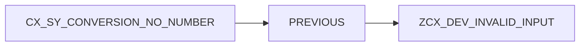

# LEVER UNE EXCEPTION AVEC RAISE EXCEPTION

## OBJECTIFS

- Déclencher explicitement une exception
- Utiliser `RAISE EXCEPTION TYPE`
- Transmettre des valeurs au constructeur
- Chaîner une cause avec `PREVIOUS`
- Éviter les exceptions sans contexte

## FORME DIRECTE

```abap
IF iv_matnr IS INITIAL.
  RAISE EXCEPTION TYPE zcx_dev_invalid_input.
ENDIF.
```

L’instruction crée un objet de la classe indiquée et interrompt le bloc de traitement courant.

## PARAMÈTRES DU CONSTRUCTEUR

Une classe d’exception peut exposer des paramètres permettant de conserver les données utiles.

```abap
RAISE EXCEPTION TYPE zcx_dev_product_not_found
  EXPORTING
    matnr = iv_matnr
    werks = iv_werks.
```

Le texte de l’erreur peut ensuite utiliser ces attributs.

## LEVER UN OBJET EXISTANT

```abap
DATA(lx_error) = NEW zcx_dev_error(
  textid = zcx_dev_error=>invalid_state ).

RAISE EXCEPTION lx_error.
```

La forme directe avec `TYPE` est généralement plus concise. La référence explicite est utile lorsque l’objet doit être préparé ou enrichi avant d’être levé.

## CHAÎNER LA CAUSE

```abap
TRY.
    lv_value = CONV i( iv_text ).
  CATCH cx_sy_conversion_no_number INTO DATA(lx_conversion).
    RAISE EXCEPTION TYPE zcx_dev_invalid_input
      EXPORTING
        previous = lx_conversion.
ENDTRY.
```

L’attribut `PREVIOUS` conserve la cause technique initiale. Le niveau supérieur peut présenter une erreur métier tout en préservant le diagnostic complet.



## MESSAGE ET EXCEPTION

Une exception peut être associée à un texte de classe de messages. Cette association est traitée dans le chapitre dédié aux interfaces `IF_T100_MESSAGE` et `IF_T100_DYN_MSG`.

Éviter de lever une exception dont le seul contenu est une chaîne générique sans attribut ni identifiant stable.

## ERREUR ATTENDUE

```abap
IF iv_quantity <= 0.
  RAISE EXCEPTION TYPE zcx_dev_invalid_quantity
    EXPORTING
      quantity = iv_quantity.
ENDIF.
```

Le nom de la classe doit exprimer la nature de l’erreur. L’appelant peut alors intercepter précisément cette situation.

## VÉRIFICATION

- Le contrôle syntaxique réussit.
- La version active correspond au code sauvegardé.
- L’exécution produit le résultat décrit dans le chapitre.
- Les cas vide, limite et erreur sont testés séparément lorsque la syntaxe le permet.

## ERREURS FRÉQUENTES

- Copier un exemple sans adapter les types, noms d’objets et données disponibles dans le système.
- Tester uniquement le cas nominal et ignorer les valeurs initiales, absentes ou invalides.
- Afficher un message technique incompréhensible à l’utilisateur.
- Attraper une exception sans action ni propagation.

## SNIPPET À RÉUTILISER

> [!NOTE]
> Adapter les noms `Z*`, les types DDIC, les données et les autorisations au système cible. Effectuer un contrôle syntaxique avant activation.

```abap
TRY.
    lv_value = CONV i( iv_text ).
  CATCH cx_sy_conversion_no_number INTO DATA(lx_conversion).
    RAISE EXCEPTION TYPE zcx_dev_invalid_input
      EXPORTING
        previous = lx_conversion.
ENDTRY.
```

## TERMES DU LEXIQUE

- [Exception](<../00 ├── LEXIQUE SAP ET ABAP/04 ├── LANGAGE ET DEVELOPPEMENT ABAP.md#exception>)
- [Dump ABAP](<../00 ├── LEXIQUE SAP ET ABAP/08 ├── EXECUTION EXPLOITATION ET ADMINISTRATION.md#dump-abap>)

## RÉFÉRENCES OFFICIELLES SAP

- [RAISE EXCEPTION — ABAP Keyword Documentation](https://help.sap.com/doc/abapdocu_latest_index_htm/latest/en-US/ABAPRAISE_EXCEPTION_CLASS.html)
- [System Response After a Class-Based Exception — ABAP Keyword Documentation](https://help.sap.com/doc/abapdocu_latest_index_htm/latest/en-US/ABENEXCEPTIONS_SYSTEM_RESPONSE.html)
- [Creating an Exception Class — SAP Help Portal](https://help.sap.com/docs/ABAP_PLATFORM_NEW/bd833c8355f34e96a6e83096b38bf192/92823e6017aa11d5969b00a0c94260a5.html)


---

[Chapitre suivant — PROPAGER UNE EXCEPTION AVEC RAISING](<./11 ├── PROPAGER UNE EXCEPTION AVEC RAISING.md>)
