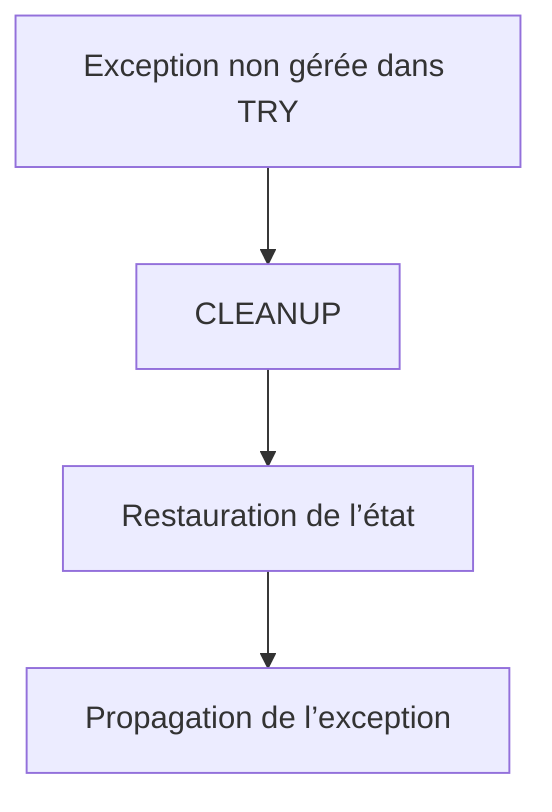

# CLEANUP ET COHÉRENCE DU TRAITEMENT

## OBJECTIFS

- Comprendre le rôle du bloc `CLEANUP`
- Restaurer un état avant propagation
- Ne pas confondre `CLEANUP` avec un bloc exécuté systématiquement
- Préserver la cohérence des données en mémoire
- Choisir des opérations de nettoyage sûres

## PRINCIPE

Un bloc `CLEANUP` appartient à une structure `TRY`. Il est utilisé lorsqu’une exception quitte la structure sans être gérée par un `CATCH` de cette structure et qu’un nettoyage doit être effectué avant la propagation.

```abap
TRY.
    lo_resource->open( ).
    lo_resource->process( ).
  CLEANUP.
    lo_resource->close( ).
ENDTRY.
```

Le comportement exact doit être vérifié selon la forme utilisée et la version ABAP. `CLEANUP` n’est pas l’équivalent général d’un bloc `FINALLY` exécuté dans tous les cas.

## OBJECTIF DU NETTOYAGE

Le nettoyage peut servir à :

- remettre une variable globale dans un état cohérent ;
- libérer une ressource applicative ;
- annuler une modification temporaire en mémoire ;
- supprimer un verrou posé avant l’erreur ;
- préparer une propagation propre.



## NE PAS MASQUER L’EXCEPTION

Le nettoyage ne doit pas remplacer l’erreur d’origine par une nouvelle erreur sans conserver la cause.

Si l’opération de nettoyage peut elle-même échouer, définir une stratégie explicite :

- conserver l’exception initiale ;
- chaîner la nouvelle erreur ;
- produire une trace technique ;
- éviter une seconde erreur qui masque la première.

## CLEANUP ET TRANSACTION

`CLEANUP` ne constitue pas automatiquement une annulation de SAP LUW. Il ne remplace pas une conception transactionnelle correcte.

Ne pas placer mécaniquement `ROLLBACK WORK` dans chaque nettoyage. La décision de valider ou annuler une transaction appartient à une frontière métier clairement définie.

## ALTERNATIVE PAR CONCEPTION

Une ressource peut parfois être gérée par une classe encapsulant son cycle de vie, ce qui réduit le besoin de nettoyage dispersé.

```abap
TRY.
    lo_service->execute( ).
  CATCH zcx_dev_error INTO DATA(lx_error).
    lo_service->reset( ).
    RAISE EXCEPTION lx_error.
ENDTRY.
```

Cette forme explicite peut être plus lisible lorsqu’une exception est traitée puis relancée.

## CAS À ÉVITER

- utiliser `CLEANUP` pour afficher un message utilisateur ;
- effectuer un traitement métier supplémentaire ;
- valider une transaction ;
- ignorer la cause initiale ;
- supposer que le bloc s’exécute après tout succès normal.

## VÉRIFICATION

- Le contrôle syntaxique réussit.
- La version active correspond au code sauvegardé.
- L’exécution produit le résultat décrit dans le chapitre.
- Les cas vide, limite et erreur sont testés séparément lorsque la syntaxe le permet.

## ERREURS FRÉQUENTES

- Copier un exemple sans adapter les types, noms d’objets et données disponibles dans le système.
- Tester uniquement le cas nominal et ignorer les valeurs initiales, absentes ou invalides.
- Afficher un message technique incompréhensible à l’utilisateur.
- Attraper une exception sans action ni propagation.

## SNIPPET À RÉUTILISER

> [!NOTE]
> Adapter les noms `Z*`, les types DDIC, les données et les autorisations au système cible. Effectuer un contrôle syntaxique avant activation.

```abap
TRY.
    lo_service->execute( ).
  CATCH zcx_dev_error INTO DATA(lx_error).
    lo_service->reset( ).
    RAISE EXCEPTION lx_error.
ENDTRY.
```

## TERMES DU LEXIQUE

- [Exception](<../00 ├── LEXIQUE SAP ET ABAP/04 ├── LANGAGE ET DEVELOPPEMENT ABAP.md#exception>)
- [Dump ABAP](<../00 ├── LEXIQUE SAP ET ABAP/08 ├── EXECUTION EXPLOITATION ET ADMINISTRATION.md#dump-abap>)

## RÉFÉRENCES OFFICIELLES SAP

- [TRY — ABAP Keyword Documentation](https://help.sap.com/doc/abapdocu_latest_index_htm/latest/en-US/ABAPTRY.html)
- [Handling Exceptions — SAP Help Portal](https://help.sap.com/docs/SAP_NETWEAVER_700/10a002cd6c531014b5e1cb16d2455072/a9b8eef8fe9411d4b2ee0050dadfb92b.html)
- [Planning Exception Handling and Delegating Exceptions — SAP Help Portal](https://help.sap.com/docs/SAP_NETWEAVER_700/12ac3fe96c531014b0ff8cfd062efa6f/e7c4934257a5c96ae10000000a155106.html)


---

[Chapitre suivant — ASSERTIONS ET POINTS DE CONTRÔLE](<./15 ├── ASSERTIONS ET POINTS DE CONTROLE.md>)
