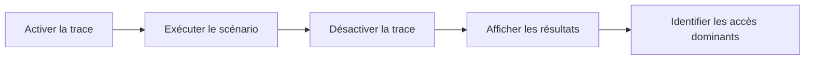

# ANALYSER LES ACCÈS AVEC ST05

## OBJECTIFS

- Utiliser `ST05` pour observer les accès SQL
- Restreindre la trace à l’utilisateur et au scénario
- Lire les opérations et durées principales
- Repérer répétitions, lectures massives et accès non sélectifs
- Désactiver immédiatement la trace après reproduction

## RÔLE DE ST05

La transaction `ST05` fournit des fonctions de trace système, notamment la trace SQL. Selon le système, elle peut aussi couvrir d’autres catégories techniques comme les accès buffer, les contrôles d’autorisation, les enqueues ou les appels RFC.

Ce chapitre se concentre sur l’usage développeur pour comprendre les accès produits par un traitement ABAP.

## PROCÉDURE GÉNÉRALE

1. préparer le scénario ;
2. activer la trace avec un périmètre restrictif ;
3. exécuter uniquement l’action utile ;
4. désactiver la trace ;
5. afficher et filtrer les résultats ;
6. analyser les opérations dominantes.



## INFORMATIONS À EXAMINER

- instruction SQL ;
- table ou vue ;
- nombre d’exécutions ;
- durée ;
- nombre de lignes ;
- clé ou prédicats utilisés ;
- programme et position d’appel ;
- préparation et exécution ;
- répétition de requêtes identiques.

## SIGNES CLASSIQUES

- `SELECT` dans une boucle ;
- requête exécutée des milliers de fois ;
- lecture d’un volume très supérieur au besoin ;
- absence de critère sélectif ;
- tri ou agrégation côté application alors que la base peut le faire ;
- accès à une table non nécessaire ;
- récupération de toutes les colonnes.

## TRACE D AUTORISATION

La trace système peut également aider à analyser certains contrôles d’autorisation. Limiter le périmètre et interpréter les résultats avec le responsable sécurité ; un contrôle échoué peut être volontaire et suivi d’une alternative autorisée.

## PRÉCAUTIONS

- ne jamais laisser la trace active ;
- éviter une trace globale sur un système chargé ;
- cibler l’utilisateur ;
- supprimer les données de trace devenues inutiles ;
- protéger les résultats contenant des valeurs techniques ou métier.

## VÉRIFICATION

- Le scénario reproduit correspond au même utilisateur, mandant, transaction et jeu de données.
- L’horodatage et l’identifiant de l’analyse sont conservés.
- La cause retenue est soutenue par une ligne source, une trace ou une valeur observée.
- Après correction, le même scénario ne reproduit plus le défaut et le résultat métier reste identique.

## ERREURS FRÉQUENTES

- Modifier les données dans le débogueur puis considérer le résultat comme reproductible.
- Laisser une trace active trop longtemps.

## FICHE DE CONTRÔLE À COPIER

```text
Système / SID       :
Mandant             :
Utilisateur         :
Transaction / outil :
Objet technique     :
Jeu de données      :
Résultat attendu    :
Résultat observé    :
Horodatage          :
Ordre de transport  :
```

## TERMES DU LEXIQUE

- [Breakpoint](<../00 ├── LEXIQUE SAP ET ABAP/08 ├── EXECUTION EXPLOITATION ET ADMINISTRATION.md#breakpoint>)
- [Watchpoint](<../00 ├── LEXIQUE SAP ET ABAP/08 ├── EXECUTION EXPLOITATION ET ADMINISTRATION.md#watchpoint>)
- [Dump ABAP](<../00 ├── LEXIQUE SAP ET ABAP/08 ├── EXECUTION EXPLOITATION ET ADMINISTRATION.md#dump-abap>)
- [Trace](<../00 ├── LEXIQUE SAP ET ABAP/08 ├── EXECUTION EXPLOITATION ET ADMINISTRATION.md#trace>)

## RÉFÉRENCES OFFICIELLES SAP

- [SQL Performance Monitoring — SAP Help Portal](https://help.sap.com/docs/ABAP_PLATFORM_NEW/a24970c68fcf4770a64bf9a78e3719e2/355d59ff44ce4f789d6b29cda7ec45fa.html)
- [Preparations for SQL Trace — SAP Help Portal](https://help.sap.com/docs/ABAP_PLATFORM_NEW/a24970c68fcf4770a64bf9a78e3719e2/9f6bbd60512c488499c02065ceb6033b.html)
- [System Trace — SAP Help Portal](https://help.sap.com/docs/ABAP_PLATFORM_NEW/e067931e0b0a4b2089f4db327879cd55/47cc212e3fa5296fe10000000a42189b.html)


---

[Chapitre suivant — ANALYSE CIBLÉE AVEC ST12](<./16 ├── ANALYSE CIBLEE AVEC ST12.md>)
