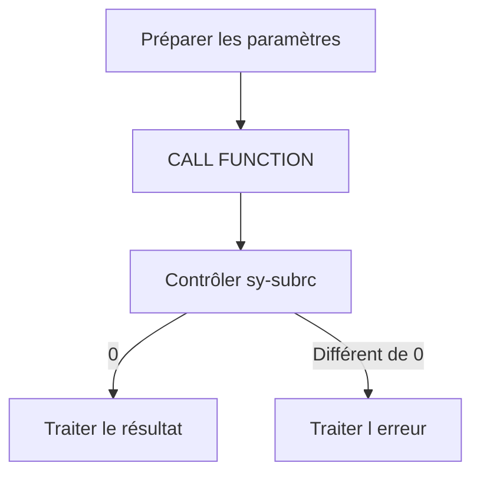

# APPELER UN MODULE FONCTION AVEC CALL FUNCTION

## OBJECTIFS

- Générer un appel depuis l’éditeur ABAP
- Mapper correctement les paramètres
- Contrôler les paramètres facultatifs
- Traiter le code retour immédiatement

## SYNTAXE

```abap
CALL FUNCTION 'Z_DEV_PRODUCT_GET'
  EXPORTING
    iv_matnr        = lv_matnr
  IMPORTING
    es_mara         = ls_mara
  EXCEPTIONS
    not_found       = 1
    invalid_input   = 2
    OTHERS          = 3.
```

Le sens est inversé par rapport à l’interface du module : l’appelant **exporte** vers les paramètres d’import du module et **importe** ses paramètres d’export.

## GÉNÉRER LE MODÈLE

Dans l’éditeur ABAP classique, utiliser la fonction **Modèle / Pattern** pour insérer l’appel. Cette méthode réduit les erreurs de nom et permet de partir de l’interface active.

## PARAMÈTRES NOMMÉS

Toujours utiliser le nom explicite du paramètre. L’appel reste lisible et résiste mieux à l’ajout de paramètres facultatifs.

## PARAMÈTRES FACULTATIFS

Ne fournir un paramètre facultatif que lorsque sa valeur a un sens. Éviter d’envoyer systématiquement une valeur initiale : l’absence du paramètre et une valeur initiale peuvent représenter deux comportements distincts.

## CODE RETOUR

Contrôler `sy-subrc` immédiatement après l’appel lorsqu’une liste `EXCEPTIONS` est utilisée :

```abap
CASE sy-subrc.
  WHEN 0.
    " Succès
  WHEN 1.
    MESSAGE 'Produit introuvable' TYPE 'E'.
  WHEN 2.
    MESSAGE 'Entrée invalide' TYPE 'E'.
  WHEN OTHERS.
    MESSAGE 'Erreur technique' TYPE 'E'.
ENDCASE.
```

Ne pas exécuter une instruction intermédiaire avant le contrôle, car elle pourrait modifier `sy-subrc`.



## APPEL DYNAMIQUE

`CALL FUNCTION (lv_name)` permet un appel dynamique. Ne l’utiliser que pour un besoin justifié, avec une liste blanche ou une validation stricte du nom. Un nom provenant directement d’une entrée utilisateur constitue un risque technique et de sécurité.

## PROCÉDURE PAS À PAS

1. Saisir `/nSE37`.
2. Entrer le nom du module fonction puis choisir **Afficher**, **Modifier** ou **Créer** selon l’autorisation.
3. Analyser les onglets Import, Export, Changing, Tables et Exceptions.
4. Lire la documentation et le code source avant tout appel.
5. Utiliser **Test/Exécuter** avec des données non destructives.
6. Pour un module Z, contrôler, activer puis tester les cas nominal et d’erreur.

## VÉRIFICATION

- Le contrôle syntaxique réussit.
- La version active correspond au code sauvegardé.
- L’exécution produit le résultat décrit dans le chapitre.
- Les cas vide, limite et erreur sont testés séparément lorsque la syntaxe le permet.

## ERREURS FRÉQUENTES

- Copier un exemple sans adapter les types, noms d’objets et données disponibles dans le système.
- Tester uniquement le cas nominal et ignorer les valeurs initiales, absentes ou invalides.
- Appeler un module fonction sans lire sa documentation et ses exceptions.
- Supposer qu’une BAPI effectue automatiquement le commit.

## SNIPPET À RÉUTILISER

> [!NOTE]
> Adapter les noms `Z*`, les types DDIC, les données et les autorisations au système cible. Effectuer un contrôle syntaxique avant activation.

```abap
CALL FUNCTION 'Z_DEV_PRODUCT_GET'
  EXPORTING
    iv_matnr        = lv_matnr
  IMPORTING
    es_mara         = ls_mara
  EXCEPTIONS
    not_found       = 1
    invalid_input   = 2
    OTHERS          = 3.
```

## TERMES DU LEXIQUE

- [Module fonction](<../00 ├── LEXIQUE SAP ET ABAP/06 ├── PROGRAMMES CLASSES ET OBJETS TECHNIQUES.md#module-fonction>)
- [Function group](<../00 ├── LEXIQUE SAP ET ABAP/06 ├── PROGRAMMES CLASSES ET OBJETS TECHNIQUES.md#function-group>)
- [RFC](<../00 ├── LEXIQUE SAP ET ABAP/10 └── ACRONYMES SAP.md#acro-rfc>)
- [BAPI](<../00 ├── LEXIQUE SAP ET ABAP/10 └── ACRONYMES SAP.md#acro-bapi>)
- [Destination RFC](<../00 ├── LEXIQUE SAP ET ABAP/07 ├── INTERFACES ET INTEGRATION.md#destination-rfc>)

## RÉFÉRENCES OFFICIELLES SAP

- [CALL FUNCTION — ABAP Keyword Documentation](https://help.sap.com/doc/abapdocu_latest_index_htm/latest/en-US/abapcall_function.htm)
- [Calling Function Modules From Your Programs — SAP Help Portal](https://help.sap.com/docs/ABAP_PLATFORM_NEW/bd833c8355f34e96a6e83096b38bf192/d1801edb454211d189710000e8322d00.html)


---

[Chapitre suivant — EXCEPTIONS CLASSIQUES ET MESSAGES](<./09 ├── EXCEPTIONS CLASSIQUES ET MESSAGES.md>)
