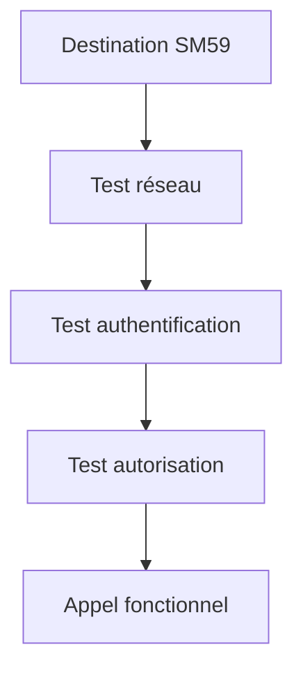

# DESTINATIONS RFC AVEC SM59

## OBJECTIFS

- Comprendre le rôle d’une destination RFC
- Lire et tester une destination dans `SM59`
- Identifier les principaux types de connexion
- Séparer développement et administration

## DESTINATION LOGIQUE

Une destination RFC fournit au runtime les informations nécessaires pour atteindre une cible. Les destinations sont maintenues dans la transaction `SM59`.

Dans un appel ABAP :

```abap
CALL FUNCTION 'Z_DEV_PRODUCT_GET'
  DESTINATION 'S4H_DEV_100'
  EXPORTING
    iv_matnr              = lv_matnr
  IMPORTING
    es_product            = ls_product
  EXCEPTIONS
    system_failure        = 1 MESSAGE lv_message
    communication_failure = 2 MESSAGE lv_message
    OTHERS                = 3.
```

## TYPES COURANTS

Le type exact dépend du scénario. Parmi les types classiques :

| Type             | Usage général                                                 |
| ---------------- | ------------------------------------------------------------- |
| Connexion ABAP   | Communication vers un système ABAP                            |
| Programme TCP/IP | Communication avec un programme externe enregistré ou démarré |
| Connexion HTTP   | Scénarios HTTP gérés dans `SM59`                              |

Ne pas choisir un type par analogie : utiliser l’architecture définie par l’équipe Basis ou intégration.

## PARAMÈTRES

Une destination peut contenir :

- hôte ou système cible ;
- numéro de système ;
- mandant ;
- utilisateur ou méthode d’authentification ;
- langue ;
- paramètres de connexion ;
- options de sécurité ;
- paramètres Unicode ou réseau selon le type.

## TESTS

Dans `SM59`, les tests disponibles dépendent du type de destination :

- test de connexion ;
- test d’autorisation ;
- test de connexion à distance ;
- mesure de temps de réponse.



Un test de connexion réussi ne prouve pas que l’utilisateur peut appeler le module métier.

## RESPONSABILITÉS

Le développeur :

- utilise le nom logique défini ;
- gère les erreurs ;
- évite les identifiants codés en dur ;
- documente la dépendance.

L’administration système :

- maintient les paramètres sensibles ;
- configure les comptes ;
- gère les certificats ou secrets ;
- contrôle les autorisations et la disponibilité.

## PROCÉDURE PAS À PAS

1. Saisir `/nSM59`.
2. Sélectionner le type de destination et ouvrir la destination concernée.
3. Commencer en mode affichage et contrôler hôte, système cible et options de connexion.
4. Exécuter **Test de connexion** puis **Test d’autorisation** lorsque disponible.
5. Distinguer une erreur réseau, une erreur de connexion et une erreur d’autorisation.
6. Ne jamais modifier les identifiants ou paramètres productifs sans validation Basis/sécurité.

## VÉRIFICATION

- Le contrôle syntaxique réussit.
- La version active correspond au code sauvegardé.
- L’exécution produit le résultat décrit dans le chapitre.
- Les cas vide, limite et erreur sont testés séparément lorsque la syntaxe le permet.

## ERREURS FRÉQUENTES

- Copier un exemple sans adapter les types, noms d’objets et données disponibles dans le système.
- Tester uniquement le cas nominal et ignorer les valeurs initiales, absentes ou invalides.
- Appeler un module fonction sans lire sa documentation et ses exceptions.
- Supposer qu’une BAPI effectue automatiquement le commit.

## SNIPPET À RÉUTILISER

> [!NOTE]
> Adapter les noms `Z*`, les types DDIC, les données et les autorisations au système cible. Effectuer un contrôle syntaxique avant activation.

```abap
CALL FUNCTION 'Z_DEV_PRODUCT_GET'
  DESTINATION 'S4H_DEV_100'
  EXPORTING
    iv_matnr              = lv_matnr
  IMPORTING
    es_product            = ls_product
  EXCEPTIONS
    system_failure        = 1 MESSAGE lv_message
    communication_failure = 2 MESSAGE lv_message
    OTHERS                = 3.
```

## TERMES DU LEXIQUE

- [Module fonction](<../00 ├── LEXIQUE SAP ET ABAP/06 ├── PROGRAMMES CLASSES ET OBJETS TECHNIQUES.md#module-fonction>)
- [Function group](<../00 ├── LEXIQUE SAP ET ABAP/06 ├── PROGRAMMES CLASSES ET OBJETS TECHNIQUES.md#function-group>)
- [RFC](<../00 ├── LEXIQUE SAP ET ABAP/10 └── ACRONYMES SAP.md#acro-rfc>)
- [BAPI](<../00 ├── LEXIQUE SAP ET ABAP/10 └── ACRONYMES SAP.md#acro-bapi>)
- [Destination RFC](<../00 ├── LEXIQUE SAP ET ABAP/07 ├── INTERFACES ET INTEGRATION.md#destination-rfc>)

## RÉFÉRENCES OFFICIELLES SAP

- [RFC Destinations — SAP Help Portal](https://help.sap.com/docs/ABAP_PLATFORM_NEW/753088fc00704d0a80e7fbd6803c8adb/4899b539ee2b73e7e10000000a42189b.html)
- [Calling RFC Function Modules in ABAP — SAP Help Portal](https://help.sap.com/docs/ABAP_PLATFORM_NEW/753088fc00704d0a80e7fbd6803c8adb/48a0f18641bc062de10000000a42189d.html)
- [Authorization Object S_RFC_ADM — SAP Help Portal](https://help.sap.com/docs/ABAP_PLATFORM_NEW/c495ada972d045b2be2869f5573af8e7/488d1c05ae444e6ee10000000a421937.html)


---

[Chapitre suivant — APPELS RFC SYNCHRONES ET ASYNCHRONES](<./15 ├── APPELS RFC SYNCHRONES ET ASYNCHRONES.md>)
