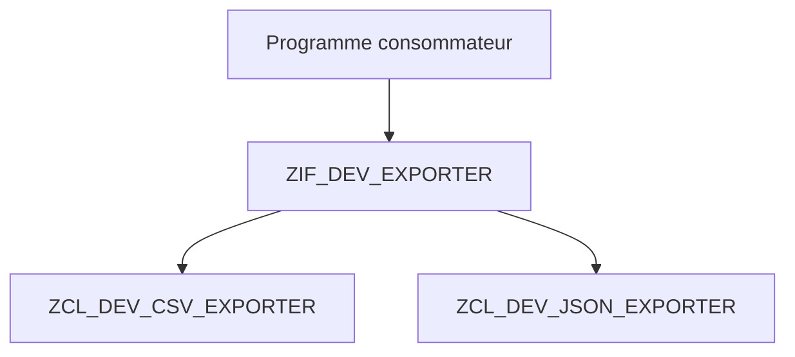

# POLYMORPHISME PAR INTERFACE

## RÉSULTAT ATTENDU

- Utiliser une référence d’interface.
- Substituer plusieurs implémentations.
- Éliminer des branchements techniques répétés.

## PRINCIPE

Le polymorphisme permet d’appeler la même méthode sur des objets de classes différentes, tant qu’ils respectent le même contrat.



## CAS D’USAGE

Une extraction doit produire du CSV ou du JSON selon une configuration. Au lieu de placer un `CASE` dans chaque appelant, deux classes implémentent `ZIF_DEV_EXPORTER`.

## CODE À ADAPTER

```abap
DATA lo_exporter TYPE REF TO zif_dev_exporter.

CASE iv_format.
  WHEN 'CSV'.
    lo_exporter = NEW zcl_dev_csv_exporter( ).
  WHEN 'JSON'.
    lo_exporter = NEW zcl_dev_json_exporter( ).
  WHEN OTHERS.
    RAISE EXCEPTION TYPE zcx_dev_unsupported_format.
ENDCASE.

DATA(lv_payload) = lo_exporter->serialize( it_data ).
```

Le `CASE` reste ici au point de composition. Le traitement métier utilise ensuite uniquement l’interface.

## PROCÉDURE DE VALIDATION

1. Créer au moins deux implémentations.
2. Typer la variable avec l’interface.
3. Affecter une première classe et exécuter la méthode.
4. Affecter la seconde sans modifier l’appel.
5. Vérifier que chaque résultat correspond au contrat.
6. Ajouter un double de test implémentant la même interface.

## CASTS

Un up-cast vers une interface est généralement implicite et sûr. Un down-cast vers une classe concrète avec `CAST` ou `?=` doit rester exceptionnel : il révèle souvent que le contrat de l’interface est insuffisant ou que l’appelant connaît trop l’implémentation.

## CONTRÔLE

Le code métier ne doit contenir aucun nom de classe d’implémentation après la phase de composition.

## ERREURS FRÉQUENTES

- Tester la classe dynamique avec `INSTANCE OF` pour choisir le comportement.
- Ajouter des méthodes spécifiques à l’interface uniquement pour satisfaire une classe.
- Répéter la création des implémentations partout au lieu de centraliser la composition.

## COMPATIBILITÉ S/4HANA

- Statut : compatible avec le développement ABAP classique sur SAP S/4HANA.
- Vérifier la syntaxe exacte avec l’aide `F1` du système cible lorsque plusieurs versions d’ABAP Platform sont prises en charge.
- Les objets globaux doivent être créés dans le package et l’ordre de transport du projet.

## RÉFÉRENCES OFFICIELLES SAP

- [Using Interfaces — SAP Learning](https://learning.sap.com/courses/deepening-your-abap-programming-knowledge/using-interfaces_e45af9bb-46e5-457b-88ef-d5ad6b0d38d7)
- [Inheritance and Interfaces — ABAP Keyword Documentation](https://help.sap.com/doc/abapdocu_latest_index_htm/latest/en-US/ABENINHERITANCE_INTERFACES.html)

---

[Chapitre suivant — HÉRITAGE, REDÉFINITION ET SUPER](<./13 ├── HERITAGE REDEFINITION ET SUPER.md>)
