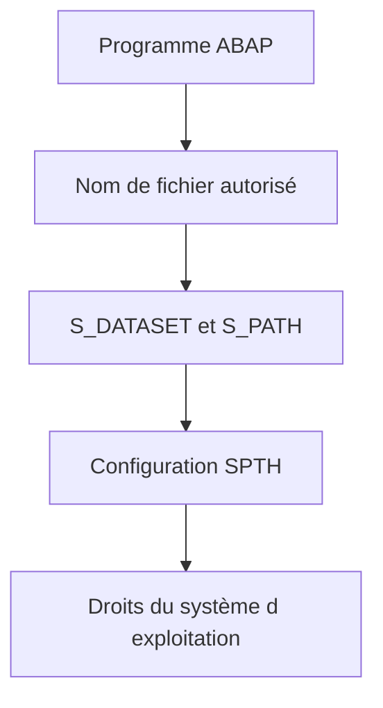

# AUTORISATIONS ET SÉCURITÉ DES FICHIERS

## OBJECTIFS

- Comprendre les contrôles appliqués aux accès fichiers
- Réduire les risques d’injection de chemin
- Protéger les données échangées

## NIVEAUX DE CONTRÔLE

L’accès à un fichier du serveur dépend de plusieurs niveaux :



- `S_DATASET` contrôle l’accès selon le programme, le fichier et l’activité.
- `S_PATH` permet un contrôle indépendant du programme sur les chemins enregistrés.
- Le système d’exploitation doit également autoriser le compte de l’instance AS ABAP.

## RISQUES

Un nom de fichier fourni depuis l’extérieur et utilisé directement dans `OPEN DATASET` crée un risque sérieux :

- lecture d’un fichier non prévu ;
- écrasement d’un fichier ;
- traversée de répertoires avec `../` ;
- divulgation de données ;
- exécution d’un filtre de système d’exploitation si `FILTER` est utilisé.

## MESURES

- Résoudre les noms par `FILE`.
- Utiliser une liste blanche d’identifiants, pas une liste noire de caractères.
- Refuser les chemins relatifs et séquences de remontée.
- Limiter les droits en lecture, écriture et suppression.
- Ne jamais journaliser un contenu sensible en clair.
- Chiffrer ou protéger les zones d’échange selon la classification des données.
- Séparer les répertoires d’entrée, de travail, d’archive et d’erreur.

## CONTRÔLE EXPLICITE

Selon le contexte et la politique du système, un contrôle explicite avec `AUTHORITY_CHECK_DATASET` peut compléter les contrôles automatiques. Le résultat doit être traité avant toute ouverture du fichier.

## PROCÉDURE PAS À PAS

1. Saisir `/nSAT`.
2. Créer ou sélectionner une variante de mesure adaptée.
3. Définir le programme, la transaction ou l’utilisateur à mesurer.
4. Démarrer la mesure puis reproduire une seule fois le scénario.
5. Arrêter et analyser le hit list, la hiérarchie d’appels et les temps nets.
6. Répéter la mesure après correction avec les mêmes données et le même contexte.

## VÉRIFICATION

- Le scénario reproduit correspond au même utilisateur, mandant, transaction et jeu de données.
- L’horodatage et l’identifiant de l’analyse sont conservés.
- La cause retenue est soutenue par une ligne source, une trace ou une valeur observée.
- Après correction, le même scénario ne reproduit plus le défaut et le résultat métier reste identique.

## ERREURS FRÉQUENTES

- Mélanger fichiers frontend et serveur dans un même scénario.
- Parser un CSV par simple séparation alors que les champs peuvent être échappés.

## FICHE DE CONTRÔLE À COPIER

```text
Système / SID       :
Mandant             :
Utilisateur         :
Transaction / outil :
Objet technique     :
Jeu de données      :
Résultat attendu    :
Résultat observé    :
Horodatage          :
Ordre de transport  :
```

## TERMES DU LEXIQUE

- [Interface](<../00 ├── LEXIQUE SAP ET ABAP/07 ├── INTERFACES ET INTEGRATION.md#interface-integration>)
- [Flux entrant](<../00 ├── LEXIQUE SAP ET ABAP/07 ├── INTERFACES ET INTEGRATION.md#flux-entrant>)
- [Flux sortant](<../00 ├── LEXIQUE SAP ET ABAP/07 ├── INTERFACES ET INTEGRATION.md#flux-sortant>)
- [CSV](<../00 ├── LEXIQUE SAP ET ABAP/07 ├── INTERFACES ET INTEGRATION.md#csv>)
- [Encodage](<../00 ├── LEXIQUE SAP ET ABAP/07 ├── INTERFACES ET INTEGRATION.md#encodage>)
- [Serveur d’application](<../00 ├── LEXIQUE SAP ET ABAP/07 ├── INTERFACES ET INTEGRATION.md#fichier-serveur-application>)

## RÉFÉRENCES OFFICIELLES SAP

- [Authorization for File Access — SAP Help Portal](https://help.sap.com/docs/ABAP_PLATFORM_NEW/7bfe8cdcfbb040dcb6702dada8c3e2f0/dc545b5a743047b6b468bbadd0085ce2.html)
- [OPEN DATASET Security Notes — ABAP Keyword Documentation](https://help.sap.com/doc/abapdocu_latest_index_htm/latest/en-US/ABAPOPEN_DATASET.html)
- [Physical and Logical File Names — SAP Help Portal](https://help.sap.com/docs/ABAP_PLATFORM_NEW/7bfe8cdcfbb040dcb6702dada8c3e2f0/9e49819d5b2a440fb508772494b9a473.html)


---

[Chapitre suivant — CYCLE `OPEN DATASET` ET `CLOSE DATASET`](<./06 ├── CYCLE OPEN DATASET ET CLOSE DATASET.md>)
