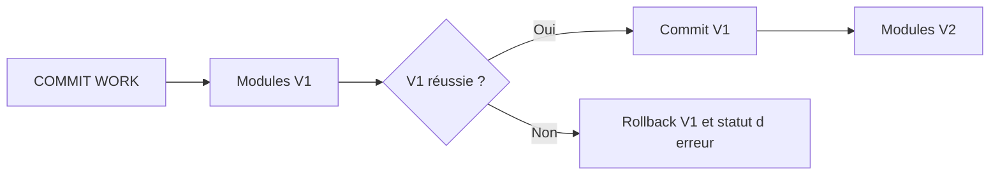

# MISES À JOUR `V1` ET `V2`

## OBJECTIFS

- Distinguer mises à jour prioritaires et secondaires
- Comprendre leur ordre de traitement
- Choisir la catégorie selon la criticité métier

## PRIORITÉS

| Catégorie | Usage                                                       | Caractéristique                                                                    |
| --------- | ----------------------------------------------------------- | ---------------------------------------------------------------------------------- |
| V1        | Données primaires indispensables à la transaction           | Exécutées en premier, dans l’ordre d’enregistrement, dans une database LUW commune |
| V2        | Données secondaires pouvant suivre la validation principale | Exécutées après la réussite de V1, éventuellement par des processus dédiés         |

Une erreur V2 ne doit pas remettre en cause les données V1 déjà validées. V2 convient donc uniquement aux mises à jour dont le retard ou la reprise séparée est acceptable.

## CRITÈRE DE CHOIX

Utiliser V1 pour ce qui définit la cohérence de l’objet métier. Utiliser V2 pour des informations dérivées ou statistiques lorsque le standard concerné le prévoit. Ne pas détourner V2 pour masquer un traitement lent sans analyser la cohérence.

## PROCÉDURE PAS À PAS

1. Lire la définition et identifier les prérequis du chapitre.
2. Choisir un objet Z ou un scénario de démonstration sans impact métier.
3. Reproduire l’exemple dans un système de développement et relever les données d’entrée.
4. Contrôler la syntaxe ou la configuration avant activation/exécution.
5. Comparer le résultat observé avec la section **Vérification**.
6. Documenter toute différence liée à la release, aux autorisations ou au paramétrage du système.

## VÉRIFICATION

- Les données sont toutes validées ou toutes annulées selon le cas testé.
- Les verrous sont libérés à la fin du traitement normal et après erreur.
- Aucune update en erreur inattendue ne reste dans `SM13`.
- Les collisions concurrentes produisent un message contrôlé, pas une incohérence.

## ERREURS FRÉQUENTES

- Supprimer manuellement un verrou sans comprendre son propriétaire.
- Relancer une update en erreur sans vérifier l’état métier.

## TERMES DU LEXIQUE

- [SAP LUW](<../00 ├── LEXIQUE SAP ET ABAP/08 ├── EXECUTION EXPLOITATION ET ADMINISTRATION.md#sap-luw>)
- [LUW base de données](<../00 ├── LEXIQUE SAP ET ABAP/08 ├── EXECUTION EXPLOITATION ET ADMINISTRATION.md#luw-base>)
- [COMMIT WORK](<../00 ├── LEXIQUE SAP ET ABAP/08 ├── EXECUTION EXPLOITATION ET ADMINISTRATION.md#commit-work>)
- [ROLLBACK WORK](<../00 ├── LEXIQUE SAP ET ABAP/08 ├── EXECUTION EXPLOITATION ET ADMINISTRATION.md#rollback-work>)
- [Enqueue server](<../00 ├── LEXIQUE SAP ET ABAP/08 ├── EXECUTION EXPLOITATION ET ADMINISTRATION.md#enqueue-server>)
- [Update task](<../00 ├── LEXIQUE SAP ET ABAP/08 ├── EXECUTION EXPLOITATION ET ADMINISTRATION.md#update-task>)

## RÉFÉRENCES OFFICIELLES SAP

- [V1 and V2 Update Function Modules — SAP Help Portal](https://help.sap.com/docs/ABAP_PLATFORM_NEW/979cf1522d164bf7a781796efd8850ee/23e9aa61638e404d81575e939b5cd847.html)
- [The Update Process — SAP Help Portal](https://help.sap.com/docs/SAP_NETWEAVER_AS_ABAP_752/979cf1522d164bf7a781796efd8850ee/c8ed15db039b4f45a8507015f531976b.html)
- [Update Statuses — SAP Help Portal](https://help.sap.com/docs/ABAP_PLATFORM_NEW/979cf1522d164bf7a781796efd8850ee/3c7ad8b964b74aac9e1d3e709b33e794.html)

---

[Chapitre suivant — MISE À JOUR LOCALE AVEC `SET UPDATE TASK LOCAL`](<./17 ├── MISE A JOUR LOCALE AVEC SET UPDATE TASK LOCAL.md>)
