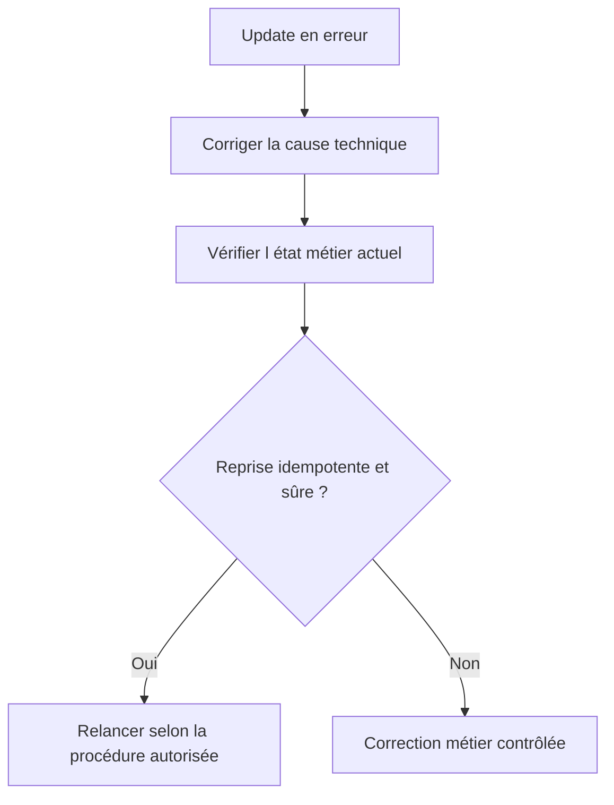

# ANALYSER ET REPRENDRE LES UPDATES AVEC `SM13`

## OBJECTIFS

- Rechercher une demande de mise à jour en erreur
- Identifier le module et la cause
- Décider si une reprise est sûre

## RECHERCHE

Dans `SM13`, filtrer notamment par :

- utilisateur ;
- date et heure ;
- mandant ;
- statut ;
- transaction ou identifiant de demande.

Analyser ensuite :

- le module fonction en erreur ;
- le message ou le dump associé ;
- les paramètres enregistrés ;
- les modules V1 et V2 de la demande ;
- l’état actuel des données métier.

## REPRISE



Ne pas relancer mécaniquement une demande ancienne. Les données ou le customizing peuvent avoir changé, et un traitement manuel peut avoir déjà compensé l’erreur.

## OUTILS ASSOCIÉS

- `ST22` pour un dump du module de mise à jour ;
- `SM12` pour les verrous ;
- `SM21` pour le journal système ;
- `SLG1` si l’application écrit un journal applicatif ;
- `SM14` pour l’état administratif du système de mise à jour.

## PROCÉDURE PAS À PAS

1. Saisir `/nSM13`.
2. Rechercher les mises à jour par utilisateur et période.
3. Ouvrir l’entrée en erreur et lire module, message et données de contexte.
4. Identifier la cause avant toute répétition.
5. Vérifier l’idempotence et l’état métier ; une reprise aveugle peut dupliquer une opération.

## VÉRIFICATION

- Les données sont toutes validées ou toutes annulées selon le cas testé.
- Les verrous sont libérés à la fin du traitement normal et après erreur.
- Aucune update en erreur inattendue ne reste dans `SM13`.
- Les collisions concurrentes produisent un message contrôlé, pas une incohérence.

## ERREURS FRÉQUENTES

- Supprimer manuellement un verrou sans comprendre son propriétaire.
- Relancer une update en erreur sans vérifier l’état métier.

## FICHE DE CONTRÔLE À COPIER

```text
Système / SID       :
Mandant             :
Utilisateur         :
Transaction / outil :
Objet technique     :
Jeu de données      :
Résultat attendu    :
Résultat observé    :
Horodatage          :
Ordre de transport  :
```

## TERMES DU LEXIQUE

- [SAP LUW](<../00 ├── LEXIQUE SAP ET ABAP/08 ├── EXECUTION EXPLOITATION ET ADMINISTRATION.md#sap-luw>)
- [LUW base de données](<../00 ├── LEXIQUE SAP ET ABAP/08 ├── EXECUTION EXPLOITATION ET ADMINISTRATION.md#luw-base>)
- [COMMIT WORK](<../00 ├── LEXIQUE SAP ET ABAP/08 ├── EXECUTION EXPLOITATION ET ADMINISTRATION.md#commit-work>)
- [ROLLBACK WORK](<../00 ├── LEXIQUE SAP ET ABAP/08 ├── EXECUTION EXPLOITATION ET ADMINISTRATION.md#rollback-work>)
- [Enqueue server](<../00 ├── LEXIQUE SAP ET ABAP/08 ├── EXECUTION EXPLOITATION ET ADMINISTRATION.md#enqueue-server>)
- [Update task](<../00 ├── LEXIQUE SAP ET ABAP/08 ├── EXECUTION EXPLOITATION ET ADMINISTRATION.md#update-task>)

## RÉFÉRENCES OFFICIELLES SAP

- [Update Management — SAP Help Portal](https://help.sap.com/docs/SAP_NETWEAVER_AS_ABAP_752/979cf1522d164bf7a781796efd8850ee/078cb02dc14d497f9779f7a309c1a7bc.html)
- [Update Statuses — SAP Help Portal](https://help.sap.com/docs/ABAP_PLATFORM_NEW/979cf1522d164bf7a781796efd8850ee/3c7ad8b964b74aac9e1d3e709b33e794.html)
- [SM13 - Update Request — SAP Help Portal](https://help.sap.com/docs/SUPPORT_CONTENT/basis/3354611548.html)


---

[Chapitre suivant — CONCEPTION, DIAGNOSTIC ET BONNES PRATIQUES](<./20 └── CONCEPTION DIAGNOSTIC ET BONNES PRATIQUES.md>)
