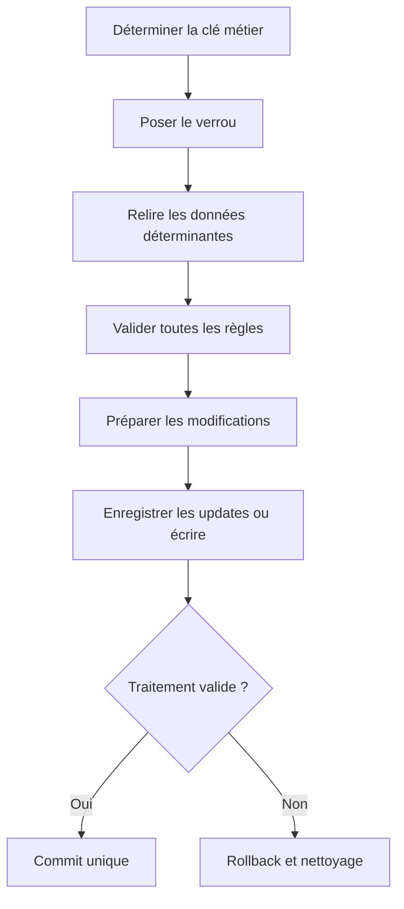

# CONCEPTION, DIAGNOSTIC ET BONNES PRATIQUES

## OBJECTIFS

- Concevoir une transaction robuste
- Éviter les commits cachés et les verrous incohérents
- Appliquer une checklist de livraison

## SÉQUENCE RECOMMANDÉE



## ERREURS CLASSIQUES

- lire puis verrouiller sans relire ;
- exécuter un commit dans une méthode profonde ou un exit ;
- poser un verrou trop large et créer des collisions inutiles ;
- libérer le verrou avant la validation ;
- utiliser V2 pour des données indispensables ;
- appeler un module en update task sans garantir le commit ;
- relancer une erreur `SM13` sans contrôler l’idempotence ;
- supprimer un verrou `SM12` sans identifier le propriétaire ;
- mélanger effets externes et transaction locale sans stratégie de compensation.

## CHECKLIST

- [ ] Unité métier et frontière de SAP LUW définies
- [ ] Propriétaire du commit identifié
- [ ] Aucun commit caché dans les composants réutilisables
- [ ] Objet et clé de verrou documentés
- [ ] Collision testée avec deux sessions
- [ ] Tous les chemins d’erreur libèrent ou transfèrent correctement le verrou
- [ ] Priorité V1 ou V2 justifiée
- [ ] Module de mise à jour sans interaction ni commit interne
- [ ] `COMMIT WORK AND WAIT` utilisé seulement quand le résultat immédiat est requis
- [ ] Reprise et idempotence documentées
- [ ] Diagnostic `SM12`, `SM13`, `ST22` et logs testé
- [ ] Tests de rollback et d’échec partiel exécutés

## PROCÉDURE PAS À PAS

1. Saisir `/nST22`.
2. Choisir la période correspondant à la reproduction.
3. Filtrer par utilisateur, transaction ou runtime error lorsque nécessaire.
4. Ouvrir le dump et relever le nom de l’erreur, l’exception, le programme et la ligne source.
5. Lire les sections **Error analysis**, **How to correct the error** et **Source Code Extract**.
6. Corréler le dump avec les données d’entrée et la version active du code.

## VÉRIFICATION

- Le scénario reproduit correspond au même utilisateur, mandant, transaction et jeu de données.
- L’horodatage et l’identifiant de l’analyse sont conservés.
- La cause retenue est soutenue par une ligne source, une trace ou une valeur observée.
- Après correction, le même scénario ne reproduit plus le défaut et le résultat métier reste identique.

## ERREURS FRÉQUENTES

- Supprimer manuellement un verrou sans comprendre son propriétaire.
- Relancer une update en erreur sans vérifier l’état métier.

## FICHE DE CONTRÔLE À COPIER

```text
Système / SID       :
Mandant             :
Utilisateur         :
Transaction / outil :
Objet technique     :
Jeu de données      :
Résultat attendu    :
Résultat observé    :
Horodatage          :
Ordre de transport  :
```

## TERMES DU LEXIQUE

- [SAP LUW](<../00 ├── LEXIQUE SAP ET ABAP/08 ├── EXECUTION EXPLOITATION ET ADMINISTRATION.md#sap-luw>)
- [LUW base de données](<../00 ├── LEXIQUE SAP ET ABAP/08 ├── EXECUTION EXPLOITATION ET ADMINISTRATION.md#luw-base>)
- [COMMIT WORK](<../00 ├── LEXIQUE SAP ET ABAP/08 ├── EXECUTION EXPLOITATION ET ADMINISTRATION.md#commit-work>)
- [ROLLBACK WORK](<../00 ├── LEXIQUE SAP ET ABAP/08 ├── EXECUTION EXPLOITATION ET ADMINISTRATION.md#rollback-work>)
- [Enqueue server](<../00 ├── LEXIQUE SAP ET ABAP/08 ├── EXECUTION EXPLOITATION ET ADMINISTRATION.md#enqueue-server>)
- [Update task](<../00 ├── LEXIQUE SAP ET ABAP/08 ├── EXECUTION EXPLOITATION ET ADMINISTRATION.md#update-task>)

## RÉFÉRENCES OFFICIELLES SAP

- [LUWs in ABAP — SAP Help Portal](https://help.sap.com/docs/ABAP_PLATFORM_NEW/8132142fd1a144a59303663a03a7c2d4/54f5462a9604498382319304869a4280.html)
- [SAP Lock Concept — SAP Help Portal](https://help.sap.com/docs/ABAP_PLATFORM_NEW/7bbf03267f654b5cb06a8bf78f61fca1/9101274dc2e048d4b473fe5c45ae4e29.html)
- [The Update Process — SAP Help Portal](https://help.sap.com/docs/SAP_NETWEAVER_AS_ABAP_752/979cf1522d164bf7a781796efd8850ee/c8ed15db039b4f45a8507015f531976b.html)
- [COMMIT WORK — ABAP Keyword Documentation](https://help.sap.com/doc/abapdocu_752_index_htm/7.52/en-US/abapcommit.htm)
