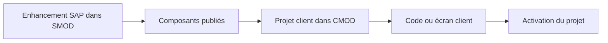

# CUSTOMER EXITS ET ENHANCEMENTS CLASSIQUES

## OBJECTIFS

- Comprendre le modèle `SMOD` / `CMOD`
- Distinguer définition SAP et projet client
- Identifier les composants d’un enhancement classique

## ARCHITECTURE



SAP définit l’enhancement et ses composants. Le client crée un projet `CMOD`, lui affecte un ou plusieurs enhancements, implémente les composants puis active le projet.

## TYPES DE COMPOSANTS

- function module exit ;
- screen exit ;
- menu exit ;
- extensions de données associées selon l’application.

Un enhancement classique peut regrouper plusieurs composants qui doivent être analysés ensemble.

## ACTIVATION

Le code présent dans un include client ne suffit pas. Le projet `CMOD` contenant l’enhancement doit être actif. Une seule implémentation active est normalement attendue pour un enhancement classique donné.

## LIMITES

- technologie historique ;
- contrat souvent moins flexible qu’un BAdI ;
- dépendance à des programmes, écrans ou groupes de fonctions précis ;
- pas de filtrage générique comparable aux BAdI ;
- plusieurs besoins peuvent devoir être regroupés dans le même projet ou composant.

## PROCÉDURE PAS À PAS

1. Saisir `/nSMOD`.
2. Entrer l’enhancement classique ou utiliser la recherche.
3. Afficher les composants : function exits, screen exits, menu exits et documentation.
4. Identifier les structures append et objets associés.
5. Ne pas modifier les includes client avant d’avoir confirmé le scénario d’appel.

## VÉRIFICATION

- L’implémentation ou le projet est actif et transporté dans le bon ordre.
- Un breakpoint confirme que le point d’extension est appelé dans le scénario visé.
- Le comportement standard reste inchangé hors du périmètre fonctionnel prévu.
- Aucune modification directe d’un objet SAP standard n’a été créée.

## ERREURS FRÉQUENTES

- Choisir le premier exit trouvé sans vérifier le moment exact de l’appel.
- Créer plusieurs implémentations concurrentes sans règles de filtre.

## FICHE DE CONTRÔLE À COPIER

```text
Système / SID       :
Mandant             :
Utilisateur         :
Transaction / outil :
Objet technique     :
Jeu de données      :
Résultat attendu    :
Résultat observé    :
Horodatage          :
Ordre de transport  :
```

## TERMES DU LEXIQUE

- [BAdI](<../00 ├── LEXIQUE SAP ET ABAP/10 └── ACRONYMES SAP.md#acro-badi>)
- [BTE](<../00 ├── LEXIQUE SAP ET ABAP/10 └── ACRONYMES SAP.md#acro-bte>)
- [Objet Repository](<../00 ├── LEXIQUE SAP ET ABAP/03 ├── REPOSITORY PACKAGES ET TRANSPORTS.md#objet-repository>)

## RÉFÉRENCES OFFICIELLES SAP

- [Customer Exits — SAP Help Portal](https://help.sap.com/docs/ABAP_PLATFORM_NEW/2b28ffa716c24348903f8ffbfeb81df8/c81975cc43b111d1896f0000e8322d00.html)
- [Customer Exit Glossary — SAP Help Portal](https://help.sap.com/saphelp_snc700_ehp01/helpdata/en/35/26b1b7afab52b9e10000009b38f974/content.htm)
- [Types of Exits — SAP Help Portal](https://help.sap.com/docs/ABAP_PLATFORM_NEW/2b28ffa716c24348903f8ffbfeb81df8/c81975e643b111d1896f0000e8322d00.html)


---

[Chapitre suivant — ANALYSER UN ENHANCEMENT AVEC `SMOD`](<./06 ├── ANALYSER UN ENHANCEMENT AVEC SMOD.md>)
