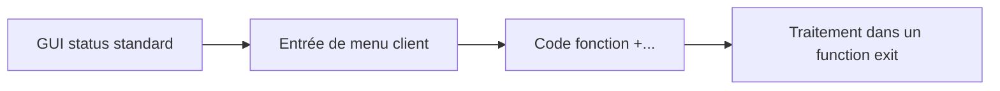

# MENU EXITS

## OBJECTIFS

- Ajouter une entrée de menu ou une fonction à une transaction standard
- Implémenter le traitement associé
- Contrôler disponibilité et autorisations

## PRINCIPE

Un menu exit permet d’ajouter une fonction à un GUI status prévu par SAP. Les codes fonction des menu exits sont généralement définis par SAP et commencent par `+`.



## IMPLÉMENTATION

- identifier le menu exit dans `SMOD` ;
- affecter l’enhancement au projet `CMOD` ;
- maintenir le texte de l’entrée ;
- implémenter le traitement dans le composant prévu ;
- vérifier les autorisations avant l’action ;
- gérer les contextes où l’action n’est pas disponible.

## BONNES PRATIQUES

- masquer ou désactiver l’action lorsqu’elle n’est pas pertinente ;
- ne pas détourner un code fonction standard ;
- afficher un texte court et non ambigu ;
- réutiliser une transaction ou une classe de service existante ;
- tester les langues de connexion utilisées ;
- contrôler le retour vers l’écran standard.

## PROCÉDURE PAS À PAS

1. Saisir `/nSMOD`.
2. Entrer l’enhancement classique ou utiliser la recherche.
3. Afficher les composants : function exits, screen exits, menu exits et documentation.
4. Identifier les structures append et objets associés.
5. Ne pas modifier les includes client avant d’avoir confirmé le scénario d’appel.

## VÉRIFICATION

- L’implémentation ou le projet est actif et transporté dans le bon ordre.
- Un breakpoint confirme que le point d’extension est appelé dans le scénario visé.
- Le comportement standard reste inchangé hors du périmètre fonctionnel prévu.
- Aucune modification directe d’un objet SAP standard n’a été créée.

## ERREURS FRÉQUENTES

- Choisir le premier exit trouvé sans vérifier le moment exact de l’appel.
- Créer plusieurs implémentations concurrentes sans règles de filtre.

## FICHE DE CONTRÔLE À COPIER

```text
Système / SID       :
Mandant             :
Utilisateur         :
Transaction / outil :
Objet technique     :
Jeu de données      :
Résultat attendu    :
Résultat observé    :
Horodatage          :
Ordre de transport  :
```

## TERMES DU LEXIQUE

- [BAdI](<../00 ├── LEXIQUE SAP ET ABAP/10 └── ACRONYMES SAP.md#acro-badi>)
- [BTE](<../00 ├── LEXIQUE SAP ET ABAP/10 └── ACRONYMES SAP.md#acro-bte>)
- [Objet Repository](<../00 ├── LEXIQUE SAP ET ABAP/03 ├── REPOSITORY PACKAGES ET TRANSPORTS.md#objet-repository>)

## RÉFÉRENCES OFFICIELLES SAP

- [Types of Exits — SAP Help Portal](https://help.sap.com/docs/ABAP_PLATFORM_NEW/2b28ffa716c24348903f8ffbfeb81df8/c81975e643b111d1896f0000e8322d00.html)
- [Enhancements, User Exits and Customer Exits — SAP Help Portal](https://help.sap.com/docs/btp/ABAP/3353526313.html)


---

[Chapitre suivant — EXTENSIONS DDIC ASSOCIÉES AUX EXITS](<./11 ├── EXTENSIONS DDIC ASSOCIEES AUX EXITS.md>)
