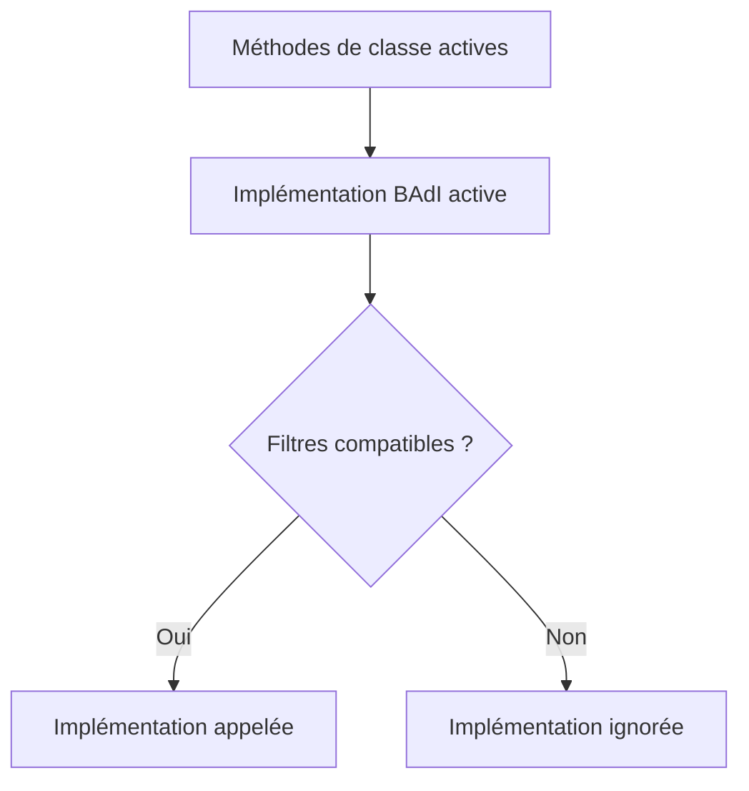

# IMPLÉMENTER UNE BAdI AVEC `SE19`

## OBJECTIFS

- Créer une implémentation BAdI client
- Générer ou affecter la classe d’implémentation
- Activer et tester l’ensemble des objets

## PROCÉDURE

1. Ouvrir `SE19`.
2. Choisir le mode correspondant au type de BAdI.
3. Saisir la définition BAdI ou l’enhancement spot.
4. Créer l’implémentation dans un package client.
5. Renseigner une description fonctionnelle.
6. Maintenir les valeurs de filtre si nécessaire.
7. Implémenter les méthodes de la classe générée ou affectée.
8. Activer la classe et l’implémentation.
9. Tester le scénario standard.

## DÉLÉGATION

Conserver une classe d’implémentation légère :

```abap
METHOD if_ex_zbadi_demo~change_data.
  zcl_dev_badi_service=>change_data(
    EXPORTING
      is_context = is_context
    CHANGING
      cs_data    = cs_data ).
ENDMETHOD.
```

Cette délégation facilite les tests, la réutilisation et la séparation entre contrat SAP et logique client.

## ACTIVATION



## VÉRIFICATION

- L’implémentation ou le projet est actif et transporté dans le bon ordre.
- Un breakpoint confirme que le point d’extension est appelé dans le scénario visé.
- Le comportement standard reste inchangé hors du périmètre fonctionnel prévu.
- Aucune modification directe d’un objet SAP standard n’a été créée.

## ERREURS FRÉQUENTES

- Copier un exemple sans adapter les types, noms d’objets et données disponibles dans le système.
- Tester uniquement le cas nominal et ignorer les valeurs initiales, absentes ou invalides.
- Choisir le premier exit trouvé sans vérifier le moment exact de l’appel.
- Créer plusieurs implémentations concurrentes sans règles de filtre.

## SNIPPET À RÉUTILISER

> [!NOTE]
> Adapter les noms `Z*`, les types DDIC, les données et les autorisations au système cible. Effectuer un contrôle syntaxique avant activation.

```abap
METHOD if_ex_zbadi_demo~change_data.
  zcl_dev_badi_service=>change_data(
    EXPORTING
      is_context = is_context
    CHANGING
      cs_data    = cs_data ).
ENDMETHOD.
```

## TERMES DU LEXIQUE

- [BAdI](<../00 ├── LEXIQUE SAP ET ABAP/10 └── ACRONYMES SAP.md#acro-badi>)
- [BTE](<../00 ├── LEXIQUE SAP ET ABAP/10 └── ACRONYMES SAP.md#acro-bte>)
- [Objet Repository](<../00 ├── LEXIQUE SAP ET ABAP/03 ├── REPOSITORY PACKAGES ET TRANSPORTS.md#objet-repository>)

## RÉFÉRENCES OFFICIELLES SAP

- [Implementation of BAdIs in the Enhancement Builder — SAP Help Portal](https://help.sap.com/docs/SAP_NETWEAVER_700/12a713d06c531014903e876ccc9a0b0d27/b2873842134bad04e10000000a1550b0.html)
- [How to Implement a BAdI — SAP Help Portal](https://help.sap.com/docs/ABAP_PLATFORM_NEW/46a2cfc13d25463b8b9a3d2a3c3ba0d9/44f518d884056c30e10000000a114a6b.html)
- [Business Add-Ins — SAP Help Portal](https://help.sap.com/docs/PRODUCT_ID/46a2cfc13d25463b8b9a3d2a3c3ba0d9/8ff2e540f8648431e10000000a1550b0.html)


---

[Chapitre suivant — BAdI CLASSIQUES, FILTRES ET USAGE MULTIPLE](<./16 ├── BADI CLASSIQUES FILTRES ET USAGE MULTIPLE.md>)
