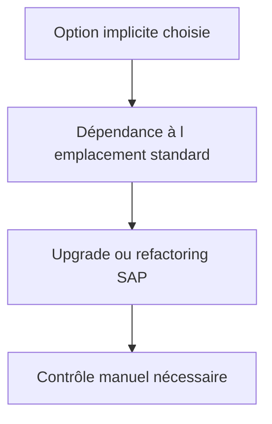

# OPTIONS D’ENHANCEMENT IMPLICITES

## OBJECTIFS

- Afficher les options implicites dans l’éditeur SAP GUI
- Choisir un emplacement stable
- Limiter le couplage au code standard

## PRINCIPE

Le runtime fournit automatiquement des options implicites à certains emplacements, sans instruction `ENHANCEMENT-POINT` écrite dans le code. Elles peuvent être affichées dans l’éditeur ABAP via les opérations d’enhancement.

Emplacements courants :

- début et fin de `FORM`, module fonction ou méthode ;
- fin d’un programme ou include ;
- fin de certaines sections de classes ou interfaces ;
- listes de paramètres extensibles selon le type d’objet.

## RISQUE



Une option implicite est moins explicite qu’un BAdI ou un point publié. Son emplacement peut devenir inadapté après une évolution du standard, même si l’objet d’implémentation reste actif.

## RÈGLES

- utiliser l’option la plus locale possible ;
- ne pas copier un bloc standard complet ;
- déléguer immédiatement à une classe client ;
- éviter la dépendance à des variables locales instables ;
- documenter la justification de l’absence d’autre extension ;
- prévoir un contrôle dans `SPAU_ENH` après upgrade ;
- limiter les traitements coûteux en début ou fin de méthode appelée fréquemment.

## PROCÉDURE PAS À PAS

1. Saisir `/nSE80`.
2. Sélectionner le type d’objet ou le package dans la liste de gauche.
3. Entrer le nom technique puis valider.
4. Commencer en mode **Afficher** pour analyser l’objet et ses sous-objets.
5. Passer en modification uniquement dans un système et un objet autorisés.
6. Contrôler la syntaxe, activer les objets modifiés puis vérifier leur statut actif.

## VÉRIFICATION

- L’implémentation ou le projet est actif et transporté dans le bon ordre.
- Un breakpoint confirme que le point d’extension est appelé dans le scénario visé.
- Le comportement standard reste inchangé hors du périmètre fonctionnel prévu.
- Aucune modification directe d’un objet SAP standard n’a été créée.

## ERREURS FRÉQUENTES

- Choisir le premier exit trouvé sans vérifier le moment exact de l’appel.
- Créer plusieurs implémentations concurrentes sans règles de filtre.

## FICHE DE CONTRÔLE À COPIER

```text
Système / SID       :
Mandant             :
Utilisateur         :
Transaction / outil :
Objet technique     :
Jeu de données      :
Résultat attendu    :
Résultat observé    :
Horodatage          :
Ordre de transport  :
```

## TERMES DU LEXIQUE

- [BAdI](<../00 ├── LEXIQUE SAP ET ABAP/10 └── ACRONYMES SAP.md#acro-badi>)
- [BTE](<../00 ├── LEXIQUE SAP ET ABAP/10 └── ACRONYMES SAP.md#acro-bte>)
- [Objet Repository](<../00 ├── LEXIQUE SAP ET ABAP/03 ├── REPOSITORY PACKAGES ET TRANSPORTS.md#objet-repository>)

## RÉFÉRENCES OFFICIELLES SAP

- [Implicit Enhancement Options — SAP Help Portal](https://help.sap.com/docs/ABAP_PLATFORM_NEW/46a2cfc13d25463b8b9a3d2a3c3ba0d9/29e59441026aae5fe10000000a1550b0.html)
- [Enhancement Options — SAP Help Portal](https://help.sap.com/docs/ABAP_PLATFORM_NEW/46a2cfc13d25463b8b9a3d2a3c3ba0d9/fbe3d8403e37762ae10000000a155106.html)
- [ABAP Source Code Enhancements — SAP Help Portal](https://help.sap.com/docs/SAP_NETWEAVER_AS_ABAP_752/46a2cfc13d25463b8b9a3d2a3c3ba0d9/a047e94086087e7fe10000000a1550b0.html)


---

[Chapitre suivant — ENHANCEMENTS DE CLASSES : PRE, POST ET OVERWRITE](<./20 ├── ENHANCEMENTS DE CLASSES PRE POST ET OVERWRITE.md>)
