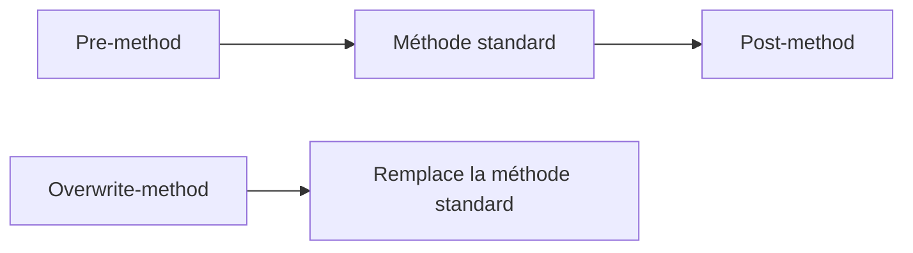

# ENHANCEMENTS DE CLASSES : PRE, POST ET OVERWRITE

## OBJECTIFS

- Étendre une classe globale sans la modifier directement
- Comprendre pre-method, post-method et overwrite-method
- Évaluer les risques de remplacement d’une méthode

## MODES

| Mode             | Moment d’exécution                              | Effet                |
| ---------------- | ----------------------------------------------- | -------------------- |
| Pre-method       | Avant la méthode d’origine                      | Prétraitement        |
| Post-method      | Après la méthode d’origine si le flux le permet | Post-traitement      |
| Overwrite-method | À la place de la méthode d’origine              | Remplacement complet |



Une overwrite-method ne peut pas être combinée avec des pre/post methods pour la même méthode d’origine.

## AUTRES EXTENSIONS DE CLASSE

Selon l’objet et la version, le framework permet notamment :

- ajout de méthodes ;
- ajout de composants ;
- ajout de paramètres facultatifs ;
- amélioration d’interfaces ou de groupes de fonctions.

## RISQUES

L’overwrite-method copie implicitement la responsabilité du code standard. Les corrections futures de SAP dans la méthode d’origine ne sont plus exécutées. Ce mécanisme doit rester exceptionnel.

Pour un pre/post method :

- vérifier les exceptions ;
- ne pas supposer que le post-traitement s’exécutera après toute sortie selon la version et le flux ;
- éviter de modifier un état interne non prévu ;
- mesurer les effets sur toutes les sous-classes et tous les appelants.

## PROCÉDURE PAS À PAS

1. Saisir `/nSE80`.
2. Sélectionner le type d’objet ou le package dans la liste de gauche.
3. Entrer le nom technique puis valider.
4. Commencer en mode **Afficher** pour analyser l’objet et ses sous-objets.
5. Passer en modification uniquement dans un système et un objet autorisés.
6. Contrôler la syntaxe, activer les objets modifiés puis vérifier leur statut actif.

## VÉRIFICATION

- L’implémentation ou le projet est actif et transporté dans le bon ordre.
- Un breakpoint confirme que le point d’extension est appelé dans le scénario visé.
- Le comportement standard reste inchangé hors du périmètre fonctionnel prévu.
- Aucune modification directe d’un objet SAP standard n’a été créée.

## ERREURS FRÉQUENTES

- Choisir le premier exit trouvé sans vérifier le moment exact de l’appel.
- Créer plusieurs implémentations concurrentes sans règles de filtre.

## FICHE DE CONTRÔLE À COPIER

```text
Système / SID       :
Mandant             :
Utilisateur         :
Transaction / outil :
Objet technique     :
Jeu de données      :
Résultat attendu    :
Résultat observé    :
Horodatage          :
Ordre de transport  :
```

## TERMES DU LEXIQUE

- [Classe](<../00 ├── LEXIQUE SAP ET ABAP/04 ├── LANGAGE ET DEVELOPPEMENT ABAP.md#classe>)
- [BAdI](<../00 ├── LEXIQUE SAP ET ABAP/10 └── ACRONYMES SAP.md#acro-badi>)
- [BTE](<../00 ├── LEXIQUE SAP ET ABAP/10 └── ACRONYMES SAP.md#acro-bte>)
- [Objet Repository](<../00 ├── LEXIQUE SAP ET ABAP/03 ├── REPOSITORY PACKAGES ET TRANSPORTS.md#objet-repository>)

## RÉFÉRENCES OFFICIELLES SAP

- [Enhancements to Classes and Interfaces — SAP Help Portal](https://help.sap.com/docs/ABAP_PLATFORM_NEW/46a2cfc13d25463b8b9a3d2a3c3ba0d9/584fb541d3d52d31e10000000a155106.html)
- [Enhancing Components of Global Classes — SAP Help Portal](https://help.sap.com/docs/SAP_NETWEAVER_AS_ABAP_FOR_SOH_740/46a2cfc13d25463b8b9a3d2a3c3ba0d9/86b83142680d5c33e10000000a155106.html)
- [Enhancement Technologies — SAP Help Portal](https://help.sap.com/docs/ABAP_PLATFORM_NEW/46a2cfc13d25463b8b9a3d2a3c3ba0d9/7063da4023a28631e10000000a1550b0.html)


---

[Chapitre suivant — BAdI DU ENHANCEMENT FRAMEWORK ET APPELS ABAP](<./21 ├── BADI DU ENHANCEMENT FRAMEWORK ET APPELS ABAP.md>)
