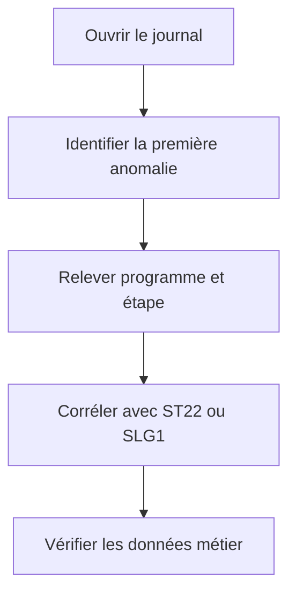

# JOURNAL DE JOB ET MESSAGES

## OBJECTIFS

- Lire le journal dans l’ordre chronologique
- Distinguer messages système et applicatifs
- Produire des informations exploitables

## CONTENU

Le journal de job contient notamment :

- démarrage et fin des étapes ;
- programme et variante ;
- messages du système de traitement de fond ;
- erreurs émises par les programmes ABAP ;
- sorties ou erreurs de certains programmes externes ;
- informations de terminaison.

## ANALYSE



La dernière erreur affichée peut n’être qu’une conséquence. Rechercher le premier message anormal et son contexte.

## JOURNALISATION APPLICATIVE

Pour un traitement professionnel, enregistrer au minimum :

- identifiant de l’exécution ;
- plage de données ;
- nombre lu, traité, réussi et rejeté ;
- erreurs avec clé métier ;
- durée des phases ;
- statut final métier.

Le Business Application Log, consultable avec `SLG1`, est souvent plus adapté qu’une longue série de `WRITE` ou de messages génériques.

## MESSAGES DANGEREUX

Des messages de type `A`, `E` ou certaines exceptions non traitées peuvent provoquer l’annulation du job. Le comportement doit être testé explicitement en arrière-plan.

## PROCÉDURE PAS À PAS

1. Saisir `/nST22`.
2. Choisir la période correspondant à la reproduction.
3. Filtrer par utilisateur, transaction ou runtime error lorsque nécessaire.
4. Ouvrir le dump et relever le nom de l’erreur, l’exception, le programme et la ligne source.
5. Lire les sections **Error analysis**, **How to correct the error** et **Source Code Extract**.
6. Corréler le dump avec les données d’entrée et la version active du code.

## VÉRIFICATION

- Le scénario reproduit correspond au même utilisateur, mandant, transaction et jeu de données.
- L’horodatage et l’identifiant de l’analyse sont conservés.
- La cause retenue est soutenue par une ligne source, une trace ou une valeur observée.
- Après correction, le même scénario ne reproduit plus le défaut et le résultat métier reste identique.

## ERREURS FRÉQUENTES

- Planifier un job avec l’utilisateur personnel d’un développeur.
- Relancer un job non idempotent après un échec partiel.

## FICHE DE CONTRÔLE À COPIER

```text
Système / SID       :
Mandant             :
Utilisateur         :
Transaction / outil :
Objet technique     :
Jeu de données      :
Résultat attendu    :
Résultat observé    :
Horodatage          :
Ordre de transport  :
```

## TERMES DU LEXIQUE

- [Job](<../00 ├── LEXIQUE SAP ET ABAP/06 ├── PROGRAMMES CLASSES ET OBJETS TECHNIQUES.md#job>)
- [Spool](<../00 ├── LEXIQUE SAP ET ABAP/06 ├── PROGRAMMES CLASSES ET OBJETS TECHNIQUES.md#spool>)
- [Processus background](<../00 ├── LEXIQUE SAP ET ABAP/08 ├── EXECUTION EXPLOITATION ET ADMINISTRATION.md#processus-background>)
- [Variante](<../00 ├── LEXIQUE SAP ET ABAP/06 ├── PROGRAMMES CLASSES ET OBJETS TECHNIQUES.md#variante>)

## RÉFÉRENCES OFFICIELLES SAP

- [Displaying a Job Log — SAP Help Portal](https://help.sap.com/docs/ABAP_PLATFORM_NEW/b07e7195f03f438b8e7ed273099d74f3/4b2bbd0f4c594ba2e10000000a42189c.html)
- [Background Processing Function Modules — SAP Help Portal](https://help.sap.com/docs/ABAP_PLATFORM_BW4HANA/7bfe8cdcfbb040dcb6702dada8c3e2f0/4d906689eba36e73e10000000a15822b.html)


---

[Chapitre suivant — SPOOL, SORTIES ET DESTINATAIRES](<./18 ├── SPOOL SORTIES ET DESTINATAIRES.md>)
