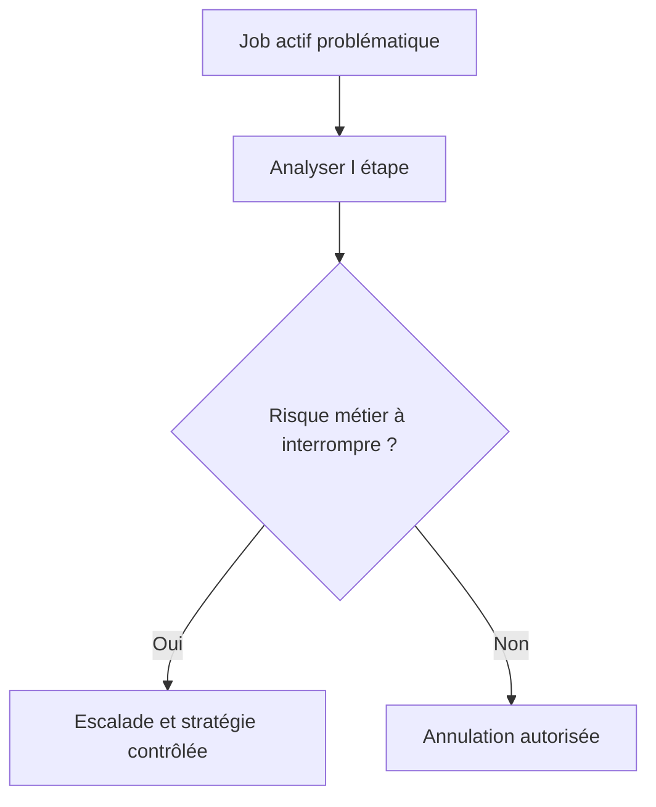

# MODIFIER, COPIER, REPLANIFIER, ANNULER ET SUPPRIMER

## OBJECTIFS

- Choisir l’action appropriée selon le statut
- Préserver les preuves avant une intervention
- Éviter les modifications non maîtrisées d’une série périodique

## ACTIONS PRINCIPALES

| Action                | Usage                                                    |
| --------------------- | -------------------------------------------------------- |
| Copier                | Créer une nouvelle définition à partir d’un job existant |
| Replanifier           | Affecter une nouvelle condition de démarrage             |
| Retirer la libération | Empêcher un job encore modifiable de démarrer            |
| Annuler               | Interrompre un job actif                                 |
| Supprimer             | Retirer une définition ou un historique selon le statut  |

Les actions disponibles dépendent du statut et des autorisations.

## AVANT D’ANNULER

1. identifier l’étape active ;
2. vérifier si le programme est en phase d’écriture ;
3. rechercher les verrous dans `SM12` ;
4. vérifier les effets externes déjà déclenchés ;
5. déterminer la procédure de reprise ;
6. conserver le journal et les éléments de diagnostic.



## JOB PÉRIODIQUE

Modifier une occurrence ne modifie pas nécessairement toute la série de la manière attendue. Après intervention, vérifier la prochaine date planifiée et l’existence d’éventuelles occurrences en doublon.

## PROCÉDURE PAS À PAS

1. Saisir `/nSM12`.
2. Renseigner utilisateur, table de verrou ou argument si ces informations sont connues.
3. Afficher les entrées et identifier le propriétaire ainsi que l’âge du verrou.
4. Vérifier qu’aucune session ou mise à jour active ne dépend encore du verrou.
5. Ne supprimer manuellement une entrée qu’après validation opérationnelle et technique.

## VÉRIFICATION

- Le job apparaît dans `SM37` avec le statut attendu.
- Le journal ne contient pas de message d’erreur non traité.
- Le spool, le fichier ou le journal applicatif contient le résultat attendu.
- Une relance contrôlée ne crée pas de doublon métier.

## ERREURS FRÉQUENTES

- Planifier un job avec l’utilisateur personnel d’un développeur.
- Relancer un job non idempotent après un échec partiel.

## FICHE DE CONTRÔLE À COPIER

```text
Système / SID       :
Mandant             :
Utilisateur         :
Transaction / outil :
Objet technique     :
Jeu de données      :
Résultat attendu    :
Résultat observé    :
Horodatage          :
Ordre de transport  :
```

## TERMES DU LEXIQUE

- [Job](<../00 ├── LEXIQUE SAP ET ABAP/06 ├── PROGRAMMES CLASSES ET OBJETS TECHNIQUES.md#job>)
- [Spool](<../00 ├── LEXIQUE SAP ET ABAP/06 ├── PROGRAMMES CLASSES ET OBJETS TECHNIQUES.md#spool>)
- [Processus background](<../00 ├── LEXIQUE SAP ET ABAP/08 ├── EXECUTION EXPLOITATION ET ADMINISTRATION.md#processus-background>)
- [Variante](<../00 ├── LEXIQUE SAP ET ABAP/06 ├── PROGRAMMES CLASSES ET OBJETS TECHNIQUES.md#variante>)

## RÉFÉRENCES OFFICIELLES SAP

- [Managing Jobs from the Job Overview — SAP Help Portal](https://help.sap.com/docs/ABAP_PLATFORM_NEW/b07e7195f03f438b8e7ed273099d74f3/4b2bc2224c594ba2e10000000a42189c.html)
- [Possible Status of Background Jobs — SAP Help Portal](https://help.sap.com/docs/ABAP_PLATFORM_NEW/b07e7195f03f438b8e7ed273099d74f3/4b308aa91dd90a93e10000000a421937.html)


---

[Chapitre suivant — DEBUGGER UN JOB AVEC `JDBG`](<./20 ├── DEBUGGER UN JOB AVEC JDBG.md>)
